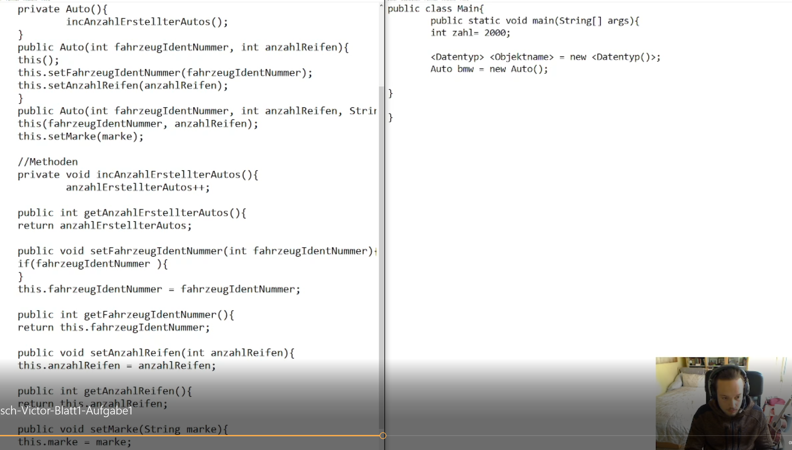
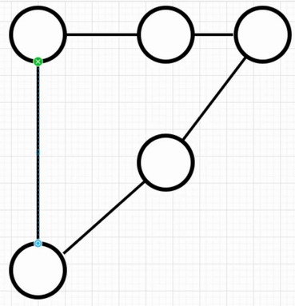
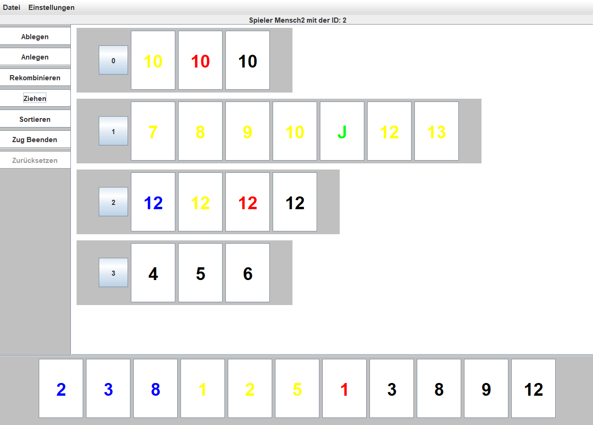

[zurück zur Hauptseite...](https://informatik-mannheim.github.io/iExpo-Winter-2021/)

Veranstaltung Programmierung 2
==============================

Dozent: Prof. Dr. Frank Dopatka
-------------------------------

Wir, das Team A1, möchten euch hier einen Einblick in das aktuelle Semester des Fachs Programmierung 2 geben. Es war ein aufregendes, ein strapazierendes und lehrreiches Fach. Ein Fach, in dem wir, neben dem normalen Prozedere, auch Videos und ein Programm produziert haben. Ja, Ihr hört richtig. Während eines Semester durften wir gemeinsam ein Programm erstellen. Dieses stellen wir euch nachfolgend auch vor.

## **Produzierte Videos und ein Einblick in die Themen**

Hier stellen wir euch nun unsere Videothemen vor.

### **Aufgabenteil 1**
#### **Objekte mit deren Eigenschaften, Gettern, Settern und Konstruktoren sowie Methoden und deren Overrides (toString, hashCode, equals)**

Um sich diesem Thema zu nähern wurde zunächst erklärt wie Vererbung in Java funktioniert, das alle Klassen in Java implizit von Object erben und ein
paar der Methoden aus dieser Superklasse vorgestellt.

Da in Java versucht wird reale Objekte möglichst genau abzubilden, wurde ein Auto angelegt und diesem exemplarisch typische Eigenschaften zugeordnet.
Ein Auto hat eine Marke, eine Anzahl von Reifen, eine Fahrzeugidentnummer und die Klasse soll sich merken wie viel Autos vom "Band gelaufen" sind. 
Zu diesem Zweck wurde noch eine static integer Variable anzahlErstellterAutos angelegt, welche von den verschiedenen Konstruktoren jeweils beim Aufruf erhöht wird.

Zum Ende des Vortrages wurden die Overrides toString, hashCode und equals gezeigt und erklärt. 
Weshalb benötigt Java die Annotation @Override?
Da sonst nicht bekannt ist, dass die betreffende Methode aus einer Superklasse überschrieben werden soll.
Es wurde gezeigt wie die betreffenden Methoden in einem Beispiel sinnvoll überschrieben werden können und wieso ein "==" nicht gleich  einem equals ist.
Abschließend habe wurde noch einen Dienst der Klasse definiert, nämlich den Motor Starten.

Das Referat hat den Zusammenhang von Objekten in Java und ihren Vorbildern in der realen Welt verdeutlicht. 
Das Gefüge und die Struktur von Klassen nähergebracht, sowie exemplarisch eine mehr oder weniger sinnvolle Funktion gezeigt.

#### **Teamarbeit und Testen** 

Thematisch geht es hier um Mittel und Wege zum Testen von Quellcode und der Zusammenarbeit im Team. Dabei wurden die Werkzeuge JavaDoc -im Bild zu sehen-, GitHub und JUnit-Test vorgestellt. 
Javadoc ist ein Software-Dokumentationswerkzeug, das aus Java-Quelltexten, in einem speziellen Format, automatisch HTML-Dokumentationsdateien erstellt.
GitHub ist eine Quelltext-Versionierung-Plattform.

#### **Exception-Handling und Strukturierung großer Anwendungen**

Wie intern mit Fehlern umgegangen wird und wie man eigene Klassen für die Fehlerabwicklung entwirft, hatten wir in diesem Video vorgestellt. Dabei wurde zwischen impliziten und expliziten Exceptions unterschieden. Außerdem wurde die Verwendung mit try-catch erklärt und beispielhaft eingesetzt. Betont wurde im in diesem Kontext auch die Wirkung des finally-Blockes. Am haben wir noch gezeigt, wie man durch die Nutzung einer Package Struktur das Programm ordnen kann.

#### **Heapsort**

Zu zeigen war die Implementierung des Heapsort-Algorithmus in Java sowie eine Erklärung des 
Algorithmus mit Hilfe eines graphischen Beispiels. Im Vergleich zu anderen Sortieralgorithmen 
ist der Heapsort-Algorithmus relativ effizient und benötigt wenig Speicherplatz, da keine extra 
Datenstrukturen angelegt werden müssen. 
Oben im Screenshot zu sehen ist ein Ausschnitt des Heapsort-Algorithmus in Java.  

### **InsertionSort**

Zu erklären war der Insertion Sort Algorithmus. 
Der Insertion Sort ist ein stabiles in-place Algorithmus.
Stabil heißt wenn zwei Elemente im Array den gleiche Wert
haben behalten sie auch ihre Sortierung und werden nicht
getauscht. In-place bedeutet das der Algorithmus keinen
extra Speicher verwendet und in seinem eigenen z.B. Array
operiert.

Er funktioniert in dem man durchs Array itteriert und man schaut ist das
jetzige Element kleiner als das Element links davon, dann tauschen sie
ihre Plätze. Das geht so lange bis das Array sortiert ist.

Blaue Kästchen -> Array Element
Orange Kästchen -> Array Index
Array wurde mit dem InsertionSort sortiert und den
Best-Case mit O(n), wenn das Array vorsortiert war und
Worst-Case mit O(n²), wenn das Array genau andersrum
sortiert war wird angebeben.

### **Aufgabenteil 2**
### **Enums/Annotationen/Wrapper-Klassen**

Zu erklären war der Aufbau von Enums, sowie die von Java mitgelieferten Annotationen als auch Wrapper-Klassen welche dazu dienen, problemlos mit elementaren Datentypen in Kombination mit Objekten zu arbeiten. Hier im Screenshot zu sehen ist eine kleine Demonstration verschiedener 
Annotation sowie eine Erläuterung des Unboxing/Autoboxing der Wrapper-Klassen welches vom Java-Compiler automatisch übernommen wird. 
### **Komposition und Aggregation**

Nein, es handelt sich nicht um Kompost und hat nichts mit dem Aggregatzustand gemein. Vielmehr geht es um die Beziehung zweier Objekte. Mit starkem Fokus auf die Objektorientierte Programmierung wollen wir auch sicher stellen, dass Objekt A nicht nur ein Teil von Objekt B ist. Es gibt auch Beziehungen, die Komposition, da kann das Teil nicht ohne das Ganze existieren. Beispielsweise ist ein Rad ohne das Auto immer noch ein Rad. Aber was passiert mit einem Raum, wenn das Gebäude abgerissen wird? 
### **Innere Klassen**

Statische Innere Klassen wird in Java wie eine normale Klasse
im Package angesehen. Die Statische Innere Klasse wird in der
Äußeren Klasse angelegt. Die Statische Innere Klasse kann auf alle
nicht statischen Attribute der Äußeren Klassen zugreifen auch wenn
sie private sind. Statische Innere Klassen kann man ohne eine Objekt
der oberen Klassen instanziieren. Das geht so:
Äußere.Innere {name} = new Äußere.Innere();
### **Strings, RegEx und der Garbage Collectorn**

Dass Strings Objekte sind und welche besonderen Eigenschaften diese mit sich bringen, wurde in diesem Video erklärt. Exemplarisch wurden die Funktionen isEmpty(), length(), getBytes() und concat() besprochen. Danach wurde die Nutzung von Regex in Java anhand der Filterung eines Strings veranschaulicht. Abgeschlossen wurde dies mit einer graphischen Vorstellung der Funktionsweise des Garbage Collectors.

### Aufgabenteil 3
### **Race-Conditions mit synchronized**

Race Conditions sind Fehler die auftreten können wenn meherere Threads auf
auf Variablen/Objekte zugreifen wollen und diese z.B. dann gegenseitig
überschreiben. Fall hier ist das 5 Threads einen counter 1000 Mal um 1
inkrementieren wollen. Nur das Problem ist das die Threads then counter mit
falschen werten überschreiben. Z.B. lässt der Sheduler Thread1 laufen, dieser
liest den counter. Nur denkt sich der scheduler ich stoppe "stoppe" Thread 1 und lasse
Thread2 laufen. Thread 2 liest den counter, inkrementiert 5 mal, schreibt es zurück in
den Counter. Jetzt denkt sich der Scheduler, "stoppe" Thread 2, starte Thread1.
Thread 1 überschreibt dann den counter mit einem falschen wert.
Nun kann man wo der counter gelesen/inkrementiert/geschrieben in einem
synchronized()-block schreiben. Der stellt sicher das nur ein Thread auf das Objekt zugriff
hat. Dieses Objekt wird dann in die () geschrieben.

### **Das Philosophenproblem **

Zu erklären war das Philosophenproblem anhand eines graphischen Beispiels, als auch dessen 
Lösung in Java. Beim Philosophenproblem dreht es sich hauptsächlich um Multithreading bzw. den 
Deadlock, welcher auftreten kann, wenn alle Threads darauf warten das benötigte Ressourcen frei werden, diese jedoch bereits reserviert sind. 

### **Das Problem des Handlungsreisenden (TSP)**

Das Traveling-Salesman-Problem oder zu Deutsch das Problem des Handlungsreisenden. Ein NP-Vollständiges Problem, welches in fast allen Bereichen aufkommt und dennoch so unbekannt ist. Eine Optimierungsrechnung, welche so viele Variationen mit sich bringt, sodass selbst moderne Rechner zu viel Zeit benötigen, um auf ein exaktes Ergebnis zu kommen. Was ist die Alternative? Approximation. Bitte? Eine Annäherungsrechnung, um dem exakten Ergebnis möglichst nahe zu kommen. Wenn man alle Möglichkeiten darstellen und berechnen möchte, dann gibt es (n-1)! Möglichkeiten. Bei 15 Zielen gäbe es bereits 1307674368000 mögliche Routen. Egal ob die Berechnung der schnellsten Route, um alle Pakete auszuliefern, oder die kürzeste Strecke, um Löscher in die Platine zu bohren. Das Problem des Handlungsreisenden steckt dahinter.

### **Ein Stundenplan via Graphenfärbung**

Hierzu wurde ein Beispiel angeführt, in dem es folgende Überschneidungen gibt:
-Herr Huber unterrichtet Englisch und Sport
-Herr Maier Mathe und Physik
-Herr Mustermann Chemie und Philosophie
-Frau Musterfrau Englisch(mit Herrn Huber gemeinsam) und Französisch
-Raumnutzung: Biologie, Physik und Chemie teilen sich einen Raum
-Musterklasse besucht Mathe, Sport, Englisch und Physik

Da die Frage lautet: Wie viele Zeitslots werden benötigt, um jegliche Überschneidung zu verhindern.
Wurde ein Graph gezeichnet und die Chromatische Zahl bestimmt. Diese ist hierbei der Indikator für die Anzahl der benötigten Slots.
Die Chromatische Zahl wurde im Video händisch selbst ermittelt und lautet 4.

Im folgenden Screenshot ist der zugehörige Graph zu sehen. 
Die Knoten entsprechen den Fächern und die Kanten kennzeichnen die jeweiligen Fächer, welche nicht zeitgleich stattfinden können.

Um eine Färbung zu ermöglichen brauchte es einen etwas abgeänderten Graphen.
Während die Kanten normal bleiben und sich nur die 2 Knoten merken zwischen denen die ungerichtete Kante verläuft, muss ein Knoten noch zusätzlich eine Farbe bekommen.
Ein Knoten merkt sich also seine Kanten, über die man auch leicht den Grad eines Knoten bestimmt, eine Farbe und seine ID.
Der Knoten muss nun über seine Nachbarknoten ermitteln welche Farbe denn noch verfügbar ist und diese zurück an die Graphenklasse übermitteln.
Das eigentlich färben, also das setzen einer Farbe erfolg nämlich dort.
Ein Graph merkt sich seine Knoten und könnte auch ermitteln was denn der maximale Grad seiner Knoten ist, in diesem Beispiel war das allerdings nicht vonnöten.

Das folgende Beispiel zeigt nun die Vorbereitung auf die Spätere Ausgabe des Ergebnisses, die ermittlung der Chromatischen Zahl, welche für die Anzahl der Slots genutzt wird
und das färben.

Abschließend habe wurde der Graph erzeugt.
8 Knoten, 11 Kanten, gefärbt und Ausgegeben.

Diese Art der Stundenplanerstellung lässt vermuten, dass sie sehr schnell sehr komplex wird.
Kein Wunder also das sich dieses Verfahren in der Problemklasse NP befindet.

## **Nun bekommt Ihr einen Einblick in unser Rummikub-Spiel**

### **Was war gefordert? Was waren die Rahmenbedingungen?**
Gefordert war das Spiel Rummikub in Java umzusetzen. Für die Spielregeln verwies man uns auf die Wikipedia-Seite des Spieles. Das ganze Semester ist aufgebaut gewesen wie eine Auftragssimulation. Unsere Ansprechpartner, die Kunden, waren jederzeit über ein Kundenforum erreichbar, um Fragen zu beantworten. Wir bekamen Aufgaben zugeteilt und mussten uns in Fünfer- bis Sechserteams zusammenfinden.
#### Funktionen die das Spiel im Laufe des Semesters mit sich bringen musste:
+ Spielregeln umsetzen
+ Speichern im CSV-Format und serialisiert
+ Laden von serialisierten Speicherständen und im CSV-Format
+ Eine KI
+ Umsetzung in der Kommandozeile (CLI)
+ Umsetzung einer grafischen Oberfläche
+ Selbstgeschriebene Fehlerbehandlung
+ Eigener Logger

### **Realisierung in der Befehlszeile**
#### **Hauptmenü**

#### **Spielmenü Spieler**

#### **Spielmenü KI**

#### **Spielmenü Spielfeld**

Wie in den hierüber liegenden Bildschirmaufnahmen zu sehen, interagiert der Akteur über eine Tastatureingabe mit dem Spiel. Dabei erkennt das Spiel auch, ob gerade ein Akteur oder eine KI am Zug ist. Den Anforderungen entsprechend gab es eine durchspielende KI und eine nicht durchspielende KI. Letztere ist auf dem Bild mit der Überschrift "Spielmenü KI" zu sehen. Auf die KI kommen wir zum Schluss noch einmal näher zu sprechen.

### **Realisierung in der Benutzeroberfläche**

Teil des Semesterspiels war die Implementierung einer simplen, übersichtlichen Benutzeroberfläche, sodass jeder Nutzer ohne große Probleme mit dem Spiel interagieren kann. Durch Konsoleneingaben kann der Nutzer alle Funktionen des Rummikub-Spiels nutzen sowie Dateien abspeichern und laden.

#### **Die GUI** 

Ab Arbeitsblatt 3 war eine vollständig funktionsfähige GUI gefordert welche mit Hilfe von Java-Swing implementiert wurde. Unsere GUI wurde nach dem MVC (Model-View-Controller) Prinzip programmiert, bedeutet die Graphische Oberfläche und Logik des Spiels sind komplett voneinander getrennt. Wir haben viel Wert auf leicht verständliche Menüs und Bedienerfreundlichkeit gelegt, so das jeder das Spiel problemlos bedienen kann. 

#### **Das Startmenü**

Sobald das Programm gestartet wird befindet sich der Nutzer im Startmenü, in welchem er entweder bis zu vier Spieler mit beliebigen Namen, oder Computer-Gegner hinzufügen kann. Außerdem kann der Nutzer von diesem Menü aus auf bereits abgespeicherte Spielstände zugreifen und diese Laden. 

#### **Das Spielmenü**

Nach Auswahl der Spieler kann der Nutzer das Spiel starten und befindet sich nun im Hauptfenster des Spiels. Hier befindet sich das Spielmenu (links), die Spielerhand (unten), das Spielfeld und die Menüleiste. Von diesem Fenster aus kann der Nutzer das Spiel spielen und auf jegliche verfügbaren Funktionen wie Speichern, Laden, Einstellungen etc. zugreifen. Es gelten die gleichen Regeln wie im Standard Rummikub Spiel und jeder Zug wird automatisch überprüft. 

 

Je nach Anforderungen ändert sich das Spielmenü um die Bedienung für den Nutzer verständlicher zu gestalten. Wenn der Nutzer sich zum Beispiel entscheidet Steine ablegen zu wollen, passt sich das Spielmenü an und bietet nur die erforderlichen Funktionen. 

#### **Das Spielfeld** 

 
Unser Spielfeld nutzt ein simples, übersichtliches Layout um alle abgelegten Steinformationen untereinander und getrennt voneinander anzuzeigen. Jede Formation ist nummeriert und alle Spielsteine sind farblich gekennzeichnet. Der Spieler kann das Spielfeld während er rekombiniert beliebig verändern und alle Formationen werden nach beenden des Zuges auf ihre Gültigkeit geprüft. 

#### **Laden / Speichern**

 

Über den von Swing mitgelieferten JFileChooser kann der Nutzer Problemlos Dateien entweder im CSV, oder im SER Format laden bzw. speichern. Mit dem eingebauten Filter werden andere Dateien direkt versteckt. 

#### **Künstliche Intelligenz (KI)**
Was ist hier unter künstlicher Intelligenz zu verstehen? Müssen wir uns Sorgen machen, dass sie ausbricht und im nächsten Zug Backgammon gegen uns spielt? Nein, leider nicht.
Es sind faktisch nur deterministische Algorithmen, welche Straßen und Gruppen erkennen und diese als solches behandeln. Die "KI" kann auch nicht maschinell dazulernen. 

[zurück zur Hauptseite...](https://informatik-mannheim.github.io/iExpo-Winter-2021/)