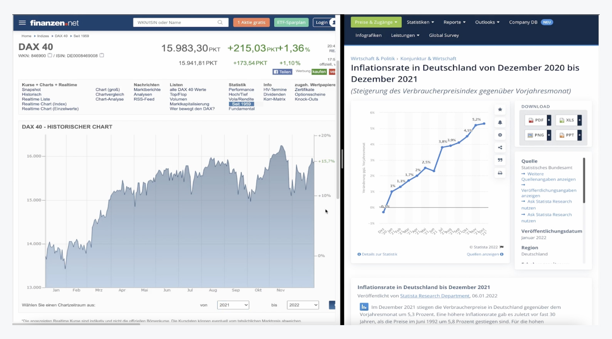
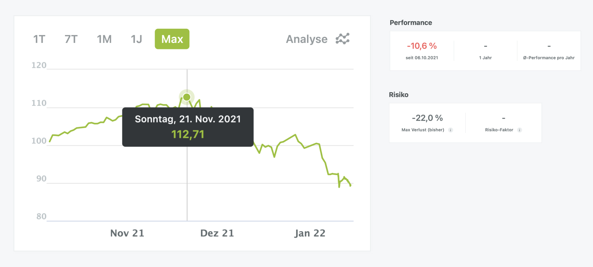

# Das Wahlpflichtmodul Technisches Trading
# Dozent: Prof. Dr. Frank Dopatka

[zurück zur Hauptseite...](https://informatik-mannheim.github.io/iExpo-Winter-2021/)

## Ziel- und Aufgabenstellung

Neben der sehr interessanten Vorlesungsreihe von Prof. Dr. Dopatka, hatten wir Studenten
die Möglichkeit uns in zwei selbst ausgewählte Themen einzuarbeiten und diese dann in Form von
Lehrvideos und Ausarbeitungen für alle Anderen aufzubereiten. Außerdem war es Aufgabe ein eigenes Depot mit einem Kapital von 1 Millionen Euro auf der Trading-Plattform "wikifolio" zu führen. Die Gewinne und Verluste die dabei entstanden sind, flossen in die Prüfungsleistung ein. 

## Lehrvideo I - Profitfaktor und Co.

Das Ziel des ersten Lehrvideos war es aufzuzeigen wie man Handelsstrategien rückblickend auf Erfolg und Verlust untersuchen kann. Das Thema ist Teil des übergeordneten Risikomanagements und soll die Wichtigkeit von regelmäßigen Analysen der genutzten Tradingstrategie vermitteln und außerdem aufzeigen, welche Optimierungsmöglichkeiten sich basierend auf den berechneten Kennzahlen ergeben.

Hierzu wurden folgende Kennzahlen aufgezeigt und anhand von einem größeren Beispiel angewandt:

- Die Trade-Ratio/ Trefferquote
- Die Payoff Ratio
- Der Profitfaktor

Das Beispiel basiert dabei auf 30 verschiedene Tradingergebnisse. Der Trader hat also eine Übersicht über all seine Trades eines bestimmten Betrachtungszeitraums erstellt. Anhand dieser Übersicht werden dann die jeweiligen Berechnungen durchgeführt und die Ergebnisse besprochen und anschließend gewinnbringend optimiert. 

Wer Interesse hat, kann sich das gerne unter nachfolgendem Link anschauen:

[Profitfaktor und Co. - Handelsstrategien auf Gewinn und Verlust untersuchen](https://www.google.com)

## Lehrvideo II - Einfluss der Inflation auf den Aktienmarkt und wie man sich schützt

Das zweite Lehrvideo konnte frei gewählt werden und war daher nicht an den Foliensatz gebunden.
Ich habe mich daher für die Thematik rund um die zur Zeit wieder ansteigende Inflation entschieden. In dem Lehrvideo behandle ich vor allem den Einfluss den die Inflation dabei auf den Aktienmarkt nehmen kann. Dazu werden im Video unter anderem Zeiten aus der Vergangenheit, die eine ähnliche Inflationsrate aufzeigten, untersucht.
Im zweiten Teil der Aufzeichnung beleuchte ich außerdem verschiedene Anlageformen auf ihre Tauglichkeit als inflationsschützende Maßnahme. 

Abbildung - Einfluss untersch. Inflationsraten auf den Dax:

Das Video findet Ihr unter folgendem Link:

[Inflation - Einfluss auf den Aktienmarkt und wie man sein Vermögen schützen kann](https://www.google.com)

## Wikifolio

Das Wikifolio diente für mich als Spielwiese. Daher war es äußerst interessant erste Erfahrungen im Trading zu gewinnen und die aus den Vorlesungen kennengelernte Strategien auszuprobieren. Es hat mir vor allem gezeigt, dass Money- bzw. Risikomanagement eines der wichtigsten Aspekte im Trading ist. Dabei soll man Gewinne möglichst mitnehmen und Verluste durch geeignet Stop-Loss Order (vgl. 1. Lehrvideo) begrenzen.
Wie man dem nachfolgenden Screenshot entnehmen kann, konnte ich bis zum 21.November etwa 12 Prozent zulegen. Leider habe ich die eben genannten Möglichkeiten nicht beherzigt und diesen Gewinn nicht mitgenommen. Anschließend fiel mein Kurs, auch wegen einigen Fehltrades bis zur letzten Indexmessung um ca. 20%, da auch keine verlustbegrenzenden Maßnahmen durchgeführt wurden. Aufjedenfall war das eine lehrreiche Erfahrung, die mir die Wichtigkeit des Risikomanagement spüren lies.

Abbildung - Kursentwicklung Wikifolio:

