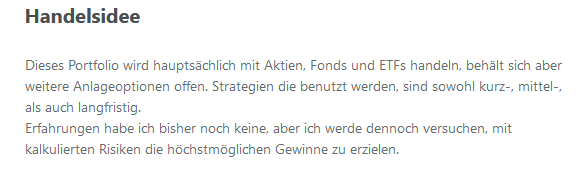
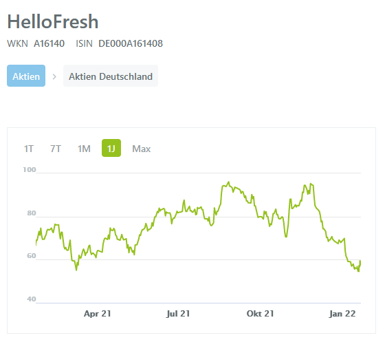

# Technisches Trading WS 21/22
### <b>Dozent: Prof. Dr. Frank Dopatka</b>

Der folgende Beitrag wurde erstellt, um einen tieferen Einblick hinter die Kulissen der Vorlesung Technsiches Trading (TRA) im Wintersemester 2021/2022 zu gewähren.
Es wird beschrieben, wie der Ablauf des Fachs war, was die erledigten Aufgaben waren und schließlich ein persönlicher Eindruck von mir darüber.

Die Vorlesung setzte sich aus vier verschiedenen Abschnitten zusammen. Der erste Teil war die Vorlesung an sich und die Vermittlung des Stoffs. Der zweite bis vierte Teil sind dabei die Bewertungskriterien für die Leistung der Studierenden. Der zweite Teil war dabei die Erstellung eines Demodepots und die aktive Nutzung dessen. Der dritte und vierte Teil waren die Erstellung von Videos und Ausarbeitungen.

## Vorlesung
Die Vorlesung wird an sich sehr frei und flexibel gestaltet. Da zu Beginn des Semesters bereits alle Foliensätze mit entsprechenden Erklärungen im "klassischen" Vorlesungsstil auf Youtube veröffentlicht sind, ist die Vorlesung interaktiv gestaltet. Das heißt, man bespricht sich eher zu Fragen der einzelnen Studenten, oder geht auf genaue Punkte nochmal etwas tiefer ein. Hat man sonst keine weiteren Punkte auf der Agenda zu besprechen und alle Fragen sind gestellt, wird sich auch mal gerne über interessante tagesaktuelle Themen im Bereich der Wirtschaft, Börse, Kryptowährung, etc. unterhalten.

Die Foliensätze der Vorlesung sind in verschiedene Themengebiete gegliedert:

|Nr.| Thema      | Beschreibung          |
|---:| ------------- |:-------------:|
|1| Grundbegriffe      | Wissensbasis für das Fach Trading herstellen |
|2| Risikomanagement     | Für einen jeden erfolgreichen Investor oder Trader ein Muss |
|3| Börsenprodukte | Übersicht über die zu erwerbenden Produkte an der Börse   |
|4| Analysemodelle | Anhand von Strategien und Modellen der fundamentalen oder technischen Analyse, mögliche Vorhersagen über die Entwicklung des Marktes herausfinden |
|5| Trading Strategien | Verschiedene Strategien, je nach Typ des Anlegers (Trader oder Investor), differenziert und dargestellt  |
|6| Börsenpsychologie | Verschiedene Typen von Tradern und das Zusammenspiel der menschlichen Emotionen  |

## Wikifolio
### Was ist Wikifolio?
Um auch praktische Erfahrungen im Bereich Trading zu sammeln, haben wir auf der Plattform wikifolio unser eigenens Tradingportfolio angelegt. Auf der Plattform Wikifolio ist es möglich bei Echtkursen mit einem Budget von 1 Mio € mitzuhandeln, natürlich nur mit einem Demodepot und nicht aus der Tasche des Studenten. Voraussetzungen die wir dabei beachten mussten, waren dass jeder Trade mind. 60 min gehalten werden muss und wir eine dauerhafte Investitionsquote von 50 % vorweisen mussten, um ein aktives Investment zu gewährleisten.

Bei der Erstellung des Wikifolios mussten wir uns auf eine Handelsidee festlegen und bestimmen mit welchen Anlageprodukten wir handeln möchten. Nachdem das Wikifolio geprüft und verifiziert wurde, konnte es auch schon losgehen.

### Persönliche Erfahrung
Mir hat die Nutzung von Wikifolio persönlich gefallen, da die Dashboards und Trading-Funktionalitäten einfach zu verstehen sind und man sich generell gut mit der Plattform zurechtgefunden hat. Was mir leider nicht so gefallen hat war der Verlauf des Graphen meines Wikifolios.

Wie man sehen kann, hat mein Portfolio am Anfang sehr gut performt, unter Anderem aufgrund von Investitionen wie Tesla, Apple, Cisco Systems oder NVIDIA. Durch 3 fehlerhafte Investitionen habe ich mir leider gegen Ende hin mein eigenes Grab geschaufelt. Die Übeltäter waren dabei ASOS, Amazon und vor allem Hellofresh. Der Anteil von ASOS war nicht zu groß, deswegen war das auch nicht so schlimm. Amazon hingegen erlitt einen ordentlichen Downfall. Und mein zweitgrößter Anteil im Portfolio, Hellofresh mit 13,2%, war dabei meine größte Enttäuschung.

Ich hätte auf Nummer sicher gehen können und sobald klar wurde, dass Hellofresh einen Downfall erleidet, die Aktie aus dem Portfolio nehmen können. Ich entschied mich aber den riskanten Weg zu gehen und vor allem aus dem Grund, da Hellofresh einen Aktienrückkauf startete, die Aktien weiterhin zu behalten. Bis zum Ende vom Fach Technisches Trading hat sich die Aktie aber nicht, wie angenommen verbessert, sondern leider weiterhin verschlechtert, was eine riesige Enttäuschung war.

## Lehrvideos
### Warum Lehrvideos?
Eine Bewertungsgrundlage für die sich Herr Dopatka über die Corona Pandemie hinweg entschieden hat, um Studenten zu prüfen, ist die Erstellung von Lehrvideos. Bei diesen Lehrvideos geht es in unserem Fall um vorlesungsergänzende Videos, die einen selbst ausgesuchten Sachverhalt aus der Vorlesung näher beschreiben. Dabei geht es darum Inhalte zu präsentieren, die den Stoff erweitern bzw. diesen anhand von Praxisbeispielen erklären.
Neben der Eignung für die Leistungsprüfung der Studierenden, gewähren diese Videos außerdem einen guten Einblick in die Themen für Jedermann.

### Mein Lehrvideo Thema
#### Verschiedene Typen von Anlegern anhand von Praxisbeispielen erklärt.

In meinem Video geht es um die verschiedenen Typen von Anlegern, also alles zwischen kurzfristigen Tradern, die auf Sekundenbasis handeln, bis Investoren die auf Jahre hinweg anlegen. Die ganze Thematik erkläre ich dabei anhand des Kurses der Volkswagenaktie.

### Persönliche Erfahrung

Es war mir wichtig bei dem Lehrvideo auf Authentizität zu achten. Ich wollte keine Powerpoint erstellen bei der ich Folien vorlese und x-beliebige Schnitte einbaue. Deswegen habe ich mich dazu entschieden, die Themen als Onetake mit aktivierter Kamera und eigenen Worten anhand von ein paar angefertigten Notizen zu erklären. Die Beispiele habe ich live und ohne Vorbereitung in den Graphen skizziert und errechnet. Leider musste ich aufgrund von mangelnder Internetverbindung 2 kleine cuts reinmachen. An sich bin ich sehr zufrienden mit meinem Video.

## Ausarbeitung
### Warum Ausarbeitungen?
Eine weitere Bewertungsgrundlage zusätzlich zum Video waren die Ausarbeitungen. Dabei konnte man sich entscheiden, ein zweites Video anzufertigen oder eine wissenschaftliche Arbeit zu schreiben. Dabei handelt es sich im Gegensatz zum Video, um selbst ausgewählte Themen, die einen aktuellen Bezug haben sollten.

### Mein Ausarbeitungsthema
#### Forex Trading: wie rentabel ist das Handeln am weltgrößten Finanzmarkt?
Ich habe mich bei bei meiner Ausarbeitung für ein zweites Video entschieden. Die Entscheidung des Themas beruhte auf persönliche Interessen, da ich mich schon seit einer langen Zeit gerne in die Thematik einlesen und selber Erfahrungen sammeln wollte. Wie auch bei einer wissenschaftlichen Arbeit müssen die Inhalte des Videos auf wissenschaftlich verifizierten Quellen basieren. 

In meinem Video gebe ich einen Einblick darin, was Forex Trading eigentlich ist und wie es funktioniert. Nach den Grundlagen nehme ich Bezug auf tagesaktuelle wissenschaftliche Erkenntnisse in dem Gebiet. Diese beziehen sich vor allem auf trainierte Vorhersagemodelle, die von Tradern verwendet werden können, um Prognosen über den Markt anzustellen. Am Ende runde ich das ganze noch mit einem Fazit ab.

### Persönliche Erfahrung
Ich habe sehr viel Wissen über das Forex Trading sammeln können und mich auch praktisch am Forex trading probieren können. Dabei habe ich innerhalb eines Demodepots sogar anhand der Techniken, über die ich mich bei der Recherche informiert habe, rentable Trades ausführen können. Probleme hatte ich bei der Erstellung des Videos in der Hinsicht, dass ich es schwer fande die wissenschaftliche recherchierten Themen in einem Lehrvideo zu integrieren. 
Dafür eignet sich meiner Meinung nach die Ausarbeitung besser, um tiefer in die Thematik einsteigen zu können.

## Fazit
Für jeden der sich schon immer mal am Finanzmarkt probieren, oder darüber Wissen sammeln wollte, eignet sich das Fach technsiches Trading sehr gut. Durch die Erstellung der Videos eignet man sich außerdem noch Skills an, wie Videos zu erstellen und zu schneiden. Was mir sehr gut gefallen hat, ist dass man sich durch die Auswahl des Themas der Ausarbeitung in Themen reinarbeiten kann, für die man persönliches Interesse birgt.
