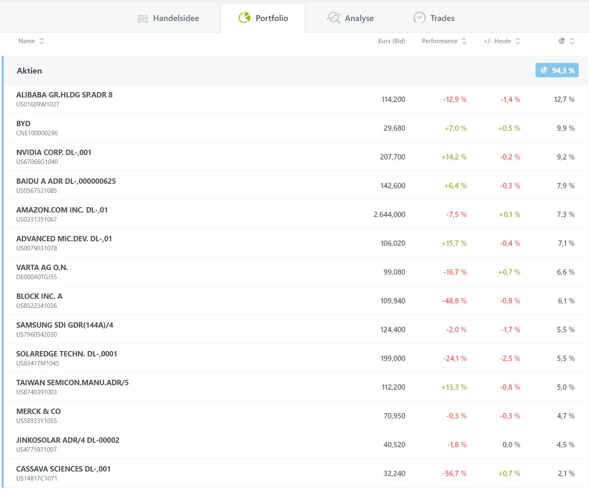
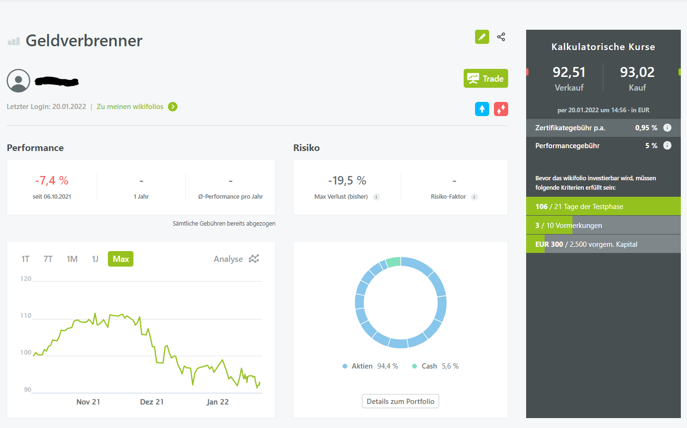
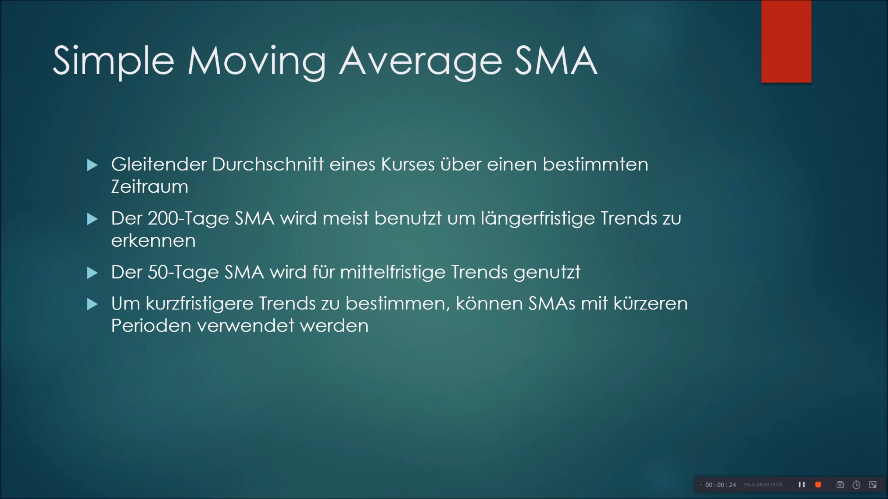
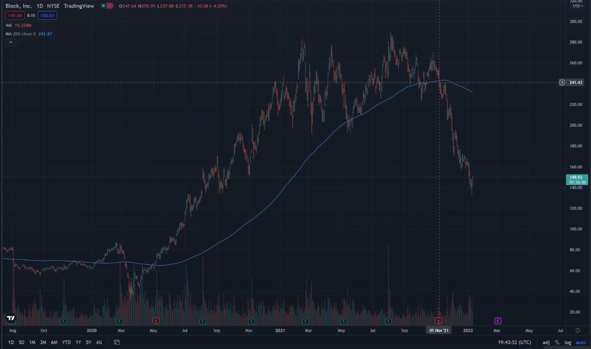
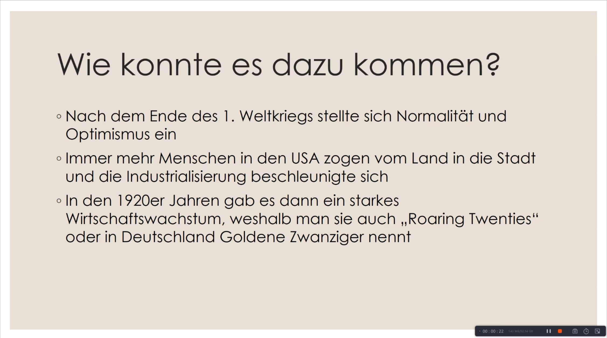
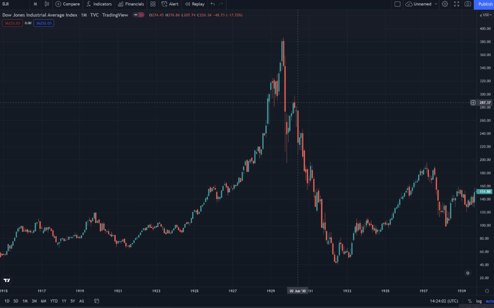

Das Wahlpflichtmodul Technisches Trading
========================================

[zurück zur Hauptseite...](https://informatik-mannheim.github.io/iExpo-Winter-2021/)

Dozent: Prof. Dr. Frank Dopatka
-------------------------------

## Wie lief der Kurs Technisches Trading ab?
Die Prüfungsleistung in TRA bestand aus drei Komponenten. Die Betreuung eines Wikifolios, die Erstellung eines Lehrvideos und die Erstellung einer Ausarbeitung.

## Das Wikifolio
Zu Beginn des Semesters erstellte sich jeder Student ein Wikifolio. Ich begann mit einem Startkapital von 1.000.000€. Damit kaufte ich dann verschiedene Aktien vor allem aus dem Tech-Sektor. Ich verfolgte eher eine Buy and Hold Strategie statt viel zu traden und entschied mich für diese Positionen:

Am Ende des Semesters wurde dann die Performance gemessen. Entsprechend der Performance konnte man im besten Fall 40 Punkte bekommen. Beim Lehrvideo und der Ausarbeitung konnte man auch jeweils 40 Punkte bekommen, für eine 1,0 benötigte man nur 100 Punkte.
Zwischenzeitlich sah es ganz gut für mich mit +11% Ende November aus. Doch es wurde erst Mitte Januar gemessen, wo ich nur noch etwa bei -7% lag:

 

## Das Lehrvideo
Für das Lehrvideo konnten wir ein Thema aus dem Foliensatz der Vorlesung wählen. Ich entschied mich für das Thema Technische Indikatoren. Diese basieren auf mathematisch-statistischen Methoden, bei denen Kursdaten einer Zeitreihenanalyse unterworfen werden. Wenn man diese analysiert kann man Kauf- oder Verkaufssignale erhalten. In meinem Lehrvideo stelle ich die bekanntesten Indikatoren vor, darunter SMA, EMA, MACD, PSAR, RSI, Bollinger Bänder, ATR.
Zunächst erkläre ich die Indikatoren jeweils in der Theorie:

 

Und danach erkläre ich die Indikatoren anhand von Praxisbeispielen:

 

Hier geht es zum Lehrvideo: <a href="https://www.youtube.com/watch?v=EbZb4G6eMJ4" target="_blank">https://www.youtube.com/watch?v=EbZb4G6eMJ4</a>

## Die Ausarbeitung
Anstatt eine Ausarbeitung zu schreiben gewährte uns Prof. Dopatka die Möglichkeit ein weiteres Video zu erstellen. Das Thema konnten wir dabei frei wählen, es musste nur etwas mit Börse/Trading zu tun haben, nicht bereits im Vorlesungsfoliensatz enthalten und nicht zu allgemein gefasst sein. Als Thema entschied ich mich für den Börsencrash 1929 und dessen Folgen.
In meinem Video erläuterte ich dazu zunächst die historischen Ereignisse:

 

Und zeigte den Crash auch nochmal anhand des Charts:

 

Hier geht es zum zweiten Video: <a href="https://www.youtube.com/watch?v=NNcIRAYCMOc" target="_blank">https://www.youtube.com/watch?v=NNcIRAYCMOc</a>

[zurück zur Hauptseite...](https://informatik-mannheim.github.io/iExpo-Winter-2021/)