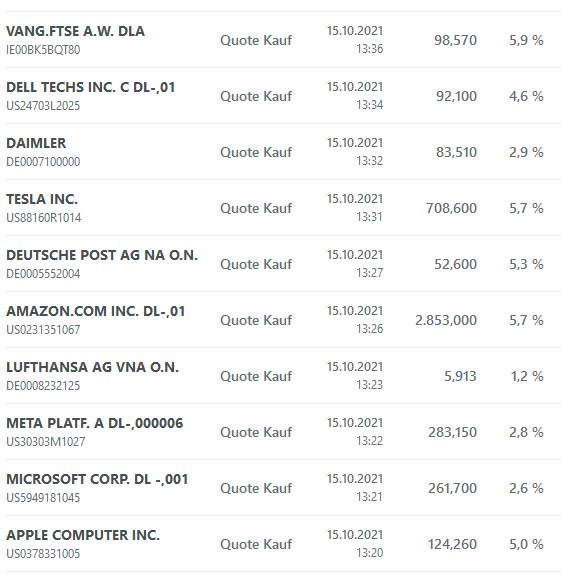
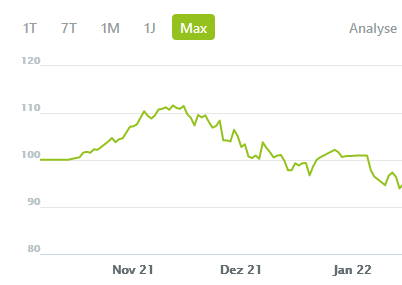
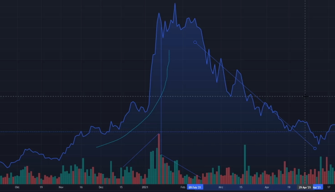

Das Wahlpflichtmodul Technisches Trading
========================================

[zurück zur Hauptseite...](https://informatik-mannheim.github.io/iExpo-Winter-2021/)

Dozent: Prof. Dr. Frank Dopatka
-------------------------------

In dem Wahlpflichtmodul(WPM) Technisches Trading wurden eine Vielzahl an Themen rund um die Bereiche Börse, Aktien, 
Fonds und weiterer Börsenprodukte behandelt. Dabei wurde viel theoretisches Wissen über die Themen vermittelt, um sie 
besser zu verstehen und analysieren zu können. In der Vorlesung selbst wurde zudem immer über aktuelle börsenbezogene 
Themen diskutiert, wodurch man die gelernte Theorie an aktuellen Ereignissen anwenden konnte.
Als Prüfungsleistung musste man ein Wikifolio führen, ein Lehrvideo erstellen und eine wissenschaftliche Ausarbeitung 
verfassen.

## Wikifolio

Wikifolio ist eine Internetseite, auf der man ein Musterdepot erstellen kann, um mit verschiedenen Finanzprodukten, 
ohne den Einsatz von echtem Geld, zu handeln. Dadurch ist es möglich verschiedene Handelsstrategien auszuprobieren, 
ohne sein komplettes Hab und Gut aufs Spiel zu setzen. Ebenso kann man sich die Depots aller anderen Teilnehmer 
anschauen, um ihre Handelsstrategie zu sehen. 
Für unsere Prüfungsleistung haben wir mit einem Startkapital in Höhe von 1.000.000€ gestartet und sollten über 
den Zeitraum des Semesters versuchen das beste daraus zu machen. Die einzige Regel dabei war, dass wir zu jeder Zeit 
mindestens 50% unseres Gesamtkapitals investiert haben mussten.

### Mein Wikifolio

Anfangs hatte ich in meinem Wikifolio eine Vielzahl verschiedener Aktien und ETFs.
Eine Auswahl meiner Käufe sind hier zu sehen:

Ich hatte mich bei meinen Investitionen größtenteils auf große Technologieunternehmen fokussiert. Zusätzlich hatte ich 
ein paar wenige Aktien von Unternehmen im Energiesektor und Baustoffhersteller. Zu Beginn war ich mit meinem Musterdepot
auch ziemlich erfolgreich. Jedoch ab mitte November startete ein Abwärtstrend, welcher bis zu dem Ende des Semesters nicht
stoppte.

Ich hatte zwischendurch vereinzelt Aktien verkauft und neue dazugekauft, aber hauptsächlich habe ich die meisten Aktien 
von Beginn bis zum Ende gehalten. Grund dafür war auch, dass man natürlich nicht derjenige sein möchte, der die Aktie 
zu früh verkauft und damit den kommenden Aufwärtstrend verpasst. Aber von meinem Ergebnis her ziehe ich den Schluss, 
dass der Aufwärtstrend manchmal eine lange Zeit auf sich warten lässt und der Verkauf von schlecht performenden Aktien 
eine gute Alternative ist.
Hier ist der komplette Verlauf meines Musterdepots zu sehen:

## Lehrvideo

Für diesen Teil der Prüfungsleistung habe ich ein Lehrvideo über das Thema "Analyse des Handelsvolumens" erstellt. 
Das Handelsvolumen gibt an, wie viele Transaktionen eines bestimmten Produkts über einen gewissen Zeitraum getätigt 
wurden. Anhand dessen ist es möglich den Preisverlauf einer Aktie besser zu verstehen und auch Trends zu erkennen und 
diese zu bestätigen. Für eine Veranschaulichung habe ich reale Beispiele herangezogen und die vorhandenen
Theoriemodelle daran erklärt. 

Hier ist die Analyse der Cloudflareaktie aus dem Video zu sehen. Anhand des Handelsvolumens ist es hierbei möglich 
den Preisverfall nach dem Höchstpunkt nachzuvollziehen.

Neben den verschiedenen Interpretationen des Handelsvolumens wird in dem Video auch noch kurz das Handelsvolumen 
an den verschiedenen Handelsplätzen erklärt. Das Thema ist auf jeden Fall interessant, wenn man sich für die 
Preistrendanalyse von Aktien interessiert.

## Wissenschaftliche Ausarbeitung

Meine wissenschaftliche Ausarbeitung handelt von dem rasanten Auf- und Abstieg von dem Unternehmen Enron um die 
Jahrtausendwende herum. Die Insolvenz des Unternehmens war damals ein großer Skandal und ich veranschauliche in 
meiner Ausarbeitung wie es dazu kam. Dazu zeige ich einige genutzten, nicht immer legale, Tricks des Unternehmens auf, 
um seine wahre Bilanz zu verheimlichen. Es ist ein sehr interessantes Thema, auch im Hinblick auf die verantwortlichen 
Menschen dahinter. Diese haben auf Grund ihrer Gier nach mehr Ruhm, Erfolg und Geld einige ihrer moralischen Werte hinter 
sich gelassen. Falls jemand Interesse an der Ausarbeitung hat, sie ist [hier](./kollapsenron.pdf) zu finden.

[zurück zur Hauptseite...](https://informatik-mannheim.github.io/iExpo-Winter-2021/)
