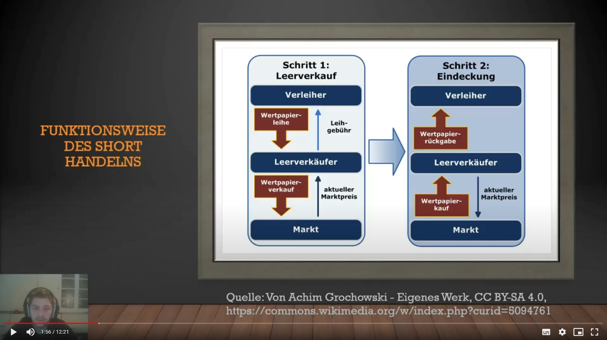

[zurück zur Hauptseite...](https://informatik-mannheim.github.io/iExpo-Winter-2021/)

Das Wahlpflichtmodul Technisches Trading
========================================

Dozent: Prof. Dr. Frank Dopatka
-------------------------------

## Wikifolio

Das Wikifolio war der praxisorientierte Teil des Wahlfaches. Alle Studierende erstellen ein Portfolie in welchem sie frei handeln können.  Die einzigen Regeln waren, dass man zu jedem Zeitpunkt mindestens 50% investiert sein musste, sowie jede Position länger als 59 Minuten gehalten werden musste. Am Ende gab es gemessen anhand der Performance in Relation zum erfolgreichsten Portfolio Punkte. In der Zwischenzeit gab es zwei Indexmessungen, in denen gezeigt wurde, wie man im Vergleich zu den Kommilitonen steht, und wie viele Punkte man bekommen würde.

Im Wikifolio kann man mit Aktien, ETFs, Fonds, Anlagezertifikaten und Hebelprodukten gehandelt werden.

Zum Start hatte ich mir noch keine allzu großen Gedanken gemacht, welche Positionen ich handeln möchte. Es war mir nur klar, dass ich mit Großkonzernen und gegebenenfalls auch Krypto handeln wollte, so auch der Name meines Wikifolios. Also wurde sich flächendeckend und mit 100% eingedeckt, z.B. Amazon, Tesla, Roche, sowie Ethereum ETFs. Der Anfang verlief gut, die meisten Aktienkurse stiegen, nicht außergewöhnliches, aber zufriedenstellend. Auch bei den fallenden Kursen habe ich mir noch keine allzu großen Gedanken gemacht. So habe ich mich zwar über den Markt durchgehend informiert, aber keinen Anlass gesehen, um bis zur ersten Indexmessung etwas zu ändern. Dort war dann ein klarer Spitzenreiter zu erkennen, der komplett in Ethereum investiert war. Da ich an sich ja auch Ethereum hatte, welches nach Tesla am besten lief, entschloss ich mich dazu meine Positionen mit Verlust zu verkaufen, und das Geld in Ethereum zu stecken. Am Anfang verlief auch das recht gut; die anderen Kurse waren auch alle positiv, somit wollte ich gar nicht zu viel ändern, was ich auch nicht tat. In den folgenden Tagen und Wochen sank Ethereum dann, der Spitzenreiter hatte es sich auf MSCI-World gemütlich gemacht und ich stand vor der Entscheidung, wie bei den anderen Kursen, beim Sinken zu verkaufen, oder doch drin zu bleiben. Da meine erste Ethereum-Position aber noch deutlich im Plus, und auch das Nachgekaufte noch nicht wirklich Verlust gemacht hatte entschied ich mich nicht zu verkaufen. Ich recherchierte, die Krypto-Blase sprach natürlich nur von einem Dip und ich glaubte ihr. Das Trauerspiel ging zu lange, die anderen Positionen von mir waren allesamt in Ordnung, dass ich den Fehler machte und mich eigentlich nur noch auf Ethereum fokussierte, aber der gehoffte Anstieg kam nicht mehr. Ich realisierte einen deutlichen Verlust und hatte mich mit dem Großteil meines Kapitals nicht mal mehr beschäftigt.

Wie vermutlich zu erkennen ist, bin ich nicht zufrieden, mit meiner Leistung im Wikifolio, aber konnte definitiv einige wertvolle Lektionen mitnehmen, die ich hoffentlich anwende, wenn es um es echtes Geld geht.

## Video

Anhand der vor dem Semester bereitgestellten Folien ließ sich jeder Studierende ein Thema genehmigen, zu welchem er dann ein Lehrvideo erstellte. Sprich die Materialen ein wenig ausführlicher und in eigenen Worten behandelt.

Bei mir war es das Thema "Short handeln anhand von Praxis-Beispielen".
Short handeln bezeichnet das Handeln mit Positionen, bei denen man denkt, dass sie in Zukunft sinken werden.  Im Video behalten ich größtenteils das "Leerverkaufen", welches aus zwei Aspekten besteht. Der Erste ist der Leerverkauf, dort leiht man sich Aktien z.B. bei einem Broker, und verkauft diese zum aktuellen Marktpreis. Der zweite Aspekt ist die Eindeckung, man kauft zu einem beliebigen Zeitpunkt, meistens jedoch spätestens zum vorher vereinbarten Zeitpunkt X am Markt zum dann aktuellen Marktpreis und gibt die geliehenen Aktien wieder zurück. Wenn die Aktien zwischen Leerverkauf und Eindeckung gefallen ist macht man somit also Gewinn.

Weiterhin vergleiche ich noch long und short handeln, und die jeweiligen Ausgänge bei steigenden oder fallenden Kursen.

Am interessantesten fand ich den Punkt des Short Squeezes, welcher sich ähnlich wie ein Crash verhält, bloß, dass die Kurse dann ansteigen.

Als Abschluss behandelte ich noch Short ETFs, welche das Short-Handeln ohne Leerverkauf ermöglichen.

Ich fand es spannend, mich mit dem Thema zu beschäftigen, da man bei Trading ja meistens davon ausgeht, dass man daran interessiert ist, dass die Kurse steigen. Mit dem Short handeln kann man sich aber genau mit dem Gegenteil beschäftigen, was mir so vorher nicht bewusst war.

## Ausarbeitung

Die Ausarbeitung sollte ein aktuelles Thema rund um das Thema Trading beinhalten, konnte jedoch auch in Form eines zweiten Videos erbracht werden.

Hier wurde mir von Herrn Dopatka gestattet ein recht exotisches Thema zu nehmen "Trading im FIFA-Markt".
Vor Allem, weil dort meine ersten Erfahrungen im Bereich Trading stattgefunden haben.
Bei dem Thema wollte ich zeigen, wie der Markt im Spielmodus Ultimate Team funktioniert und wie dort auch getradet werden kann.
Der Markt dort wird lediglich von den Usern benutzt, diese bieten Spieler an und andere User kaufen sie, das Ganze mit der Währung "Coins". Der allgemeine Sinn ist, Spieler zu kaufen mit denen man in diversen Modi spielen kann. Jedoch gibt es auch die Möglichkeit Coins zu verdienen, indem man wie bei einem Investment billig kauft und teurer verkauft. Hierbei gibt es hauptsächlich zwei Möglichkeiten, das Live-Trading und das traden mit SBC-Futter.

#### Live-Trading

Das Live-Trading funktioniert, da manche Spieler Karten bekommen, die anhand der Leistung im echten Leben besser werden können. Wenn Spieler XY nun ein gutes Spiel hat, man dies recht früh mitbekommt, kann man diesen Spieler nun noch recht billig einkaufen, und kurze Zeit später, meistens innerhalb einer Stunde, teuer verkaufen. Hier handelt man meistens aufgrund des Preises nur mit einer Karte.

#### SBC-Futter

Mit SBC-Futter handelt man eher langfristig, SBCs sind Möglichkeiten im Spiel Karten einzutauschen, um verschiedene Sachen, bspw. Spieler zu bekommen. Diese SBCs müssen gewisse Bedingungen erfüllen, meistens müssen die Spieler, die man abgibt, ein gewisses Rating, meistens 83er oder höher, erfüllen. Wenn es keine relevante SBC gibt, sind die Spieler, die das Rating zwar erfüllen aber nicht gespielt werden, recht billig zu erwerben. Diese hält man dann so lange bis eine relevante SBC erscheint, und verkauft sie mit Profit. Da die Spieler generell trotzdem sehr billig im Vergleich zum allgemeinen Budget sind, handelt man hier mit normalerweise über 100 Karten.

Das Erstellen des Videos hat Spaß gemacht, da ich mein Hobby mit der Hochschule verbinden konnte, allerdings habe ich gemerkt, dass der Umfang des Marktes und die dann doch recht beschränkten und simplen Möglichkeiten des Tradings dort, nicht ganz die Erwartungen der Ausarbeitung erfüllt haben.

## Fazit

Das Wahlfach Technisches Trading ist ein sehr guter Einstieg, wenn man sich um die Thematik Trading interessiert, oder auch bestehendes Wissen vertiefen will. Es gibt sehr viel nützliches Vorlesungsmaterial, wöchentliche Webkonferenzen, bei denen man so gut wie alle Themen rund um Trading diskutieren kann, sowie die Vertiefungen einzelner Themen durch das Video und die Ausarbeitung. Als Zusammenführung davon, dann noch die Möglichkeit des Wikifolios, womit man die Möglichkeit hat, die Theorie direkt in die Praxis umsetzen zu können. 

[zurück zur Hauptseite...](https://informatik-mannheim.github.io/iExpo-Winter-2021/)