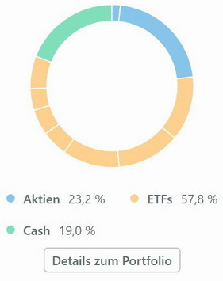

Das Wahlpflichtmodul Technisches Trading
========================================

[zurück zur Hauptseite...](https://informatik-mannheim.github.io/iExpo-Winter-2021/)

Dozent: Prof. Dr. Frank Dopatka
-------------------------------

In der Wahlpflichtveranstaltung Technisches Trading der Hochschule Mannheim geht es um die Grundlagen im Zusammenhang mit der Börse, darunter Themenbereiche wie Grundbegriffe, Risikomanagement, Börsenprodukte, Analysemodelle, Trading-Strategien und Börsenpsychologie. 
Die Veranstaltung setzt sich aus mehreren Teilbereichen zusammen aus denen später eine gemeinsame Prüfungsleistung ermittelt wird, diese sind zum einen das eigenständige Management eines Wikifolios, das erstellen eines Lehrvideos zu einem speziellen Themenbereich der Vorlesung und einen schriftliche Ausarbeitung zu einem nicht in der Vorlesung genannten Thema, vorzugsweise etwas Aktuelleres.

# Wikifolio

Das Wikifolio ist eine Plattform in der man sowohl selbst Aktien in einem Portfolio, als auch bereits von anderen erstellte Portfolios zusammenfassen kann. Im Rahmen dieser Veranstaltung sollten wir ein eigenes Portfolio über die Dauer eines Semesters managen, Ziel dabei war es das Porfolio zusammenzustellen, dass am Ende die beste Performance erzielen würde. 
Als Startbedingung hatten wir ein Musterportfolio mit einem Startkapital von einer Millionen Euro, dass es nun intelligent und effizient anzulegen gilt, die Ansätze dabei, ob Day Trading oder Buy and Hold etc., sind frei wählbar. 

## Mein Trading-Ansatz

Mein Ansatz bestand zu 50% aus einem breit gefächertem ETF Anteil der langfristig gehalten werden sollte. Diese setzten sich wie folgt Zusammen: 55% Industrieländer, 25% Schwellenländer, 10% Rohstoffe, 10% Immobilien.  
Der Industrieländeranteil setzte sich weiterhin aus 40% Nordamerika, 44% Europa und 16% Asien-Pazifik zusammen.
10% des Portfolios sollten langfristig in ausgewählte Blue Chips angelegt werden, bevorzugt wurden größtenteils Aktien aus dem Tech-Umfeld.  
15% des Portfolios sollten lang- bis mittelfristig in nach der Fundamentalanalyse Unterbewertete Wertpapiere investiert werden. 
15% des Portfolios sollten kurz- bis mittelfristig aktiv in Wertpapiere investiert werden, Kauf- und Verkaufsignale sollten hier durch die Chart-Analyse ausfindig gemacht werden. 
10% des Portfolios sollten als finanzieller Liquiditätspuffer dienen und hätten bei Bedarf überall eingesetzt werden können.
Tatsächlich blieb der Liquiditätspuffer aber größer (bei ungefähr 19%) als vorgesehen, dafür blieb der Anteil an kurz- bis mittelfristigen Wertpapieren aufgrund des hohen Analyseaufwands weg. Auch der ETF Anteil war am ende etwas höher als vorgesehen (etwa 57,8%)

## Meine erzielte Performance

## Meine Asset Allocation

# Lehrvideo zum Unterthema Chartformationen, Wiederstand und Unterstützung

Im Lehrvideo bestand die Aufgabe darin ein bereits behandeltes Thema der Vorlesung verständlich zu erklären, ohne dabei nur den bereits bekannten Stoff vorzulesen. Oft, sowie auch bei mir, wurde das durch eine Praktische Herangehensweise erledigt. Da mein Thema (Chartformationen, Wiederstand und Unterstützung) aus der Chartanalyse kommt, machte ich mein Video auch anhand eines echten Charts. Ich erklärte die bekannten Chartformationen, wie man sie in einem Chart ausfindig machen kann und was sie bedeuten, genau so erklärte ich die Wiederstände und Unterstützungen praktisch indem ich vermutete einzeichnete und daraufhin auf ihre Qualität in der Vergangenheit überprüfte. 

# Schriftliche Ausarbeitung zum Thema Algorithmisches Trading und Robo-Advisor

In der schriftlichen Ausarbeitung sollten wir ein noch eher unberührtes Thema, welches wir uns im Vorfeld unter Absprache mit dem Professor selbst aussuchen durften, anhand wissenschaftlich fundierten Quellen erklären. Mein Thema war Algorithmisches Trading und Robo-Advisor, ich erklärte in meiner Arbeit zunächst beide Begriffe und ging näher auf die funktionsweise ein, besonders im Hinblick auf das algorithmische Trading. Beim Robo-Advisor-Part war es mir wichtig die Vor-, sowie Nachteile gegenüber zu stellen um eine Aussage über deren Nutzen treffen zu können, sowie eine Aussage über die Entwicklung beider Technologien in der Zukunft. 

[zurück zur Hauptseite...](https://informatik-mannheim.github.io/iExpo-Winter-2021/)