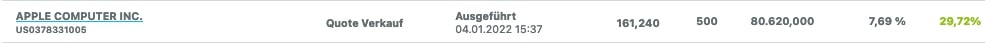
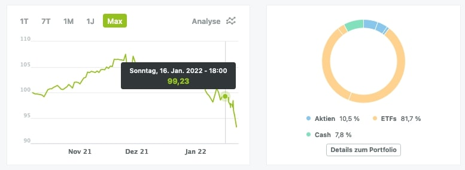

[zurück zur Hauptseite...](https://informatik-mannheim.github.io/iExpo-Winter-2021/)

Das Wahlpflichtmodul Technisches Trading
========================================

Dozent: Prof. Dr. Frank Dopatka
-------------------------------

# Cihad Aydemir

## Einleitung
Bei dem Kurs "Technisches Trading", welches von Prof. Dr. Dopatka angeboten wird, geht es darum grundlegende Defintionen und Strategien zum Handel mit Aktien und ähnlichen Wertpapieren zu lernen. Dabei werden die Themen ausführlich in Videoaufzeichnungen von Prof. Dr. Dopatka behandelt. Zusätzlich gibt es wöchentliche Frage- und Diskussionsrunde bei denen offene Fragen und interessante Themen behandelt werden können.

## Aufbau
Der Kurs "Technisches Trading" besteht dabei aus drei verschiedenen Bestandteilen aus denen man jeweils Punkte sammeln kann. Diese sind zu einem die "Wikifolio"-Platffrom auf der man über die Dauer des Vorlesungszeitraums durch Handeln mit Aktien Punkte sammeln kann. Desweiteren ist es möglich mit dem Lehrvideo Punkte zu sammeln in dem der Studierende ein Thema aus den Foliensätzen von Prof. Dr. Dopatka aussucht und diesen in einem Lehrvideo ausführlich und übersichtlich erklärt. Gemeinsam mit dem Lehrvideo wird auch die Ausarbeitung in Form eines Videos oder einer schriftlichen Ausarbeitung abgegeben, welches ebenfalls Punkte bringt.

### Wikifolio
Auf der Plattform "Wikifolio" haben wir zu Beginn des Kurses einen Kapital von 1.000.000€, um unser Portfolio zu erstellen. Hierbei habe ich versucht mit einem großen Anteil meines Kapitals auf wertstabile Aktien und ETF's zu setzen, um das Risiko größerer Verlüste gering zu halten. So konnte ich über den größten Teil des Semesters einen zwar nicht all zu hohen, dennoch stabilen Wert einzuhalten. Aufgrund fehlender Erfahrung in Themen Stop-Loss-Order's habe ich in ein paar der Aktien den perfekten Zeitpunkt zum Verkauf der Aktien verpasst und habe dadurch größere Verlüste eingefahren. Zudem trugen ein paar schlecht ausgewählte Aktien dazu bei meinen Index noch weiter in den Minus Bereich zu führen. Dennoch habe ich es durch gute Trades, wie der Verkauf meiner Apple-Aktien zu einem Gewinn von 29% (siehe folgende Abbildung), meinen Index zu stabilisieren.

So konnte ich zur letzten Indexmessung am 16.01.2022 den praktischen Teil des "Technischen Trading"-Kurses mit einem Index von -1,4896% also einem Wert von 99,20€ abschließen.

### Lehrvideo: Anleihen - Anhand von praktischen Beispielen erklärt
Für das zu erstellende Lehrvideo habe ich mich für das Thema "Anleihen" entschieden. Wie man bereits an meinem Portfolio im praktischen Teil erkennen kann liegen wertsichere und risikoarme Investitionen in meinem Interessengebiet, so bat sich das Thema "Anleihen" sehr gut an, da diese auch von vielen Experten als wesentlich risikoärmer als der Handel mit Aktien angesehen wird. Hierbei habe ich versucht anhand von praktischen Beispielen die Grundmerkmale, Definitionen der Anleihen, den Handel mit Anleihen und die verschiedenen Arten von Anleihen zu erklären. Besteht Interesse zu diesem Video, so kann man sich dies mit einem Klick auf die nachfolgende Abbildung anschauen. 

 
 **Anleihen erklärt an praktischen Beispielen (Cihad Aydemir)**
### Ausarbeitung: Auswirkungen der Corona-Pandemie auf die Wirtschaft

Für die Ausarbeitung habe ich mir das Thema "Auswirkungen der Corona-Pandemie auf die Wirtschaft" ausgesucht, da dies ein sehr aktuelles und wichtiges Thema ist, welches uns alle auf eine Art und Weise betrifft. So habe ich versucht die Auswirkungen der Pandemie aufzuzeigen in dem ich Analysen in verschiedenen Bereichen und Unternehmen geführt habe. Zusätzlich habe ich einen Einblick in die Entwicklung des Arbeitsmarktes  und auch den langfristigen Veränderungen gewährt.

## Fazit

Der Kurs "Technisches Trading" gewährt den Studierenden einen sehr guten Einblick in die Welt der Börse und ermöglicht es wichtige Kenntnisse zu gewinnen. Selbst für jemanden wie mich der bisher keinerlei Erfahrung in diesen Themen hatte, war es möglich sehr viel Erfahrung zu sammeln und neues zu lernen. Zudem macht das kompetitive Format des praktischen Teils das ganze noch einmal spannender und setzt einen sehr guten Reiz besser zu werden. 

[zurück zur Hauptseite...](https://informatik-mannheim.github.io/iExpo-Winter-2021/)
