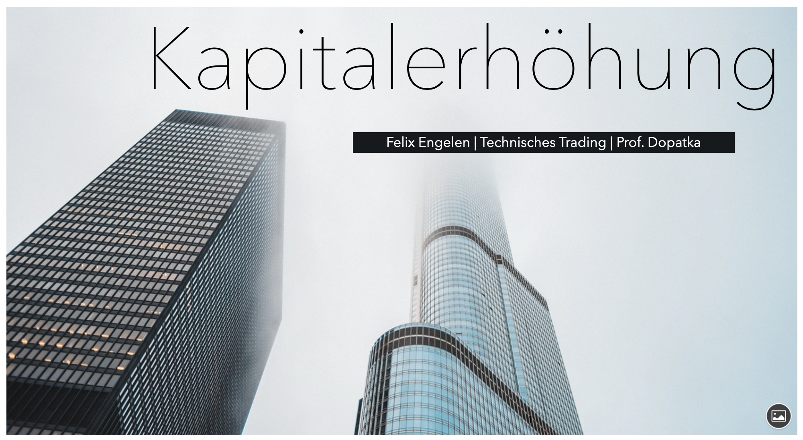
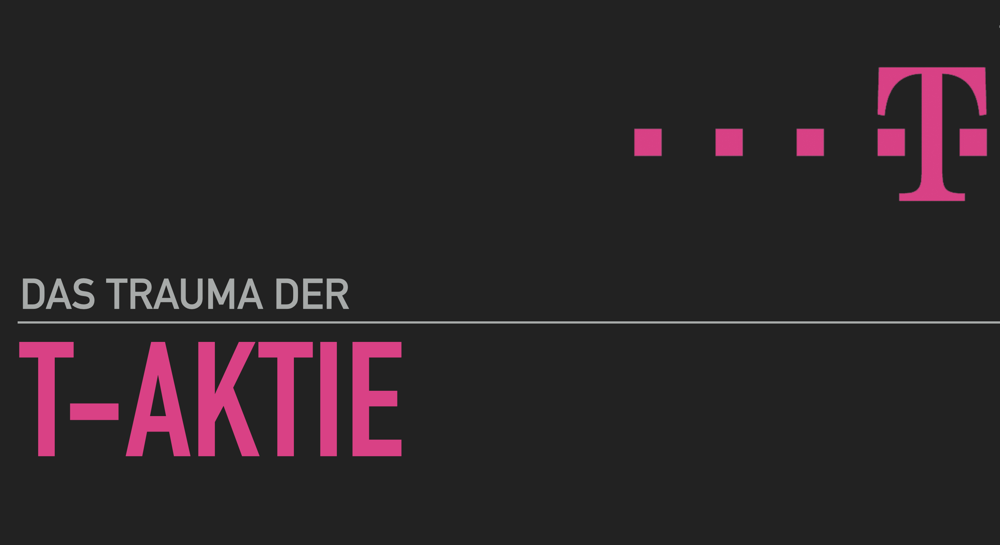

# Das Wahlpflichtmodul Technisches Trading

[zurück zur Hauptseite...](https://informatik-mannheim.github.io/iExpo-Winter-2021/)

## Überblick

In der Wahlpflichtveranstaltug "Technisches Trading" werden umfassend die Grundlagen zum Thema Aktienhandel mithilfe eines ausführlichen Foliensatzes beschrieben. Dieser Foliensatz ist eigenständig durchzuarbeitet und aufkommende Fragen können dann an einem festen Termin, der  wöchentlich stattfindet, besprochen werden. Die Veranstaltung besteht aus drei verschiedenen CA-Abgaben die in Einzelarbeit zu bearbeiten sind. 

Bei CA 1 handelt es sich um die Pflege eines eigenen Depots mit Spielgeld über die Social-Trading-Plattform Wikifolio. Diese Verwaltung erstreckt sich über einen Zeitraum von etwa drei Monaten. Dabei wird zu Beginn eine Referenzmessung des Depot-Wertes erhoben. Nach etwa drei Monaten wird eine finale Indexmessung gemacht und die Performance zur Anfangsmessung berechnet. Die Teilnehmer der Veranstaltung agieren mit ihren Depots in einer Art Konkurrenzkampf, da das Depot mit der besten Performance den Maßstab für die Punkteverteilung vorgibt. Bei der Verwaltung des Depots sind gewisse Vorgaben zu beachten.

In CA 2 ist ein Lehrvideo in Eigenarbeit von den Teilnehmern zu erstellen. Dabei können die Themen selbst ausgesucht werden, natürlich muss ein Bezug zum Aktienhandel vorhanden sein und sollen in diesem Format den bereits existierenden Foliensatz ergänzen. Mit der Erstellung des Lehrvideos kann jederzeit, nach abgenommenem Thema, begonnen werden. 

Die letzte Aufgabe - CA 3 - besteht aus einer Ausarbeitung zu einem Thema mit Bezug zum Aktienhandel. Dieses Thema soll zusätzlich einen aktuellen Bezug haben. Dabei kann jeder Teilnehmer selbst entscheiden welches Format er für diese Ausarbeitung wählt. Entweder kann wieder ein Video-Format gewählt werden oder die Ausarbeitung in Textform erarbeitet werden. Dabei ist zu beachten, dass die Anforderungen an die Ausarbeitung, die einer wissenschaftliche Arbeit sind. Beispielsweise muss die Literatur aus qualitativen Quellen bestehen. 

Bei den drei CA-Aufgaben können jeweils 40 Punkte erworben werden und somit ein Punktestand von 120 Punkten erreicht werden. 

Soweit zum organisatorischen Ablauf der Veranstaltung.

***

## Eigene Erfahrungen

### Wikifolio

Das Wikifolio unterliegt gewissen Vorgaben. Während des gesamten Zeitraumes muss mindestens 50% des Geldes immer investiert sein. Dazu muss jeder Trade mindestens eine Stunde gehalten werden, bevor dieser wieder verkauft werden kann.

Der Start mit dem Wikifolio war recht positiv. Bereits nach wenigen Tagen schnellte das Depot mit mehreren Prozent ins Plus. Das gewählte Risikomanagement bestand darin mehr als 50% des Geldes in einem oder auf mehrere ETF's verteilt zu investieren. Dadurch sollte ein kontinuierlicher Anstieg von zumindest 50% des Geldes gewährleistet sein. Die restlichen 50% wurden in Einzelaktion investiert. Sehr empfehlenswert bei der Diversifikation ist zudem die Verwendung von einem Stop-Loss-Limit bei jedem Trade zu setzen, da so der Verlust begrenzt wird. Aus eigener Erfahrung hätte dies das Depot vor größeren Schwankungen verschont. Großen Einfluss auf die Trades, kann die Beobachtung der Konkurrenz-Depots nehmen, da natürlich jeder die beste Performance erreichen möchte. Auch das Thema Copy-Trading wird oft angewendet, dadurch können jedoch auch schnell Verluste verbucht werden. Daneben werden gerade zum Ende des Zeitraumes oftmals viele Spekulationen getroffen, um das eigene Depot mit erhöhtem Risiko ins Plus schnellen zu lassen. Auch spekulative Trades für schnelle Erfolge werden immer stärker in Betracht gezogen. Diese haben beispielsweise zu einem erheblichen Einbruch der Performance meines Depots geführt, da oftmals auch kein Stopp-Loss-Limit gesetzt wurde. Ebenso ist die Verwendung von Hebelprodukten weniger zu empfehlen, da in den meisten Fällen ein hoher Verlust eingebüßt wird. Das eigene Risikomanagement wird dann oftmals komplett vernachlässigt. Natürlich ist das Pflegen eines Depots recht spekulativ und es braucht auch Glück, um eine gute Performance zu erreichen. Dadurch dass kein echtes bzw. eigenes Geld für die Depots verwendet wird, ist auch die Risikobereitschaft deutlich höher, als es im privaten Depot der Fall ist. Definitiv konnten so unterschiedliche Erfahrungen gemacht werden und viele Erkenntnissen gesammelt werden, die den privaten Aktienhandel in Zukunft prägen werden. 

***

### Lehrvideo

Für das Lehrvideo ist eine Videolänge von mindestens zehn Minuten vorgegeben. Das Thema des Lehrvideos konnte sich jeder Teilnehmer selbst aussuchen, aus dem Foliensatz. Zusätzlich zu dem Foliensatz konnten beliebige weitere Materialien hinzugezogen werden. Auch die Ausgestaltung der Lehrvideos ist sehr frei und jedem selbst überlassen. Diese Aufgabe führt dazu sich mit einem Thema intensiver auseinanderzusetzen. Beispielsweise das Thema Kapitalerhöhung. Daneben muss die Struktur ähnlich wie bei einer Präsentation ausgearbeitet werden und eigene Gedankengänge veranschaulicht werden. Das Thema muss dazu in den Gesamtkontext eingeführt werden und mit eigenen Erfahrungen oder realen Beispielen veranschaulicht werden. Durch das Videoformat sind viele mit einer neuen ungewohnten Herausforderung konfrontiert. Dadurch konnten viele Erfahrungen im Bereich Videodreh und -schnitt gesammelt werden, welche viele Teilnehmer wahrscheinlich ohne diese Veranstaltung nicht in dieser Form erhalten hätten. 

Neben der Einarbeitung in das Thema bestand die Herausforderung für Ungeübte im Bereich Videodreh vor allem darin das Video lebendig zu gestalten und eine konsistente Struktur zu verfolgen. Das komplette Video in einem Durchgang aufzunehmen ist dabei nicht zu empfehlen. Oft werden Animationen zu spät aktiviert oder man verspricht sich. Bei einer Präsentation ist dies kein großes Problem, aber in einem Video stört jeder Versprecher. Deswegen bietet es sich an das Video in kleinere Videos aufzuteilen und diese aufzunehmen. Und dann im Nachgang zusammenzuschneiden. 

#### Thema

Was wird unter einer Kapitalerhöhung verstanden?

Eine Kapitalerhöhung wird von Gesellschaften vollzogen, um das Eigenkapital und damit die Liquidität zu erhöhen. Dazu geht die Gesellschaft hin und gibt neue Aktien, also Anteile an der Gesellschaft aus. Diese neuen Aktien werden junge Aktien genannt. Durch die Ausgabe junger Aktien können Investoren diese Anteile erwerben und werden so zu einem Aktionär dieser Gesellschaft. Mit dem Zeichnen von diesen jungen Aktien erhält die Gesellschaft frisches Kapital für die jeweiligen Bedürfnisse der Gesellschaft. Dabei können die Gründe für eine Kapitalerhöhung unterschiedlicher Natur sein. Zum einen kann das frische Kapital verwendet werden, um Altschulden und damit Fremdkapital zu tilgen. Des Weiteren können neue Investitionen ermöglicht werden, bspw. für eine Firmenfusionierung. Zum anderen kann das neue Kapital bei einem Liquiditätsengpass genutzt werden, die Gesellschaft solvent zu halten. Neue Anteile führen zu einer Verwässerung der Altaktien, da nun mehr Anteile verfügbar sind. Um dieser Verwässerung entgegenzuwirken, erhalten Altaktionäre ein sogenanntes Bezugsrecht. Altaktionäre können die Weisung erteilen die jungen Aktien zu dem jeweiligen Bezugsverhältnis zu zeichnen. Das Bezugsverhältnis führt dazu, dass der Aktienbestand so weit aufgestockt werden kann, sodass die Anteile des Altaktionärs nicht mehr verwässern. Ausführliche Erklärung und einen aktuellen Bezug im Video:

{:target="_blank" rel="noopener"}

***

### Ausarbeitung

Die Ausarbeitung kann im Gegensatz zur Lehrvideo-Aufgabe auch in Textform abgegeben werden. Jedoch unterliegt die Ausarbeitung den Ansprüchen einer wissenschaftlichen Arbeit. Dadurch besteht eine Vorgabe darin nur qualitative Quellen zu verwenden. Auch bei der Ausarbeitung kann das Thema frei gewählt werden, jedoch wird ein aktueller Bezug vorausgesetzt. Durch die gemachten Erfahrungen aus der Lehrvideo-Aufgabe kann jeder Teilnehmer gut abschätzen in welchem Format die Ausarbeitung bearbeitet werden soll. Der Großteil entschied sich für das Videoformat. Dadurch, dass jeder das eigene Thema wählen konnte, bestand auch ein Interesse dahinter sich damit intensiv auseinanderzusetzen. Dementsprechend unproblematisch ist die Erstellung der Ausarbeitung im Videoformat. 

#### Thema

Das Trauma der T-Aktie.

Bei der T-Aktie handelt es sich um Anteile der Gesellschaft „Deutsche Telekom AG“. Im Jahr 1996 war der Börsenstart der Telekom und verleitete unzählige Anleger zum Zeichnen dieser Aktien. Der Aktienkurs schoss vermeintlich unaufhaltsam in die Höhe. Dadurch entstand in Deutschland eine Welle der Euphorie für den Kauf von T-Aktien.  Ein paar Jahre später brach jedoch der Aktienkurs unaufhaltsam ein und viele private Anleger verloren existenzbedrohende Geldsummen. Der Kursabfall folgte aus unterschiedlichen Gründen. Dabei auch Gründe, die die Telekom bereits wusste, jedoch nicht frühzeitig publiziert hatte. Dies führte dazu das immer mehr Anleger klagten und zum Ende knapp 16.000 Anleger bis heute mit einem Verfahren gegen die Telekom standhielten. Bis im November 2021 dann nach über 20 Jahren ein Urteil und eins Angebots seitens Telekom für die betroffenen Anleger ausgesprochen wurde. 

Diese Erfahrung prägte zwei Generationen und ist noch heute, nach über 20 Jahren, bei vielen Deutschen ein Grund die Finger weg vom Aktienhandel zu halten. 

{:target="_blank" rel="noopener"}

***

Die Veranstaltung "Technisches Trading" ist für jeden zu empfehlen, der bereits im Privaten den Handel mit Aktien betreibt oder dies in Zukunft in Betracht zieht. Auch für Unerfahrene ist mit dieser Veranstaltung ein sehr guter Einstieg in die Welt des Aktienhandel gegeben. Studierende mit Interesse an Aktien kommen vollumfänglich auf ihre Kosten.

[zurück zur Hauptseite...](https://informatik-mannheim.github.io/iExpo-Winter-2021/)