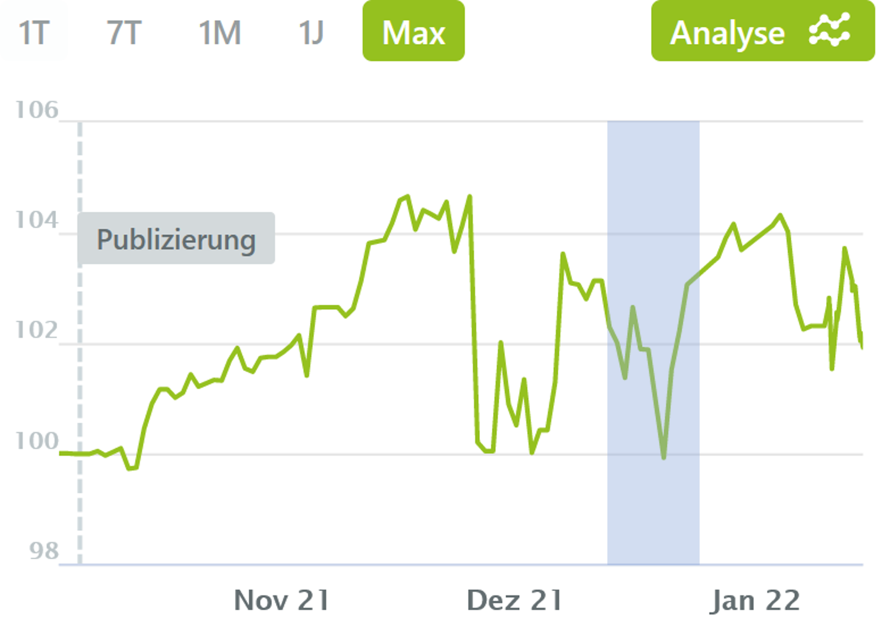

[zurück zur Hauptseite...](https://informatik-mannheim.github.io/iExpo-Winter-2021/)

Das Wahlpflichtmodul Technisches Trading
========================================

Dozent: Prof. Dr. Frank Dopatka
-------------------------------

# Johannes Günther

# Wie fühlt es sich an, ein Händler zu sein?

Ein Händler muss grundsätzlich nur folgende Dinge machen: Kaufen, Verkaufen und Geld verdienen. Aber wie schwer ist das eigentlich und was muss man über die Regeln wissen, damit man das möglichst lange durchhält ohne Bankrott zu gehen? Im Wahlfach _Technisches Trading_ konnten wir Studierende dieser Fragen in der Praxis nachgehen. Die gewonnenen Erkenntnisse werden dabei für Interessierte im Internet zur Verfügung gestellt.

Über die Ergebnisse des Studenten _Johannes Günther_ können Sie an dieser Stelle etwas erfahren.

---

## I. Wikifolio - Kaufen, Verkaufen und Geld verdienen

Über die Plattform [Wikifolio](https://www.wikifolio.com/de/de/home){:target="_blank" rel="noopener"} kann sich jeder einmal wie ein Trader fühlen. Dazu ist nur ein Musterportfolio zu erstellen, bevor man zu realen Kursen seine Handelsideen ohne Risiko von finanziellen Verlusten umsetzen kann. Das Ziel war es nun innerhalb des Semesters mit einer Handelsstrategie und einem virtuellen Handelskonto, die größtmögliche Rendite zu erzielen.

**Handelsidee**

Die Handelsidee des vorliegenden Portfolios beschränkte sich auf die passive und zeitarme Strategie des _Buy'n'Hold_. Genauer wurde nach den Ansätzen, die Gerd Kommer in seinem Buch _Souverän investieren mit Indexfonds und ETFS_ beschreibt, eine Indexing-Strategie verfolgt, also eine Nachbildung des gesamten Marktes. 

{:target="_blank" rel="noopener"}

[Portfolio Startseite]

Auch wenn sich laut dem allgemeinen Wissen ein Buy'n'Hold-Ansatz nicht unter den Begriff des _Tradings_ oder _aktiven Handelns_ fällt, ist dennoch ein Zeitraum von 4-Monaten noch zu kurz, um die Strategie als langfristiges Investieren zu klassifizieren. Wir bewegen uns hier in einer Grauzone, was diese Strategie betrifft.

Aus dem Gesichtspunkt der Pflege hält sich hier der Zeitaufwand in absoluten Grenzen. Die Strategie bildet den Markt ab und das über kostengünstige ETFs. Lediglich würde auf längeren Zeiträumen ein Rebalancing anfallen, also die Wiederherstellung der anfänglich bestimmten prozentualen Aufteilung des Portfolios.

{:target="_blank" rel="noopener"}

[Portfolio Startseite]

**Ergebnis**

Kurz vor dem Ende des Semesters steht das Portfolio in einem leichten Plus bei 1,9% (Stand: 2022-01-15 11:12) gemessen seit dem 01.10.2021. Die Korrelation mit dem Markt als solches kann auch aus dem Vergleich mit anderen bekannten Indizes abgeleitet werden.

[Portfolio Startseite]{:target="_blank" rel="noopener"}

Dennoch unterliegt man mit diesem Ansatz allen (ja wirklich _ALLEN_) Schwankungen, die der Markt so in einem 4-Monats-Zeitraum erlebt. So werden sie sich sicher auch noch aus den Nachrichten über die Entdeckung einer neuen noch gefährlicheren Mutation erinnern, die erneute Sorgen in dieser pandemischen Lage in die Welt gebracht hat. Der Markt hat auch diese Information verarbeitet und somit den Wert dieses Portfolios Ende November auf seinen Startwert zurückgesetzt.

[Portfolio Startseite]{:target="_blank" rel="noopener"}

Anfang des Jahres ist auf dem Verlauf ein erneuter Rücksetzer zu sehen. Dieser lässt sich sicher nicht auf eine Nachricht zurückführen. Dennoch wird mitunter die Entscheidung der US-amerikanischen Notenbank _Federal Reserve (FED)_ Einfluss gehabt haben, welche vereinfacht ausgedrückt weniger Geld in die Weltmärkte einbringen wird.

[Portfolio Startseite]{:target="_blank" rel="noopener"}

---

## II. Lehrvideo - Idee der Zertifikate

**Discount-Zertifikate**

Alles wird teurer. Benzin, Holz, Strom, etc. Die Inflation steigt stetig in Deutschland. Da freut man sich doch, wenn es etwas vergünstigt gibt. Nein, ich rede hier nicht vom Wochenend-Angebot für das Kilo-Kartoffeln beim Discounter um die Ecke, sondern um vergünstigte Investments in ein Finanzinstrument. _Discount-Zertifikate_ versprechen genau das. Ein Investment in ein Finanzinstrument, das man billiger erhalten kann, als es momentan am Markt gehandelt wird. Welche Chancen, aber auch besonders welche Risiken es bei diesem Finanzinstrument gibt, erfahren Sie im [Abschnitt _Discount-Zertifikate_](https://www.youtube.com/watch?v=ns_0GfwBqB4&t=598s) des Lehrvideos.

**Express-Zertifikate**

Auf der Such nach profitablen Geldanlagen mit wenigstens ein bisschen Rendite müssen Privatkunden meistens immer tiefer graben. Produkte mit dem Namen "Sommerzins" erwecken ein Gefühl von Sicherheit und Rendite gleichzeitig. Was sich aber unter der Haube solcher Produkte doch verbergen kann, sind komplizierte strukturierte oder derivative Finanzprodukte wie _Express-Zertifikate_. Was das ist und vor allem wie das überhaupt funktioniert, das eine "gesicherte" Rendite angeboten werden kann, erfahren Sie in [Abschnitt _Express-Zertifikate_](https://www.youtube.com/watch?v=ns_0GfwBqB4&t=1554s) des Lehrvideos.

---

## III. Ausarbeitung - Handelsunterbrechungen an der _New York Stock Exchange (NYSE)_

Auch wenn man in der heutigen Zeit aus der Finanzwelt häufig von Skandalen, Inflation und Crashs hört, könnte man meinen, dass das System von bösen Leuten durchkreuzt ist. Dennoch gibt es immer parallel auch Bestrebungen die Investoren in dieser Welt zu schützen. 
Im März 2020 wurde in Folge der starken Abwertung bedingt durch das Coronavirus an der NYSE mehrere Male innerhalb weniger Tage ein automatischer Schutzmechanismus ausgelöst, der dafür sorgen soll, dass der Handel mit Finanzinstrumenten ruhig und besonnen bleibt. Auch wenn dieser Schutzmechanismus die Investoren beschützen soll, darf sicher auch dir Frage gestellt werden, ob das überhaupt die gewünschten Effekte bringt, denn Crash bleiben deswegen nicht aus. Eine Untersuchung dieser Frage finden Sie in diesem Video.

## Fazit - Und wie ist es jetzt ein Händler zu sein?

Auch wenn es vermutlich keinem der Studierenden gelang, vollumfänglich in die Rolle eines selbständigen Händlers einzusteigen, konnte ich persönlich bereits aus dem Interagieren mit dem Material Erfahrungen mitnehmen.

Dem tagtäglichen Druck ausgesetzt zu sein, den eigenen Lebensunterhalt zu verdienen in einem System dessen Ausgang man selbst nicht bestimmen kann, stelle ich mir mehr als nur stressig vor. Allein die Tatsache, dass Teile der Note von der Performance des Wikifolios abhängen, machten mir am Anfang schwitzige Hände. Allerdings habe ich meine Strategie daraufhin so gewählt, dass der eigene Zeitaufwand dafür begrenzt ist, denn mein Einfluss auf dieses Ergebnis ist es ebenso.

Darum habe ich mich dazu entschieden den größten Teil der Zeit, den ich für die Vorlesung aufgewendet habe, dem Lehrvideo und Ausarbeitung zu widmen deren Ergebnisse ich beeinflussen konnte.

Jeder Händler hat hier einen anderen Ansatz, wie an diese Themen heranzugehen ist. Darum ermuntere ich Sie auch die Erfahrung der anderen Kommilitonen durchzulesen, da jede Strategie so individuell wie die Person ist.

Ich hoffe sie konnten etwas aus den erarbeiteten Materialien mitnehmen.

Vielen Dank und bis bald.

[Portfolio Startseite]: https://www.wikifolio.com/de/de/w/wf0caymans "Portfolio Startseite"

[zurück zur Hauptseite...](https://informatik-mannheim.github.io/iExpo-Winter-2021/)
