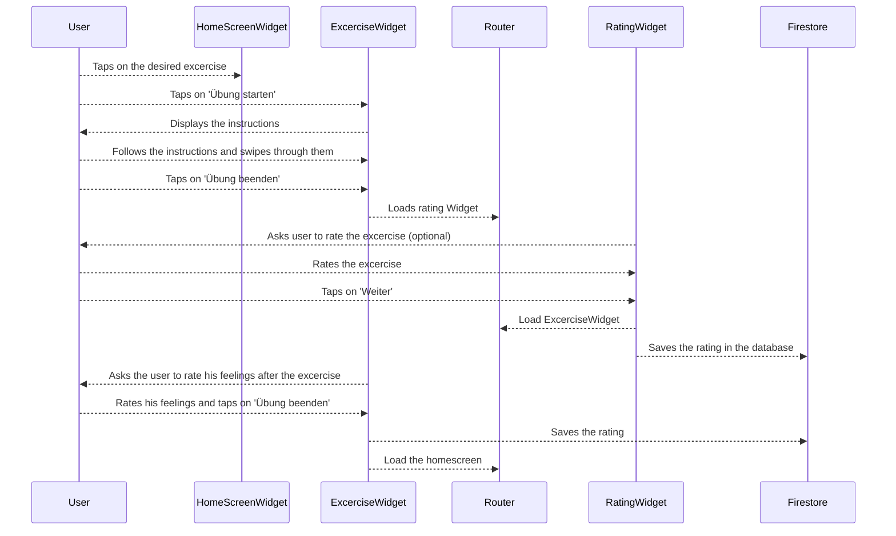
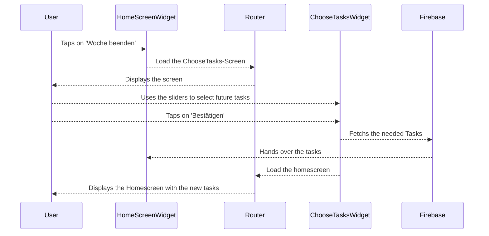

# Mentalport

**Mentalport** ist eine Applikation, die psychologische Hilfe bietet und als Zwischenanlaufstelle noch vor dem Besuch bei einem Psychologen dient. Sie kann auch als schnelle Hilfe bei Alltagsproblemen zur Hand genommen werden und bietet umfassende Funktionen und Hilfestellungen, die im Folgenden vorgestellt werden.

# Die App und ihre Funktionen

Im Nachfolgenden werden die Screens der Applikation vorgestellt und kurz ihre jeweilige Funktion erläutert.

## Login und Registrierung

Wenn man die App startet bekommt man kann man sich einloggen oder neu registrieren.

Man kann sich nun registrieren oder einloggen, wenn man bereits einen Account hat.

## Das psychologische Profil

Nach dem erstmaligen einloggen bekommt man eine Reihe von Fragen gestellt. Diese dienen dazu ein psychologisches Profil zu erstellen und die Bereiche zu erfragen, die einem beim Benutzen der App am wichtigsten sind. Man kann diese Befragung jederzeit erneut durchführen und die ausgewählten Bereiche ändern.

## Hauptfunktionen der App

In diesem Kapitel werden die wichtigsten Funktionen der App erläutert und anhand von Screenshots veranschaulicht.

### Der Home Screen

Das Herzstück von **Mentalport** ist der Home Bildschirm. Hier findet man die wichtigsten Funktionen schnell und einfach auf einen Blick. Die Kernfunktionen beinhalten:

 - Das **Nutzerprofil** mit dem **Stimmungstracking**
 - Die **Einstellungen**, in denen man auch seine Bereiche neu erfragen kann
 - Die wöchentlichen **Übungen**
 - Die **Favoriten** Liste
 - Eine **Chat** Funktion (wird in der Zukunft noch implementiert)
 - Den **Notfallkoffer**
 - Die tägliche **Routine**
 - **Aktuelles** (wird in der Zukunft noch implementiert)
 
 

### Die Übungen

Die wichtigste Funktion der App sind die **Übungen**. Sie gehören zu der täglichen Routine des Nutzers und bieten dem eine gute Hilfestellung. Die Übungen, die dem Nutzer angezeigt werden sind auf Basis des psychologischen Profils und der ausgewählten Bereiche für jeden Benutzer individuell. Jede Übung bietet eine Anleitung, wie die Übung auszuführen ist.

Nachdem man eine Übung durchgeführt hat kann man diese bewerten. Die Bewertung, die man den Übungen gibt wird in die Auswahl der Übungen für die kommenden Wochen mit einbezogen. Außerdem erhält man für jede Übung eine Punktzahl. In der Zukunft werden diese Punkte dazu benutzt ein **Level-System** einzubauen, mit dem man sich durch das abschließen von Übungen verschiedene Belohnungen erarbeiten kann. Dies dient dazu die App etwas spielerischer zu gestalten und den Nutzer dazu zu motivieren am Ball zu bleiben.

Nachdem man alle Übungen für eine Woche abgeschlossen hat kann man auf den **"Woche beenden"** Button drücken um die Übungsanzahl für die darauffolgende Woche sowie den Anteil an großen Übungen darin auszuwählen. Man kann dies auch vorzeitig tun ohne alle Übungen abgeschlossen zu haben, aber empfohlen ist es zuerst alle Übungen einer Woche zu bearbeiten.

### Die Favoriten

Mit antippen des **Herz** Symbols kann man eine Übung den Favoriten hinzufügen. Tippt man nun in der Navigationsleiste auf das **Favoriten** Icon, so kann man dort auf einen Blick alle seine favorisierten Übungen sehen.

### Nutzerprofil und Stimmungstracking

Das **Benutzerprofil** bietet mehrere Funktionen. Unter dem Reiter **Stimmung** kann man das **Stimmungstracking** starten und so seine Stimmungslage aufzeichnen.

Unter **Fortschritte** sieht man seinen aktuellen Level und den Punktestand. Man kann außerdem in der Übungshistorie die zuletzt bearbeiteten Übungen sehen.

Unter **Insights** kann man seinen Stimmungsverlauf sowohl Grafisch als auch Textuell sehen.

Im **Stimmungstracking** kann man seine vergangenen Stimmungen einsehen und seine aktuelle Tagesstimmungs dokumentieren. Man kann dies sehr rudimentär tun oder auch bis ins Detail. Eine detaillierte Stimmungsaufzeichnung hilft dabei die Übungen und Hilfestellungen individuell auf den Nutzer zuzuschneiden.

### Der Notfallkoffer

Der **Notfallkoffer** bietet dem Nutzer der App schnelle Hilfe bei akut auftretenden Problemen. Er bietet eine Notruf Taste, sowie verschiedene Anlaufstellen für unterschiedliche Probleme. Außerdem findet man hier einige spezielle Übungen, die dazu dienen eine schnelle Hilfe darzustellen und beruhigend zu wirken.

### Die tägliche Routine

Dieses Feature stellt eine Art To-Do-Liste bereit, in der man seine täglichen Aufgaben eintragen und auch abhaken kann. Es soll dazu dienen einen geregelteren Alltag zu bekommen. Per antippen der Glocke kann man Benachrichtigungen aktivieren und mit der Pfeiltaste kann man die Reihenfolge seiner Todos ändern.

### Die Einstellungen

Unter diesem Menüpunkt kann man verschiedene Einstellungen treffen, die helfen die Applikation individueller zu gestalten. Unter anderem kann man hier auch die Abfrage für das psychologische Profil erneut durchführen, wenn man das Gefühl hat es hat sich etwas geändert.

### Das Menü

Hier findet man nochmals einige wichtige Punkte über das Mentalport Team und dessen Service. Auch eine persönliche Beratung lässt sich über dieses Menü absprechen.

### Weitere geplante Features

 - **Chatfunktion** - Eines der wichtigsten für die Zukunft geplanten Features ist die Chatfunktion. Der Nutzer soll hiermit die Möglichkeit erhalten das Mentalport Beratungsteam schnell und einfach zu erreichen, um sich dort individualisierte Hilfe holen zu können.
 - **Gameification** - Die App soll in der Zukunft durch ein ausgeklügeltes Punkte- und Belohnungssytem spielerisch gestaltet werden, sodass der Nutzer etwas für seinen mentale Gesundheit tun und dabei Spaß haben kann. 
 - **Aktuelles** - Diese Funktion soll dem Nutzer die Möglichkeit bieten übersprungene Übungen einzusehen und im Nachhinein noch zu bearbeiten.
 - **Verschiedene Menüpunkte** - Einige der Menüpunkte verweisen zum aktuellen Stand nur auf die Mentalport Webseite und sind noch nicht individualisiert. Dies wird in der Zukunft noch implementiert.
 - **Machine-Learning-Algorithmus** - Ein Machine-Learning-Algorithmus soll speziell für die App entwickelt werden, der die Antworten der Nutzer auswertet und diese in die Übungsauswahl mit einbezieht. Dies soll für ein hohes Maß an Individualisiserung sorgen und dem Nutzer das Gefühl geben, dass seine Entscheidungen und Bewertungen wichtig sind und zu erkennbaren Änderungen führen.
 - **Bearbeitungssektion in Übungen** - Die Übungen müssen aktuell noch mit Stift und Papier bearbeitet werden. Dies soll aber in Zukunft direkt in der App passieren.
 - **Push Notifications** - Es sollen push notifications eingefügt werden, die den Nutzer daran erinnern seine täglichen Übungen zu erledigen. Das ganze soll nicht aufdringlich wirken, hat aber einen wichtigen psychologischen Effekt bei dem Nutzer, um mentale Gesundheit in dessen Lifestyle zu integrieren.

# Warum Mentalport?

Du hast mentale Probleme, die dich belasten, aber ein Gang zum Psychologen ist die unangenehm?
Du hast viele kleine Themen, die dir zu schaffen machen, aber die nicht ausreichen um professionelle Hilfe in Anspruch zu nehmen?
Es gibt Dinge, die du dir gerne von der Seele reden möchtest, bei denen es dir jedoch unangenehm ist sie im Kreis deiner Vertrauten anzusprechen?

Dann geht es dir wie vielen anderen auch. Auf Dauer kann es sehr belastend diese Dinge mit sich herum zu tragen. 
Die Lösung dazu heißt **Mentalport**. 
Mit der Mentalport App kannst du dir schnell, einfach und anonym Hilfe auf dein Smarphone holen!
Mehr Informationen zur Applikation gibt es auf der [Mentalport Webseite](https://mentalport.de).

## Wie kann Mentalport mir helfen?

Mentalport bietet eine Vielzahl von Übungen, die speziell von Psychologen entwickelt wurden, um Menschen durch den Alltag zu helfen und bei der Bewältigung von Problemen zu unterstützen. Die Übungen werden nicht willkürlich ausgewählt, sondern auf das psychologische Profil des Nutzers zugeschnitten.
Neben den Übungen bietet Mentalport auf eine persönliche Hilfe. Über die App kann man schnell und einfach die Mentalport Berater kontaktieren, welche freundliche und kompetente Hilfe anbieten.

## Was macht Mentalport besonders?

Das besondere an Mentalport ist, dass hier nichts verallgemeinert wird. Es wird ein psychologisches Profil erstellt, die Stimmung des Nutzers wird immer wieder aufgezeichnet und der Nutzer hat die Möglichkeit ausführliche Bewertungen für die einzelnen Übungen abzugeben. Diese Daten werden dann dazu verwendet das Hilfsangebot für den Nutzer persönlich und individuell zu gestalten. Der Nutzer hat somit selbst sehr viel Einfluss darauf welche Inhalte für ihn in der App sichtbar werden. 
Außerdem bietet Mentalport die Möglichkeit seine Probleme mit Spaß anzugehen und zu meistern. So wird Mentalport zu einer praktischen Hilfe bei verschiedensten Problemen, auf die man immer wieder mit Freude zurückgreift. Die wichtigsten Punkte, die Mentalport besonders machen sind die folgenden:

- **The new mental health livestyle** ist das Motto von Mentalport. Die Applikation bietet also nicht nur Hilfe allein, sondern bemüht sich auch diese in den Lebensstil der Nutzer mit einfließen zu lassen.
- **Mentale Gesundheit** kann mit Mentalport einfach und schnell in den **Alltag** integriert werden.
- **Push notifications**, **Stimmungstracking** und **Routinen** helfen dem Nutzer dabei seine mentale Gesundheit in dessen Alltag zu integrieren und so seine Stimmung dauerhaft zu verbessern.
- Eine **KI Implementation** sorgt dafür, dass das Angebot von Mentalport maximal auf den jeweiligen Nutzer zugeschnitten und individualisiert wird. Dazu sollen in Mentalport unter anderem Dinge, wie eine recommendation engine, Textanalysen und Verhaltensanalysen integriert werden, jedoch ohne dabei die Privatsphäre des Nutzers zu verletzen.
- Der Nutzer muss sich beim verwenden der App sicher fühlen und ein Vertrauensverhältnis muss aufgebaut werden. Daher wird sichergestellt, dass alles innerhalb der App **anonym** stattfindet.

# Technische Hintergründe

Mentalport wurde in der Programmiersprache Dart entwickelt mit Hilfe des Flutter Frameworks. Gearbeitet wurde dabei mit Android Studio. Als Backend dient Firebase mit dem Firestore als Datenbank.

## Technischer Kontext (Gesamtsystem)

Die folgende Abbildung zeigt das Gesamtsystem mit allen beteiligten Nachbarschaftssystemen. Darunter befindet sich eine Kurzbeschreibung der einzelnen Teilsysteme.

 - **User** - Der Nutzer, der die Mentalport App verwendet
 - **Phone** - Ein Smartphone auf dem die Mentalport App installiert ist
 - **Frontend** - Das Frontend stellt alles dar, was der Nutzer in der App sehen kann. Aufgebaut ist es durch verschiedene Widgets, die dann die einzelnen Screens zusammen stellen
 - **Firebase Backend** - Das Backend wurde mit Firebase entwickelt, da dies eine einfach Möglichkeit bietet ein gut funktionierendes Backend aufzubauen, es gut dokumentiert ist und bereits viele nützliche Funktionen, wie den z.B. eine Login Funktion zur Verfügung stellt
 - **Firestore Database** - Firebase liefert auch direkt eine Datenbank mit, den Firestore Dieser ist ohne Weiteres ausreichend um die Daten, die die App benötigt zu speichern und zu laden

## Struktur in der App

Die App ist in unterschiedliche Komponenten aufgeteilt und strukturiert, die im Folgenden aufgezählt und erklärt werden:

 - **app-actions** - Hier werden die Teile der App aufbewahrt, die vom Nutzer aktiv verwendet werden, um mit dem Backend  zu kommunizieren, wie z.B. die Funktion des "Woche beenden"-Buttons
 - **app-data** - Hier werden Laufzeitdaten gespeichert und genutzt, die dem Nutzer dann zur Laufzeit angezeigt werden
 - **app-widgets** - Hier befinden sich sämtliche Widgets, die dann in der App optisch angezeigt werden
 - **assets** - Hier befinden sich Bilder, die in der App dargestellt werden
 - **styles** - Hier befinden sich Stilelemente, wie Farben, die immer wieder verwendet werden
 - **util** - Beinhaltet Funktionen und Klassen, die für eine korrekte Funktionalität der App benötigt werden
 - **util-widgets** - Beinhaltet Widgets, die man nicht direkt in der App sieht, aber die immer wieder verwendet werden, z.B. Platzhalter um einen Platz zwischen den einzelnen Widgets sicher zu stellen
 - **test** - Beinhaltet Tests für die App, die benötigt werden, um eine ausreichende Qualitätssicherung zu gewährleisten
 - **anderes**  - Im lib Ordner außerhalb von Unterordnern befinden sich noch einige Dateien. Die wichtigsten davon sind die main.dart, die das Herzstück der App bildet, die pubspec.yaml, die alle verwendeten libraries enthält und die router.dart, die dafür sorgt, dass man immer auf den korrekten Screen weitergeleitet wird

## Bausteinsicht

In diesem Kapitel werden die Subsysteme Frontend und Backend in Ihre Bausteine zerlegt, um die Funktion jener Systeme besser zu verdeutlichen.

### Backend

Das Backend wurde durch **Firebase** realisiert. Da der Code hierzu nicht bekannt ist und es sich um einen Drittanbieter handelt wird es hier keine Aufstellung der einzelnen Komponenten geben. Folgende Funktionalitäten von Firebase werden für die Mentalport App verwendet:

 - **Authentication** - Firebase bietet einen authentication service, der bei Mentalport für das erstellen eines Accounts, den Login und den Logout verwendet werden.
 - **Firestore Database** - Beinhaltet die Anmeldedaten der Nutzer, sowie sämtliche Übungen, die in der App angezeigt werden
 - **Hosting** - Der Hosting Service von Firebase wurde neben dem Appstore für das Deployment einer ersten Testversion der App verwendet
 - **Functions** - Über Firebase kann man sogenannte Cloudfunctions verwenden. Hierüber läuft die Picker Funktion, die die Übungen auswählt, die zu dem Nutzer passen und ihm angezeigt werden.
 - **Machine Learning** - In Zukunft wird ein Machine Learning Algorithmus kommen, der die Funktionalität der App unterstützt und verbessert. Dieser wird voraussichtlich auch über Firebase gehostet.

### Frontend

In der folgenden Abbildung sieht man das gesamte Frontend mit all seinen Teilkomponenten. Gezeigt werden die Bereiche, die in der App zu sehen sind und die Verbindung zwischen ihnen.

 - **auth-gate** - Schnittstelle zwischen Firebase und der App. Hier werden die Authentifizierungsdaten der Nutzer gespeichert.
 - **current-areas** - Hier werden auf Basis der Einstiegsklassifikation die Top Bereiche für den Nutzer festgelegt und gespeichert
 - **current-excercises** - Hier werden die Übungen der aktuellen Woche gespeichert und angezeigt
 - **daily-excercises** - Hier werden die täglichen Übungen gespeichert und angezeigt
 - **daily-routine** - Eine Art Tagesplaner Tool für ein einfach zu realisierendes Scheduling, um den mental health Lifestyle in den Alltag zu integrieren
 - **emergency** - Notfallkoffer Seite mit allen wichtigen Anlaufstellen darin
 - **favorites** - Hier werden favorisierte Übungen gespeichert und angezeigt
 - **entry-classification** - Nachdem man sich erstmalig registriert hat werden einem eine Reihe von Fragen gestellt. Diese dienen dazu den Nutzer zu klassifizieren und ein psychologisches Profil zu erstellen
 - **excercise** - Eine Übung, die in der App bearbeitet werden kann
 - **excercise-card** - Übungskarte, die man im Hauptmenü sieht und diese anklicken kann um auf eine Übung zu gelangen
 - **excercise-configuration** - Hier werden einige Hilfsmittel für die Übungen festgelegt und bereitgestellt 
 - **home-page** - Kern der App. Hier finden sich die aktuellen Übungen sowie ein Menü, durch das man zu allen wichtigen Funktionen der App gelangt
 - **post-registration-flow**- Leitet alle Schritte ein, die nach der Registrierung eines Nutzers einmalig unternommen werden müssen.
 - **profile** - Profilseite über die man unter anderem in da Stimmungstracking kommt
 - **registration-form** - Formular, dass der Nutzer angezeigt bekommt, wenn er sich neu bei der App registriert
 - **settings** - Hier können verschiedene Individualisierungseinstellungen gemacht werden und die Einstiegsklassifikation kann hier erneut durchgeführt werden
 - **sign-in** - Login screen der App, den man beim starten der App bekommt sofern man auf den Login Button tippt
 - **sign-up** - Hier kann man sich als neuer Nutzer in der App registrieren
 - **sign-in-or-up** - Erster Screen den der Nutzer sieht, sofern er nicht eingeloggt ist. Man kann hier auswählen ob man sich einloggen oder neu bei Mentalport registrieren möchte
 - **main** - Zentrum der App, das letztendlich ausgeführt wird. Nutzt den Router um den Nutzer an die richtige Stelle zu lenken
 - **router** - Hier treffen alle Screens der App aufeinander. Die Klasse sorgt auch dafür, dass der Nutzer immer an die richtige Stelle geführt wird. Verwendet wurde die generated routing Methode

## Laufzeitsicht

Hier werden beispielhaft zwei Szenarien gezeigt, die je einen Vorgang beinhalten der zur Laufzeit ausgeführt werden kann.

### Szenario 1: Übung durchführen

### Szenario 2: Woche beenden

# Arbeit an der App

Beim entwickeln von Mentalport habe ich nicht nur alleine gearbeitet sondern wurde in das Entwicklungsteam des Startups mit einbezogen. Dadurch hat die Arbeit sehr viel Spaß gemacht und ich konnte vieles lernen, nicht nur über das Entwickeln mit Flutter und Dart, sondern auch über die Teamarbeit innerhalb eines realen Unternehmens.

## Was lief gut?

Kurz nachdem ich mich für Mentalport als Semesterprojekt entschieden hatte wurde ich auch schon von dem Startup kontaktiert und dazu eingeladen mit dem App Entwicklungsteam zusammen zu arbeiten. Dies bot mir eine weitere Anlaufstelle für Fragen und die Möglichkeit mich mit anderen Entwicklern aus diesem Bereich auszutauschen. Außerdem half es mir schnell in das Flutter Framework und in die App Entwicklung rein zu kommen. Ich hatte die Möglichkeit an einem Projekt zu arbeiten, das in der Realität zum Einsatz kommen soll, weshalb auch meine Arbeit daran weiter verwendet wird und seinen Zweck erfüllt. Ich habe an den wöchentlichen Teammeetings teilgenommen und hatte so die Möglichkeit dem Team auch mitzuteilen was meine Aufgaben innerhalb des Hochschulkurses sind. Das Team hat dies beachtet und so kam es, dass ich während des Semesters überwiegend an dem Flutter Teil des Projektes gearbeitet habe, während die anderen Entwickler sich um die Cloudfunctions und die Backend Logik gekümmert haben, die die App unterstützen.

Abgesehen von dem Appentwicklungsteam, welches mich sehr bei meiner Aufgabe unterstützt hat, war ein weiterer positiver Punkt die Offenheit und Hilfsbereitschaft der Professoren. Auf Emails, in denen ich Fragen zur Entwicklung gestellt habe, kamen stets schnelle und ausführliche Antworten, die mir auch jedes Mal sehr weiter geholfen haben. Außerdem gab es nach jeder Vorlesung die Möglichkeit im Meeting zu bleiben und um Hilfe bei spezifischen Problemen zu bitten. Ich hatte das Gefühl, dass es mir nicht passieren kann, dass ich an einem Punkt hängen bleibe, weil ich immer die Möglichkeit hatte mir Hilfe zu holen, wenn ich welche benötige.

Durch die Zusammenarbeit mit dem Mentalport Team hatte ich auch die Möglichkeit mir ausreichend Feedback zu meiner Arbeit zu holen. Dabei wurde alles nicht nur Teamintern besprochen sondern es wurden auch viele Usability Tests durchgeführt, die ein aussagekräftiges Feedback zurück lieferten und mir halfen meine Arbeit zu verbessern. 

## Was würde ich nächstes Mal anders machen?

Ich habe innerhalb des Kurses sehr viel gelernt, was jedoch auch dazu führt, dass ich im Nachhinein einiges anders machen würde.

Als das Projekt los ging wollte ich schnell damit anfangen eine verwendbare Oberfläche zu bauen und habe sehr schnell mit dem Entwickeln eines Loginscreens und eines Homescreens angefangen. Dabei habe ich mir auch sehr viele Gedanken um das Design gemacht und mir sehr viel Arbeit gemacht, die im Nachhinein gesehen etwas verschwendet war. 

Aus heutiger Sicht wäre es deutlich klüger gewesen sich mehr Gedanken um den Aufbau der Applikation zu machen. Würde ich das Projekt noch einmal machen, würde ich mir zuerst Gedanken darum machen welche Screens die App enthalten soll und wie genau diese aufgebaut sind. Ich würde die nötigen Widget Trees skizzieren und mir überlegen wie ich die App strukturiere, welchen Aufbau ich verwende (z.B. Bloc Pattern) und wie ich das Routing regle. Erst danach würde ich mit dem Entwickeln beginnen. Außerdem würde ich mir über das Design erst am Ende Gedanken machen und mich zu Anfangs erstmal um die Struktur kümmern.

Während im großen Maße Usability Tests durchgeführt wurden, habe ich die Widget Tests und Unit Tests leider etwas vernachlässigt. Ich habe zwar einige wenige Widget Tests geschrieben, aber leider nicht in dem Umfang wie es sein sollte, um eine hohe Qualität der App zu gewährleisten. Nächstes Mal würde ich mich daher von Anfang an umfassend darüber informieren wie man testen sollte und dann direkt beim Entwickeln zu jedem Widget, dass ich entwerfe und jeder Funktion die ich entwickle auch direkt sinnvolle Tests dazu schreiben.

Eine weitere Sache die ich anders machen würde wäre es Variablen die man immer wieder verwendet, wie Farbcodes oder Standard Abstände an einer zentralen Stelle zu speichern, statt diese immer wieder aufs neue zu initialisieren.

## Was habe ich gelernt?

Die Lernkurve innerhalb dieses Kurses war sehr steil. Vor dem Kurs konnte ich nicht mit Flutter und Dart umgehen. Jetzt bin ich so weit, dass ich sagen kann ich könnte ohne weiteres eine App von Null auf entwickeln. Ich habe viele Fehler während meiner Arbeit gemacht und dadurch gelernt worauf ich beim Entwickeln einer App achten muss.

Anfangs habe ich mir sehr schwer getan einen Screen einer App zu bauen und das hat mich oft mehrere Tage Arbeit gekostet, da ich auch sehr vieles neu nachlesen musste und nicht wusste wie man die Dinge richtig strukturiert und in der App positioniert. Heute schaffe ich es die gleiche Aufgabe in etwa einer Stunde zu erledigen. 

Hat man mir am Anfang gesagt, dass ein bestimmter Screen mit dieser und jener Funktion benötigt wird, so stand ich erstmal auf dem Schlauch und musste vieles googeln oder erfragen. Heute habe ich das Gefühl, dass mir bei den meisten Dingen direkt eine Idee in den Kopf schießen würde wie ich etwas angehe.

# Fazit

Der Kurs und die Arbeit an dem Projekt hatte bei mir einen sehr großen Lerneffekt und ich habe vermutlich mehr gelernt als in jedem anderen bisherigen Kurs. Die Organisation lief sehr gut und die Professoren haben sich Mühe gegeben. Ich hatte sehr viel Spaß daran an der App zu arbeiten und bin stolz auf das Endergebnis, auch wenn dieses noch nicht ganz fertig ist.

Dadurch, dass ich so viel Spaß an der Arbeit hatte, habe ich auch sehr viel Aufwand hinein investiert, mehr als für einen solchen Wahlpflicht Kurs vorgesehen ist. Dies hat leider auch dazu geführt, dass ich andere Kurse etwas vernachlässigt habe. 

Für das nächste Mal wäre vielleicht eine andere Reihenfolge der Vorlesungsthemen schön, allerdings habe ich auch keine Lösung wie man es am besten machen sollte. Die Vorlesung zum State Management und zu den Menüs wären wohl etwas früher ganz hilfreich. Ideal wäre es wenn man sämtliche Vorlesungsthemen innerhalb einer Blockkurses von 1-2 Woche am Anfang des Semesters abarbeiten würde und dann alle Mittel hat, um den Rest des Semesters an seiner App zu arbeiten, aber das ist vermutlich nicht umsetzbar.

Es war eine interessante Erfahrung bei einem realen Entwicklungsteam mitzuarbeiten, was auch einen großen Lerneffekt hatte und so freue ich mich nun darauf auch in meinem Praxissemester weiter bei Mentalport mitarbeiten zu dürfen und noch tiefere Einblicke zu erhalten.
