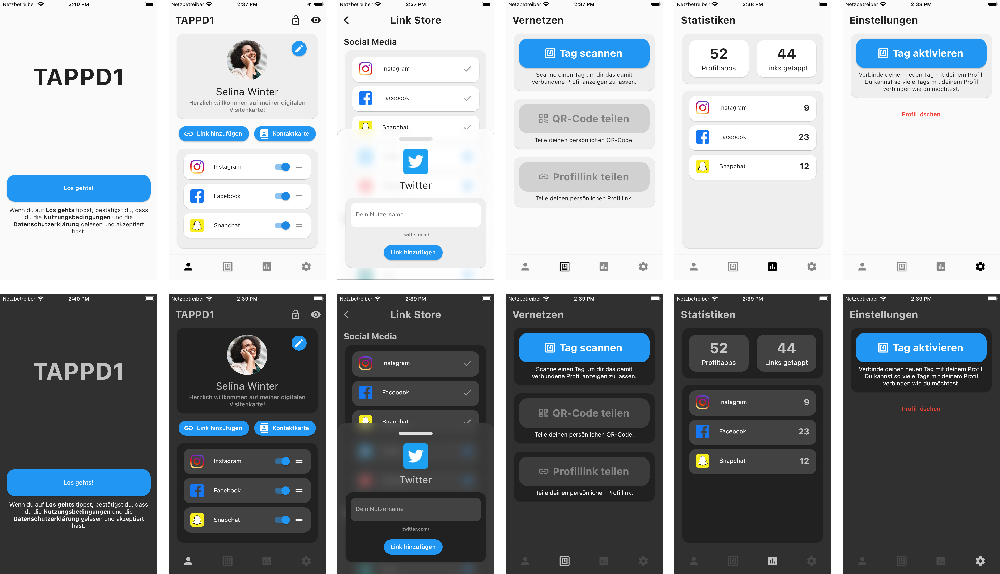
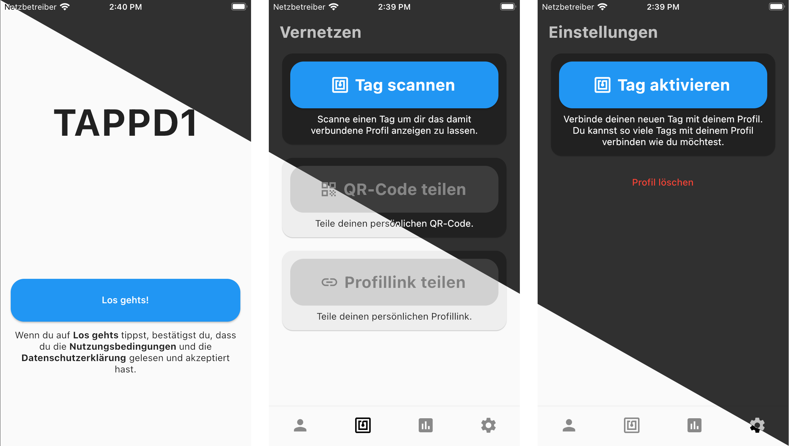
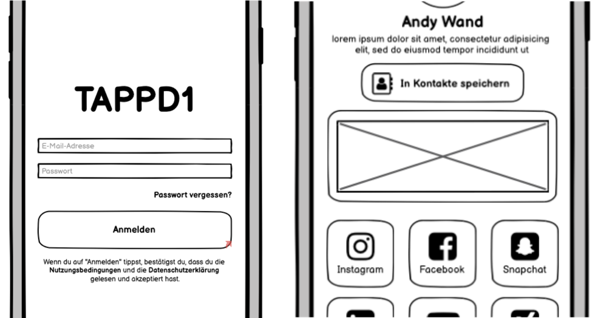

# CPD App Project using Provider and Firebase

This is the app project for the course CPD. It uses provider for state management and Firebase as backend.

Firebase is a backend as a service platform. This project uses various products of Firebase:

- Firebase Authentication

- Firebase Storage (image upload)

- Firebase Firestore (database)

## Project Goals

The overall goal was to learn the fundamentals of the Flutter Framework.
The App enables you to create a digital business card and to share it via NFC-Tags.

## The App: TAPPD1

After registering anonymously in the app, you have the option to add various contact details to your business card. These contact details can then be shared using NFC.

To share your business card via NFC, you need a writeable NFC chip that is NDEF-formatted. Within the app, you can write your business card to this chip or read other business cards from NFC chips.

Once shared, the user can access the various links of your business card or, depending on the setting, add the contact card to their native contacts app.

It is also possible to set three different profile modes.

- Open: Your entire business card is visible after one scan

- Direct: The app forwards directly to a link you have selected

- Private: Your business card is temporarily invisible.

## Project Key Features

* NFC - Reading and writing NFC-Tags

* Firebase - Quick and easy to use backend

* User Registration - Anonymous sign in with Firebase Auth

* Themes – Support for dark and light mode

* Provider – State management

* Simple UI - No complex registration just start right away

## Future Roadmap
* Additional Sign-in methods

* Share contact card via QR-Code / Link

* Save scanned profiles to App and synchronize with native contacts app

* Option for special highlighting of certain links like YouTube or Spotify

## Conclusion
Cross-platform development is very convenient, especially with Flutter.
I was initially afraid that I would have to write some things natively for iOS and Android, , especially because of the NFC functionality, but that ended up not being the case.

Still, it has to be said that Flutter takes some getting used to.
It took me a long time to get familiar with it, especially when it comes to state management with provider. I definitely see room for improvement here. But once you understand it, it's a lot of fun and you can implement a lot of things very easily.
