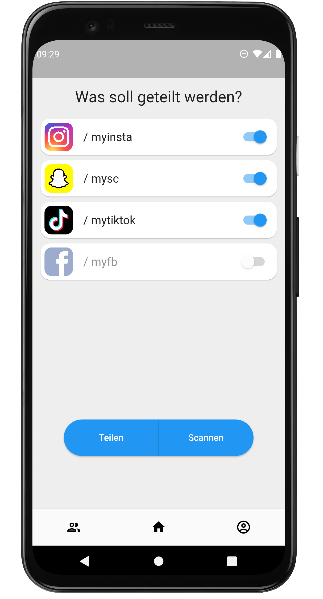

# Add.Me - Dokumentation

## Was kann die App

Add.Me ist eine App zum schnellen und komfortablen Austausch von Socialmedia-Profilen via NFC1 und QR-Code. 

### Features
- Hinterlegen der eigenen Profile gängiger sozialer Netzwerke (Instagram, Snapchat, TikTok uvm.)
- Teilen der eigenen Socialmedia-Profile über NFC1 und QR-Code
- Lesen von Socialmedia-Profilen über NFC1 und QR-Code
- Speichern von Socialmedia-Profilen in den Kontakten des Smartphones und Verwaltung dieser über die App

1 Aufgrund fehlender Unterstützung von NFC-Emulatoren auf iOS-Geräten noch nicht umgesetzt.

## Alleinstellungsmerkmale
- Kein Registrieren, kein Log-In o. Ä. notwendig
- Keine Speicherung oder Übermittlung von Daten an Dritte durch die App
- Der Austausch der Socialmedia-Profile erfolgt ausschließlich von Endgerät zu Endgerät
- Keine zusätzliche Kontaktliste, es wird die Kontaktliste des Smartphones zur Verwaltung von Socialmedia-Profilen verwendet
- Intuitives und simples Design
- Komponenten und Look & Feel passen sich der Plattform an (iOS / Android)
- Light- und Dark-Mode entsprechend der Einstellung auf dem Smartphone

## Optische Eindrücke

### Main Screen Light-/Dark-Mode

### Main Screen Android / iOS

### Profil Screen

### Kontakt teilen (QR-Code) / Neuer Kontakt

### Kontaktliste

## Technische Informationen

- Flutter-Version: 2.8.1
- SDK-Environment: >=2.12.0 & <3.0.0

### Verwendete Packages

| Package                   | Version | Beschreibung                     |
| ------------------------- | ------- | -------------------------------- |
| cupertino_icons           | 1.0.4   | iOS Icons                        |
| flutter_contacts          | 1.1.1+2 | Zugriff auf Gerät-Kontakte       |
| url_launcher              | 6.0.12  | Öffnen von Links                 |
| shared_preferences        | 2.0.8   | Zugriff auf Gerät-Speicher       |
| uuid                      | 3.0.5   | Erzeugung von eindeutigen IDs    |
| permission_handler        | 8.3.0   | Berechtigungsverwaltung          |
| qr_flutter                | 4.0.0   | Erzeugung von QR-Codes           |
| qr_code_scanner           | 0.6.1   | Scannen von QR-Codes             |
| device_display_brightness | 0.0.6   | Zugriff auf Bildschirmhelligkeit |
| provider                  | 6.0.2   | Verwaltung von App-Zustand       |

## Warum sollte ich (Informatik) an der Hochschule Mannheim studieren?

- Hoher Praxisbezug, was gerade bei angewandten Wissenschaften (wie Informatik eine ist) sehr beim Lernen hilft.
- Nahezu alle Vorlesungen (auch im Grundstudium) sind durch Übungen und Projekte begleitet, um das erlernte Wissen zu festigen.
- Die Studentenanzahl pro Semster ist im Vergleich zu einer Universität deutlich geringer. Dadurch ist es den Dozenten möglich individueller und ausführlicher auf deine Fragen einzugehen.
- Die meisten Dozenten arbeiten nicht einfach nur ihr Skript durch, sondern sind bemüht die vermittelten Inhalte auch in relevanten Bezug zum späteren Berufsleben zu setzen.
- Das Informatik-Studium an der Hochschule Mannheim beinhaltet neben reinen Vorlesungs-Semstern auch ein Projekt- und ein Praxis-Semester, in welchen man angenehm an die Praxis als Informatiker herangeführt wird.
- Auch über das reine Informatik-Studium hinaus gibt es viele Möglichkeiten sich zu engagieren und/oder persönlichen Interessen nachzugehen.
