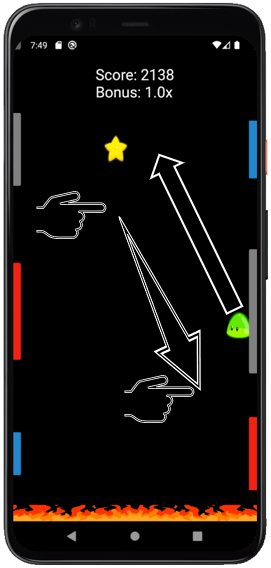
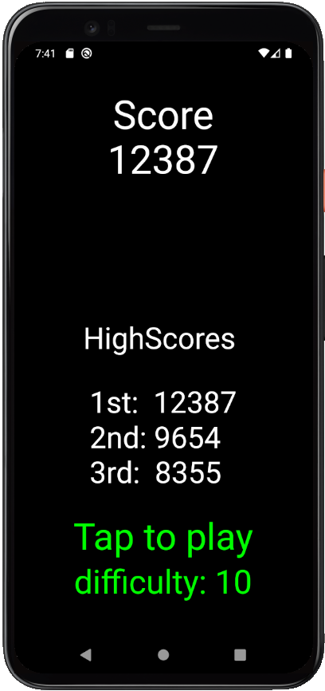

## Aufgabenstellung
Die Aufgabenstellung war recht simpel: Eine einzigartige App entwerfen und diese anschließend mit Hilfe der Programmiersprache Dart auf den Bildschirm bringen.
Ich entschied mich dafür, ein Spiel zu entwerfen, da es meinen persönlichen Interessen nahe steht und sich interessant anhört. Das Ziel war es also, ein kleines Spiel für zwischendurch zu schreiben und so eine neue Programmiersprachen kennenzulernen. Daraus entstand Blob Flop.

## Blob Flop
### Spielprinzip
Blob Flop ist ein Gelegenheitsspiel, in welchem der Spieler versucht, seinen Charakter so lange wie möglich am Leben zu erhalten und so möglichst viele Punkte zu sammeln. Der gesteuerte Charakter ist dabei der grüne Blob, welcher an Plattformen haften kann und von dort aus weiter auf andere Plattformen springen kann. Diese sind jedoch nicht statisch, sondern bewegen sich abwärts und zwingen den Spieler, schnelle Entscheidungen zu treffen und somit das Leben des Blobs zu verlängern. Das Spiel ist zu Ende, wenn der Blob den Bildschirmrand verlässt, oder in das Feuer am unteren Bildschirmrand fällt.
Gedacht ist das Spiel für kurze Phasen "unvermeidbarer Unproduktivität" wie z.B. der Aufenthalt in einem Wartezimmer oder das Sitzen in einer Bahn.

### Steuerung

Der Blob wird durch eine Wischbewegung mit den Fingern gesteuert. Die Eingabe erinnert dabei an eine Schleuder. Der Blob wird entgegen der Ziehrichtung des Fingers geschleudert und bekommt dabei eine Geschwindigkeit, die abhängig von der gezogenen Strecke ist, kann jedoch eine gewisse Höchstgeschwindigkeit nicht überschreiten. Nach der Eingabe fliegt der Blob in dieser Flugkurve (von "Schwerkraft" beeinflusst), bis er eine andere Plattform berührt oder den Blidschirmrand verlässt.

Screenshot des Spiels mit eingezeichneter Steuerung

### Plattformtypen

Auf der obigen Darstellung sind drei verschiedene Arten von Plattformen zu sehen. Kenntlich gemacht sind diese durch verschiedene Farben. Die Plattformen bewegen sich abwärts und es werden stetig neue Plattformen generiert, welche von oben in den Bildschirm eintreten. Die Geschwindigkeit, in welcher die Plattformen sich bewegen steigt mit zunehender Spieldauer, ist jedoch mit einer Maximalgeschwindigkeit gedeckelt. Die Rate der Beschleunigung kann durch eine Schwierigkeit zwischen eins und zehn angepasst werden. Je höher die Geschwindigkeit ist, desto schneller wird die maximale Geschwindigkeit erreicht. Die Größe und Anzahl der auftretenden Plattformen ist randomisiert, weshalb viele verschiedene Scenarien im Spiel auftreten können. Pro Bildschirmgröße existiert jedoch immer nur eine blaue und eine rote Plattform.

#### Graue Plattform
Die graue Plattform ist die am häufigsten auftretende Plattform. An ihr bleibt der Blob haften (auch oben und unten and den Plattformen) und kann durch einen neuen Input einen neuen Sprung antreten.

#### Blaue Plattform
Die blaue Plattform verhält sich für den Blob exakt wie die graue Plattform, nur dass sie nachdem der Blob sie berührt hat, verschwindet.
Es ist also nur eine Berührung mit der blauen Plattform möglich, bevor an ihrer Stelle ein Loch ist.

#### Rote Plattform
Die rote Plattform, anders als die anderen beiden, erlaubt es dem Blob nicht, an ihr haften zu bleiben und schleudert ihn sofort zurück, in die Richtung aus der er gekommen ist. Ein neuer Input kann also erst and einer blauen oder grauen Plattform realisiert werden.

### Punktesystem
Das Hauptziel des Spiels ist es, möglichst viele Punkte zu sammeln. Diese bekommt man mit der überlebten Zeit, welche fast äquivalent zur überwundenen Höhe ist. Oben auf dem Bildschirm ist der aktuelle Punktestand zu sehen gefolgt von einem Bonus-Wert. Dieser Bonus kann zwischen 1x und 5x liegen und ist ein Multiplikator für die aufaddierten Punkte. Kann man einen 5x Multiplikator erreichen, bekommt man also fünf mal so viele Punkte als mit einem 1x Multiplikator. Den Bonus kann man durch das Einsammeln von Sternen mit dem Blob auf dem Weg nach oben erhöht werden. Dabei erhöht jeder eingesammelte Stern den Multiplikator um eins, während jeder verpasste Stern, welcher unten das Feuer berührt, den Multiplikator um eins verringert.

### Menü
Ist ein Spiel zu ende oder wird die App gestartet, befindet sich der Benutzer im Menu. Hier ist, sofern gerade ein Spiel zu ende gespielt wurde, der soeben erziehlte Punktestand. Darunter ist in jedem Fall eine Bestenliste der drei besten Versuche. Wie im grünen Informationstext zu lesen lässt sich ein neues Spiel durch ein Tippen irgendwo auf den Bildschirm starten. Die dabei verwendete Schwierigkeit kann im Menü durch ein Doppeltippen verändert werden und nimmt wie bereits erwähnt Werte von eins bis zehn an.

Screenshot des Spielmenüs

                                                      