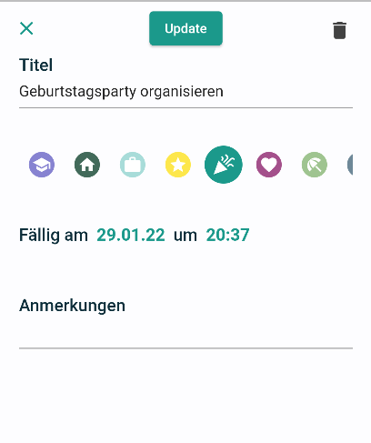

Die Anwendung "Do-it" wurde im Rahmen der Veranstaltung CPD im Wintersemester 21/22 entwickelt. 
Es handelt sich dabei um eine Implementierung einer Todo Liste mit dem Flutter Framework. Das Hauptaugenmerk liegt auf dem Erstellen und abhaken von Aufgaben ("Todos").

### Hintergrund 
Der psychologisch wertvolle Nutzen von Todo Listen wurde bereits mehrfach wissenschaftlich bewiesen[^fn1][^fn2]. Insbesondere während stressigen Phasen, etwa der Klausurenphase, sollte jeder auf eine Todo Liste zurückgreifen können. Am praktischen ist dies per App auf dem Smartphone, um jederzeit Zugriff zu haben.

Sucht man in den App Stores von iOS und Android nach einer Todo App gibt es bereits eine unzählige Menge. Oft sind diese aber überhaupt nicht intuitiv, wobei das Konzept einer Todo Liste extrem simpel ist. Häufig finden sich ebenso überflüssige Funktionen, deren Nutzen nicht immer klar ist. Do-it versucht sich an einer möglichst unkomplizierten Benutzbarkeit, die ein schnelles Erstellen sowie Abhaken von Aufgaben ermöglicht, und sticht somit aus der Masse hervor. 

### Die App  
Der Homescreen der Anwendung stellt eine Listenansicht mit anstehenden und den heute erledigten Aufgaben dar. Über das Icon rechts oben gelangt man auf die Listenansicht für alle erledigten Todos, sortiert nach dem Tag an dem die Aufgaben erledigt wurden.

Über die Navigationsbar unten gelangt man zu der Kalenderansicht. Hier kann man sich in einem Monatskalender eine Übersicht über anstehende Aufgaben ansehen. Die einzelnen Aufgaben sind dabei als farbige Punkte (je nach Kategorie) an dem jeweiligen Fälligkeitstag zu sehen. Zuätzlich  erhält man unterhalb des Kalenders für den ausgewählten Tag eine Liste der anstehenden Aufgaben. 

In allen Listen kann mithilfe einer horizontalen Swipe-Geste der Status (erledigt/ nicht erledigt) der Aufgabe geändert werden. 

Auf allen Screens gibt es die Möglichkeit über den + Button eine neue Aufgabe hinzuzufügen. Das einzige Pflichtfeld ist hierbei der Titel. Optionale Felder sind Kategorie, welche mithilfe repräsentativer Icons ausgewählt werden kann, Datum und Uhrzeit (Defaultmäßig sind diese auf den Zeitpunkt des Erstellens gesetzt), welche mithilfe eines Date- und Timepicker gewählt werden können, sowie weitere zusätzliche Notizen. Der Vorgang kann durch das Kreuz in der linken oberen Ecke abgebrochen werden, oder, wenn alle Pflichtfelder ausgefüllt sind kann über den Button in der Mitte oben die neue Aufgabe hinzugefügt werden. 

Um eine Aufgabe zu bearbeiten wird auf die jeweilige Aufgabe in einer Listenansicht getippt.

Über das Bearbeiten ist es auch möglich eine Aufgabe vollständig zu löschen. Dies ist über den Button rechts oben möglich. 

Nach jedem erfolgreichen erstellen, bearbeiten und löschen erfolgt eine Meldung auf dem Bildschirm in Form einer Snackbar. 

### Umsetzung 
Die Umsetzung der Anwendung erfolgte mit dem Cross-Platfform Framework Flutter. Es handelt sich also um eine plattformunabhängige Anwendung, welche sowohl auf dem iOS als auch dem Android Betriebssystem als Native App ausführbar ist. 

Das State Management innerhalb der Anwendung wurde mit dem Provider-Package umgesetzt.

Die Daten, bzw. die Aufgaben werden ausschließlich lokal auf dem jeweils benutzten Gerät gespeichert. Dies geschieht über eine SQLite Datenbank. Die in der Anwendung gespeicherten Daten können also nur manuell per Kopie der DB-Datei auf ein anderes Gerät importiert werden. Die Aufgaben werden mithilfe einer eigenen Klasse repräsentiert, mit den Attributen id (automatisch von DB erzeugt), Titel, Kategorie, der Zeitpunkt des Erstellens, den aktuellen Status (erledigt/nicht erledigt), das Fälligkeitsdatum, optional zusätzliche Infos und wann die Aufgabe erledigt wurde. 

In der Projektstruktur wird unterschieden zwischen zwei Hauptseiten, der Listenansicht und dem Kalender, wobei der Kalender einen Teil der Widgets der Listenansicht wiederverwendet. Damit dies möglich ist, war es wichtig das Projekt in kleine Widgets zu unterteilen, was für das Flutter Framework auch best-practice ist. 

[^fn1]: Scullin, Michael K. et al. “The Effects of Bedtime Writing on Difficulty Falling Asleep: A Polysomnographic Study Comparing To-Do Lists and Completed Activity Lists.” Journal of Experimental Psychology: General 147 (2018): 139–146.

[^fn2]: DOMINICAN UNIVERSITY. (2015) Goals Research Summary. [Online] Besucht am 24.01.2022 https://www.dominican.edu/sites/default/files/2020-02/gailmatthews-harvard-goals-researchsummary.pdf
