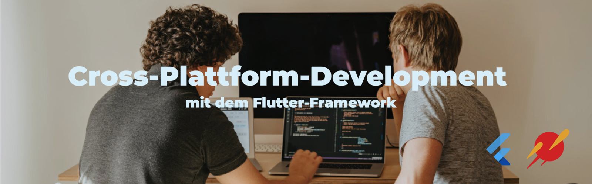

## Cross-Platform Development mit Flutter
Du möchtest eine App bauen, die sowohl auf Android- als auch iOS-Geräten läuft, sich per Webbrowser bedienen lässt und auch unter Linux, MacOS, Windows und sogar dem RaspberryPi lauffähig ist?

Genau dies war das Ziel des Kurses, welcher zusammen mit 
[MARS, dem Center for Entrepreneurship der Hochschule Mannheim](https://www.startup.hs-mannheim.de/) durchgeführt wurde. 20 Teams nutzten die Möglichkeit, um ihre eigene App-Idee mit Hilfe von [Flutter](https://flutter.dev/) umzusetzen. Die folgenden Seiten zeigen einige der Ergebnisse.

## Projekte
* [Add.Me](add_me.md){:target="_blank" rel="noopener"} - Austausch von Socialmedia-Profilen. Hier im [Video](add_me_qr_scan_demo.mp4){:target="_blank" rel="noopener"}.
* [Blob Flop](blobflop.md){:target="_blank" rel="noopener"} - Eins Spiel für kurze Pausen. Hier im [Video](blobflop.mp4){:target="_blank" rel="noopener"}.
* [Do-it](doit.md){:target="_blank" rel="noopener"} - Todo Liste
* [MarkIt](markit.md){:target="_blank" rel="noopener"} - Standorte speichern
* [Mentalport](Mentalport.md){:target="_blank" rel="noopener"} - Psychologische Hilfe
* [PocketShelf](pocketShelf.md){:target="_blank" rel="noopener"} - Die mobile Bücherverwaltung
* [Resideo](resideo.md){:target="_blank" rel="noopener"} - Die WG-App
* [Resippy](resippy.md){:target="_blank" rel="noopener"} - Kochrezepte verwalten
* [Spotify Pogo Party](spotify_pogo_party.md){:target="_blank" rel="noopener"} - Gemeinsame Playlist
* [Sportify](sportify.md){:target="_blank" rel="noopener"} - Workout-Tracking
* [TankoTanko](tankotanko.md){:target="_blank" rel="noopener"} - Überwachung von Fahrzeugkosten 
* [TAPPD1](TAPPD1.md){:target="_blank" rel="noopener"} - Kontaktaustausch mittels NFC
* Tony Kroos Academy
  * [Homescreen](tka-homestream.md){:target="_blank" rel="noopener"} - Homestream
  * [Videoplayer](TKAvideoplayer.md){:target="_blank" rel="noopener"} - Videoplayer in Cool
* [yoro](yoro.md){:target="_blank" rel="noopener"} - Die ToDo App
