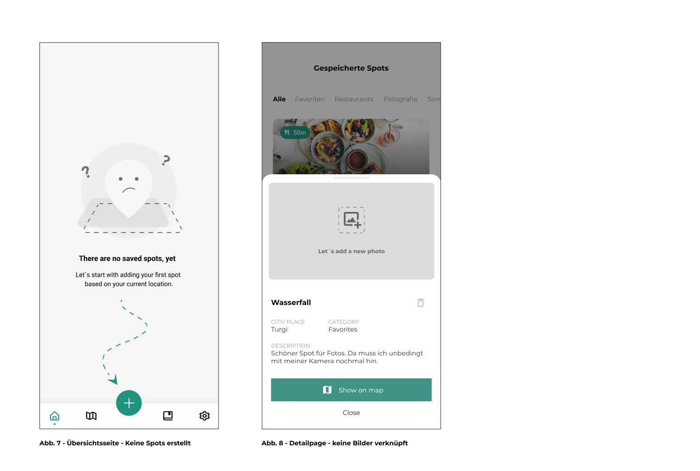

# MarkIt

Schonmal an einem wunderschönen Ort gewesen und die Kamera nicht dabei gehabt? In einer fremden Stadt den wohlmöglich besten Cappuccino geschlürft und am nächsten Tag vergessen wo genau das Café war? Mit MarkIt gehört das alles der Vergangenheit an. Unsere App gibt dem Nutzer die Möglichkeit mit wenigen Klicks den momentanen Standort anschaulich zu speichern, ihm Bilder zuzuordnen, in übergeordnete Kategorien zu verwalten und in unserer Map-Ansicht alle erstellten Spots der Umgebung einzusehen.

## I Problemstellung  

Unserer Zielgruppe gehören Content Creator, Fotografen aber auch unternehmenslustige Personen an. Menschen die es Lieben neue Orte zu entdecken und diese zu dokumentieren. Oft kommt es aber auch vor, dass man spontan die Kamera oder das Skizzenbuch vergessen hat. Umständlich wird dafür bspw. der Standort über Google Maps durch einen Screenshot gespeichert ohne Bilder damit zu verknüpfen. Tage später, dann der Ärger. Man erinnert sich nicht mehr an den Zusammenhang und weiß nicht mehr was mit dem Screenshot gemeint war. Er wird gelöscht und die potenzielle Location für das nächste Foto scheint verloren.
  
## II Die App

Basierend hierauf haben wir uns Gedanken gemacht, welche Funktionalitäten unsere App braucht um das beschriebene Problem unserer Nutzer vollumfänglich anzusprechen. Es wurden Personas und User Stories erstellt, die letztendlich zu nachfolgender Funktionalität führten. Einfachheitshalber werden nur die Kernfunktionen beschrieben.

### Dashboard

Auf der Übersichtsseite (Abb. 2) wird der Nutzer nach dem Einloggen empfangen und erhält eine Übersicht aller favorisierter Spots. Außerdem kann er von dieser zentralen Ansicht auf die jeweiligen Listenansichten der Kategorien oder durch die Navigation im unteren Bereich auf die einzelnen Unterseiten, wie zum Beispiel der Kartenansicht wechseln.

### Das Erstellen eines Spots

Der Fokus lag vor allem darauf dafür zu Sorgen, dass unsere Nutzer möglichst einfach und intuitiv Spots anlegen können. Hierzu dient primär ein Button der auf jeder Unterseite  der App präsent ist. Das heißt egal wo sich der Nutzer befindet, er hat immer die Möglichkeit Spots zu erstellen und muss nicht etwa auf eine bestimmte Ansicht wechseln um dies durchzuführen. Bei der Erstellung muss dem Spot ein Name sowie eine Kategorie wie etwa Fotografie, Restaurants usw. zugeteilt werden, sodass man später noch einen guten Überblick über alle Spots erhält. Dem Spot können bei der Erstellung außerdem auch Bilder und eine Beschreibung hinzugefügt werden (Abb. 3).

### Einteilung in Kategorien

Um die dann angelegten Spots auch übersichtlich aufzuzeigen wurden Listenansichten zu den einzelnen Kategorien, mit welchem ein Spot verknüpft werden kann, implementiert (Abb. 4). So ist gewährleistet, dass bei Bedarf nur eine bestimmte Kategorie angezeigt wird. Es dient daher auch gewissermaßen einer Filterung. Durch einfaches swipen zur Seite hin, kann ganz intuitiv zwischen den Listen gewechselt werden. Falls man weitere Informationen über einen bestimmten Spot erhalten will, erhält man durch Klick auf den Spot die jeweilige Detailansicht (Abb. 5).

### Detailansicht

Dieses Popup Fenster beinhaltet alle relevanten Daten, wie bspw. die Stadt oder Region, die zugehörige Kategorie und eine textuelle Beschreibung.
Sofern der Nutzer Bilder verknüpft hat, erinnern diese durch die Bildersammlung im oberen Bereich an die Ortschaft. Es lassen sich natürlich auch nachträglich neue Bilder hinzufügen.
Außerdem lässt sich der Spot mit einem Klick auf der Map anzeigen oder nach Bestätigung löschen.

### Mapansicht

Alle erstellten Spots, lassen sich außerdem auf einer Karte anzeigen. Diese Spots werden grafisch durch einen Pin visualisiert (Abb. 6). Durch Klick auf den Pin öffnet sich zudem die Detailansicht des jeweiligen Spots, sodass auch auf dieser Ansicht alle nötigen Inhalte aufgezeigt werden. Für den Fall, dass sich der Nutzer auf der Karte verirrt hat, wurde mit dem Button im rechten unteren Bereich die Möglichkeit geschaffen die Karte erneut anhand des aktuellen Standorts zu zentrieren. Der aktuelle Standort ist durch einen blauen Punkt hervorgehoben.

### Empty States

Da wir ein besonderes Augenmerk auf die User Experience legen wollten, sollte zu jeder Zeit gewährleistet werden, dass unsere Nutzer auch über alle Möglichkeiten in der App aufgeklärt werden. Falls zum Beispiel bestimmte Inhalte noch nicht angezeigt werden können, oder Eingaben Fehler aufweisen, wird der Nutzer darüber informiert und aufgeklärt.
Der folgende Screen (Abb. 7) erscheint bspw. wenn noch keine Spots angelegt wurden. Es wird darauf hingewiesen, dass in diesem Fall durch Klick auf den Add-Button ein Spot erstellt werden kann. Genauso wurde auch der Fall abgefangen, wenn noch kein Bild verknüpft wurde (Abb. 8).

## III Technologie

### Flutter
Flutter ist ein von Google entwickelte Frontend-Framework. Es erlaubt die plattformübergreifende Entwicklung von Apps ohne größere individuelle Anpassungen des Codes. So ist es möglich mit einer einzigen Code-Basis Anwendungen für unterschiedliche Betriebssysteme wie z.B Android oder iOS zu realisieren. Hierfür wird die ebenfalls von Google entwickelte Programmiersprache Dart verwendet. 

### Datenbank 
Zur lokalen Speicherung der zu erstellenden Spots wird eine Dart Implementierung der SQLite-Datenbank verwendet. 

### App-Berechtigungen
Für die eben vorgestellten Funktionen werden von der MarkIt-App einige Berechtigungen für die Lauffähigkeit benötigt. Dazu werden beim erstmaligen Start der App, Berechtigungen zum Zugriff auf die Kamera, der Fotogalerie und den Standort des Geräts angefragt. Ohne diese Bestätigung sind einige Kernfunktionen nicht nutzbar, da Spots ohne GPS-Daten nicht anhand des Standorts erstellt werden können und nachfolgend auch nicht auf der Kartenansicht angezeigt werden. Außerdem wäre es nicht möglich Spots mit Bildern aus der Galerie oder der Kamera zu verknüpfen.

### Kamera-Funktion
Um den Nutzern die visuelle Speicherung der Spots zu ermöglichen, benötigen wir, wie auch zuvor erwähnt die Berechtigung der Nutzer. Ist diese erteilt, kann der Nutzer nun beim Anlegen der Spots, Bilder mit diesem Spot verknüpfen, dies wird durch das Package [image_picker](https://pub.dev/packages/image_picker) ermöglicht. Bei der Erstellung der Spots, wird durch eine Auswahl aus der Galerie des Nutzers oder mit Hilfe der Kamera ein Foto ausgewählt bzw. gemacht. Dieses Foto wird daraufhin mit Hilfe der Kodierungstechnik Base64 kodiert und in Form einer Zeichenkette auf der Datenbank eingespeichert. Sobald die jeweiligen Bilder innerhalb der App angezeigt werden müssen, werden diese wieder enkodiert und dem Nutzer dargestellt.

#### GPS
Für die Verwendung der GPS-Daten des Nutzers, wird die externe Dart-Bibliotheke [geolocator](https://pub.dev/packages/geolocator) genutzt. Dieser ermöglicht es uns nach der Berechtigung der GPS-Nutzung stetig die aktuellen GPS-Daten des Smartphones abzufragen. Anhand dieser Daten können wir die aktuelle Position des Nutzers auf der Karte anzeigen und zum Speichern von Spots verwenden. Zudem ermöglicht uns diese Bibliothek die Distanz zwischen zwei Längen- und Breitengraden zu ermitteln, so können wir die Distanz verschiedener Spots zum Standort des Nutzers ermitteln.

### State Management
Unter dem Begriff "State-Management" versteht man die Verwaltung der Daten und der Zustände der Anwendung. Hierfür verwenden wir die [GetX](https://pub.dev/packages/get), welches einer der beliebtesten Bibliotheken für die Zustandsverwaltung ist. Es verwendet den so genannten "reaktiven Statemanagement"-Ansatz. Dabei werden alle Daten und Zustände einer Ansicht in eine eigene Komponente, hier auch "Controller" genannt, ausgelagert. So ermöglicht man nicht nur die Nutzung dieser Controller über die ganze Anwendung hinweg, sondern auch eine höhere Testbarkeit. Zudem ist es möglich die Daten in einem Controller zu observieren, dies bedeutet, dass bei Veränderungen an observierten Daten diese auch sofort an den eingesetzten Stellen aktualisiert werden.

## IV Fazit

Im Modul Cross-Platform-Development hatten wir die Möglichkeit eine frei wählbare Problematik durch die Entwicklung mit Flutter sowohl für iOS als auch Android zu realisieren. Da alle Teammitglieder keine oder wenige Erfahrung mit dieser expliziten Programmiersprache mitbrachten, war es für uns alle eine Herausforderung, die jedoch mit dem eingebrachten Fleiß eine solide mobile App hervorbrachte. Die wöchentlichen theoretischen Vorlesungen begleiteten uns dabei unser Vorhaben zu realisieren. Dennoch mussten einige Themen selbst recherchiert werden, da diese im Lehrplan erst später behandelt werden sollten.
Alles in allem können wir alle das Modul CPD Studierenden empfehlen, die das nötige Interesse für die Umsetzung einer eigenen App Idee mitbringen. Jedoch sollte man hierfür auch genügend Zeit einplanen. Projektmanagement Methoden wie Scrum, Kanban usw. sind hier unerlässlich, da ohne professionelles Zeitmanagement und gute Arbeitseinteilung die Zeit, je nach Vorhaben, knapp bemessen sein kann.
