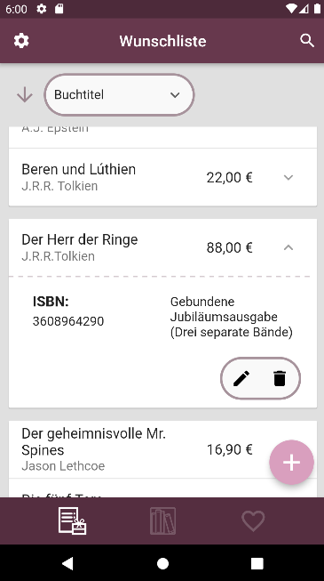
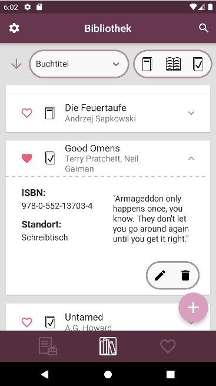
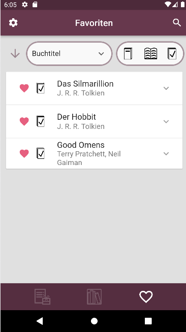
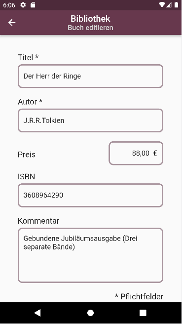
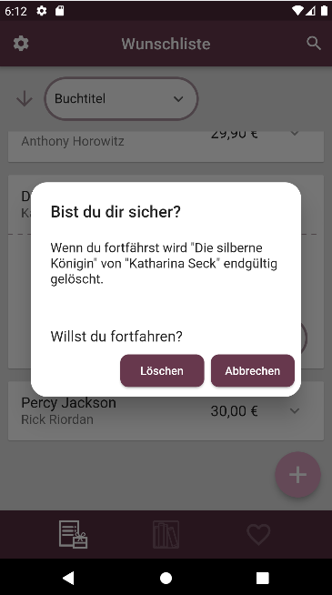
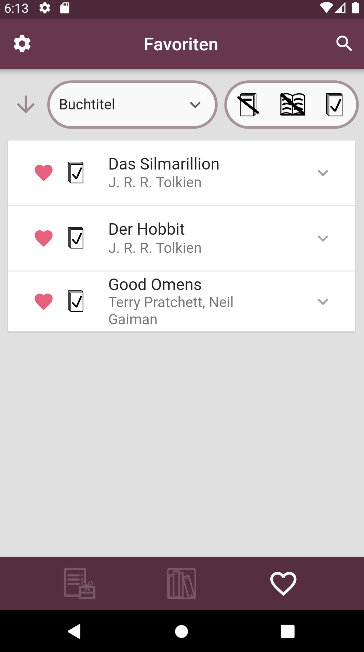
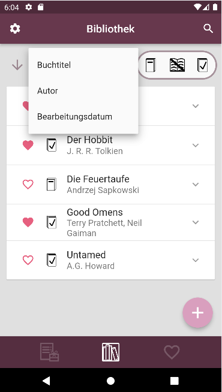
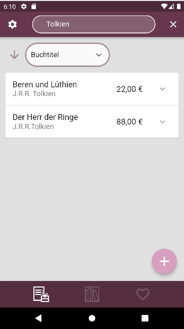
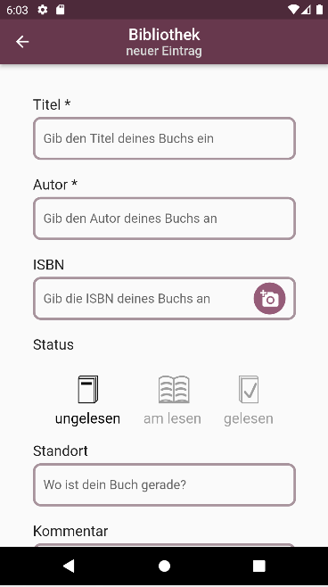
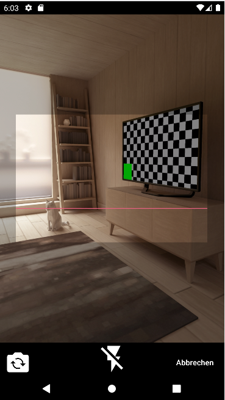

## Veranstaltung Cross-Platform Development mit Flutter

#### Dozenten: Dr. Christoph Giess, Philipp Bletzer

##    Die mobile Bücherverwaltung PocketShelf

Die mobile Anwendungen wurde von den IB-Studierenden Christina Jöst, Orpheas Aggelidakis entwickelt.

Im Rahmen der Veranstaltung wurden in Gruppen von 1-3 Personen Apps entwickelt. Das Thema durften wir selbst wählen.

### Problemstellung

Wir haben uns als Aufgabe gewählt, eine mobile Bücherliste zu entwickeln. Sie soll die Möglichkeit bieten, neue Bücher schnell und einfach zu speichern und alte Bücher leicht wiederzufinden.

Zusätzlich sollen interessante Bücher in einer Wunschliste gespeichert werden können.

### Umsetzung

Eigene Icons innerhalb der App kurz erklärt: 

  

​	    ungelesen					gerade am lesen					gelesen

Das Herzstück unserer App bilden die Listen der gespeicherten Bücher. Diese lassen sich zentral platziert als Liste aller, im Besitz befindlichen Bücher oder nur der Favoriten anzeigen. Zusätzlich vorhanden ist eine separate Liste interessanter Bücher, die noch nicht gekauft wurden.

 

Um die Übersichtlichkeit zu erhöhen, sind die Einträge auf die wichtigsten Informationen (Titel, Autor) reduziert. Um weitere Informationen zum jeweiligen Buch zu erhalten, lassen sich die Einträge ausklappen. Es lässt sich jedoch immer nur ein einziger Eintrag ausklappen, Beim Öffnen eines weiteren Eintrages wird der Vorherige automatisch wieder eingeklappt.

Die weiteren Informationen umfassen optional den Standort, die ISBN und einen vom Benutzer verfassten Kommentar zum Buch.

Außerdem gelangt man durch das Ausklappen zur Bearbeitungs- und Löschfunktion für den bereits existierenden Eintrag.

 

Zusätzlich bietet die Anwendung die Möglichkeit die vorhandenen Einträge zu filtern, zu sortieren und nach Schlagworten zu durchsuchen. So kann auch bei großen Listen noch der Überblick bewahrt werden.

   

Lieblingsbücher können vom Benutzer zusätzlich markiert und so in den Favoriten hinterlegt werden.

Über den Plus-Button lassen sich jederzeit neue Einträge anlegen. Hierbei werden nur Titel und Autor zwingend benötigt.

Zum Ergänzen einer ISBN kann die Kamera zum Scannen des Barcodes auf dem Buch verwendet werden.

  

## Technische Informationen

- Listen werden lokal auf dem Gerät gespeichert

### Was war daran besonders interessant?

- „Hands-on“ lernen durch direkte Umsetzung von Gelerntem in einem eigenen Projekt.
- Das Projekt bot eine gute Gelegenheit zur Übung von Projektorganisation/-management.
- Es wurden aktuelle Technologien und Konzepte verwendet, die auch außerhalb des Studium Anwendung finden.

