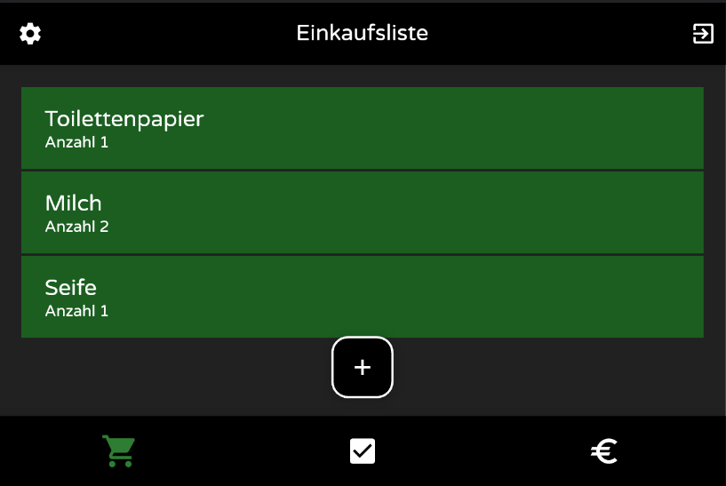
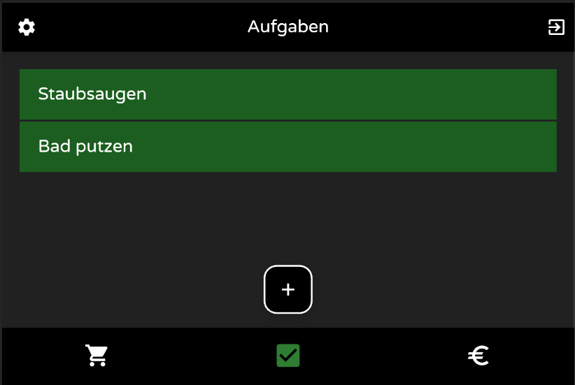
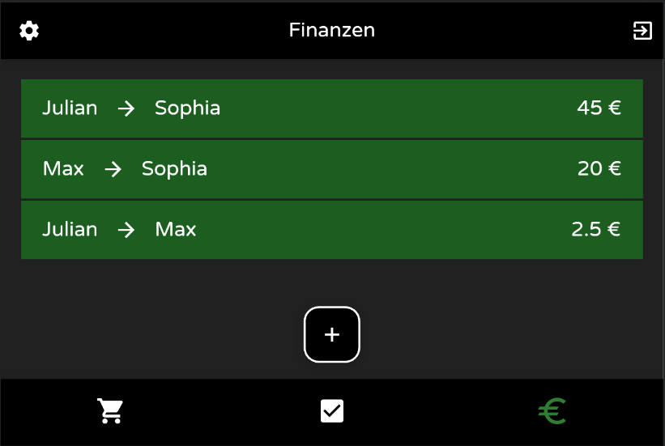

# Resideo

## Der Rahmen
+ Cross-Plattform-Development Vorlesung als Wahlpflichtmodul (6./7. Semester)
+ Erarbeitung einer eignenen App-Idee auf Grundlage der Vorlesung
+ Eigenständiges Arbeiten mit Flutter (Dart)

## Die App
Resideo soll das Zusammenleben in einer Wohngemeinschaft vereinfachen.
Dazu bietet die App nach einer Registrierung und dem Erstellen einer WG die folgenden drei Funktionen:

1. Einkaufsliste zum einfachen Festhalten der Bedürfnisse der WG.
   
2. Das Notieren der zu Bewältigenden Aufgaben.
   
3. Das Verwalten von Schulden, welche innerhalb der WG anfallen.
   

## Technische Informationen
+ Frontend: Flutter-Framework (Dart)
+ Backend: Firebase (Firestore, Fireauth)
+ MVC Designpattern (Modell-View-Controller) verwendet
  + Klare Trennung von den Daten/Logik/Darstellung
+ Einsatz des Bloc-Patterns
  + Verschiebung der Logik aus der View-, in die Controller-Schicht

## Alleinstellungsmerkmale
+ Plattformunabhängig (Web, Android, IOS)
+ Niedrige Hemmschwelle der Nutzung
+ Minimalistischer Aufbau
  + Funktionen sind selbsterklärend
  + Keine unnötigen Features
+ Modularer Aufbau
  + Kann flexibel erweitert werden

