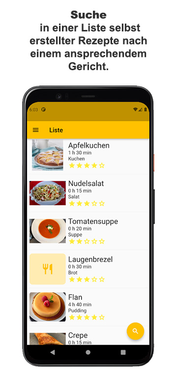
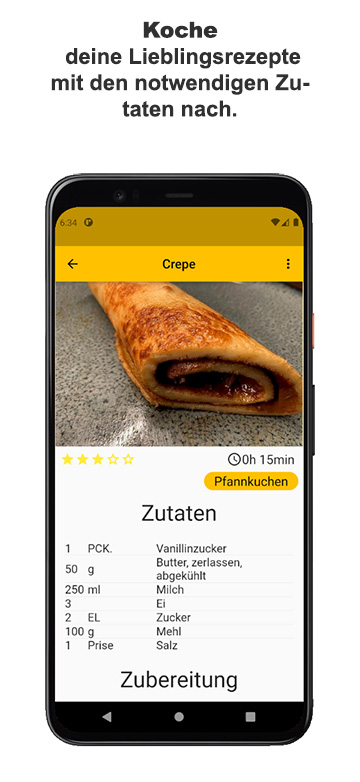
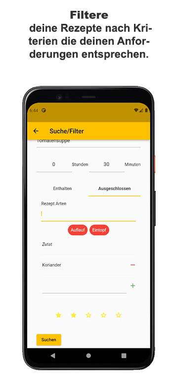
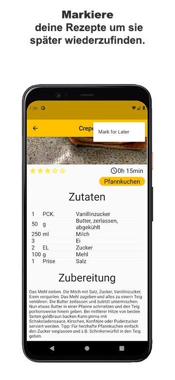
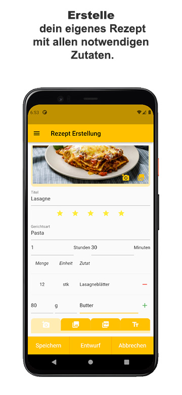
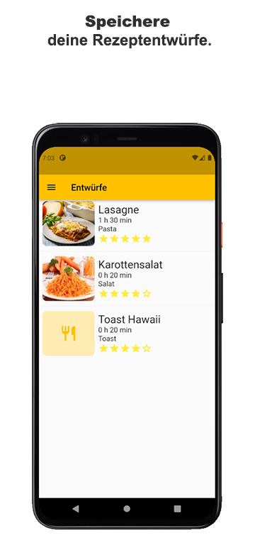

# Resippy

## Ausgangsituation
Bisher gab es viele Rezeptseiten und Blogs online, z.B. Chefkoch, oder eine Rezeptsammlung in Form von Zetteln und Büchern zu Hause.
Besonders in den Zettel- und Büchersammlungen sind Rezepte oft nur schwer findbar, weil es keinen guten Überblick über alle Rezepte gibt.

Unser Ansatz: **resippy** - Eine App zur Organisation von Rezepten aus der Sammlung zu Hause

## Was macht uns aus?
Resippy braucht keine Internetverbindung für die Benutzung. Alle Rezepte werden lokal gespeichert.

Der Benutzer kann die Rezepte nach unterschiedlichen Kriterien filtern. Dazu gehören Standard-kriterien von anderen Rezeptplattformen, wie die Kochdauer, der Name, die Bewertung oder die Rezeptart, aber es kann auch nach Zutaten gefiltert werden.
Wenn zu Hause z.B. nur noch 2 Eier sind und man einen Kuchen backen möchte, dann kann nach Kuchenrezepten gesucht werden, die zwei Eier oder weniger verwenden.

## Technische Informationen
- nur für Android
- Android 10 (oder höher aufgrund von Entwicklung mit Android API 29)
- benutzt eine SQLite Datenbank zum Speichern von Rezepten 

## Was hätte mich vor dem Studium angesprochen?
- App Designen
- App deployen und auf eigenem Handy benutzen
- eigene App Idee konzeptionieren & implementieren mit spezifischer Hilfe der Profs
