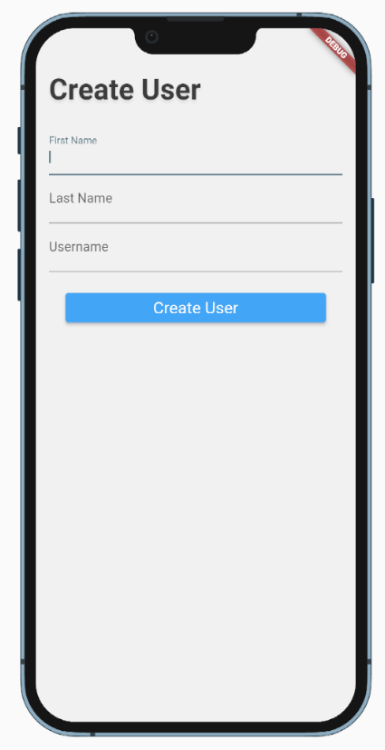
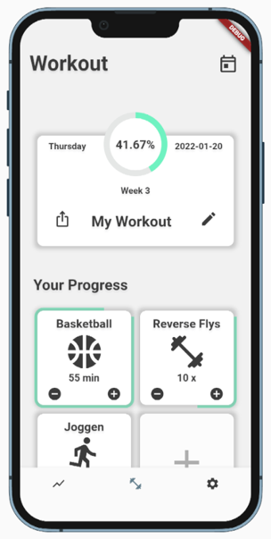
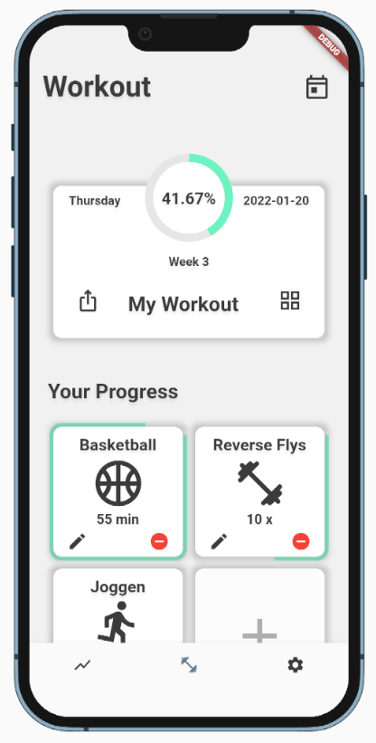
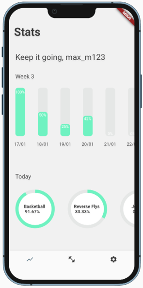
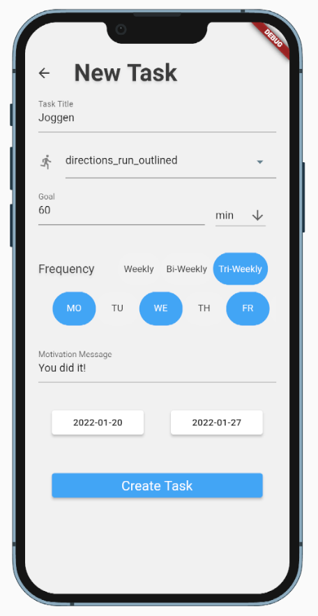
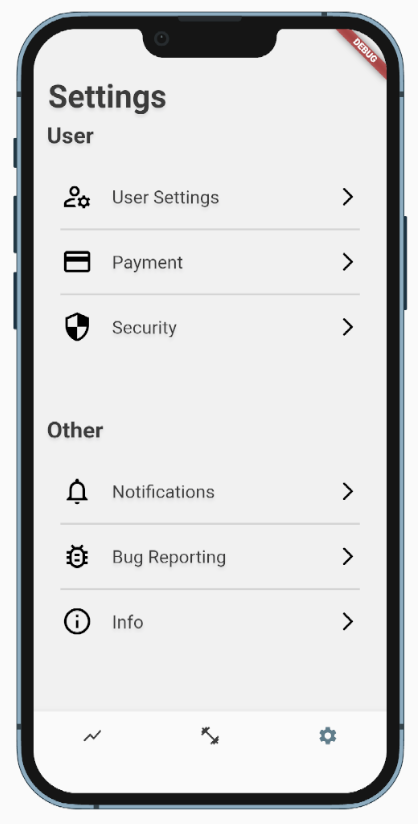
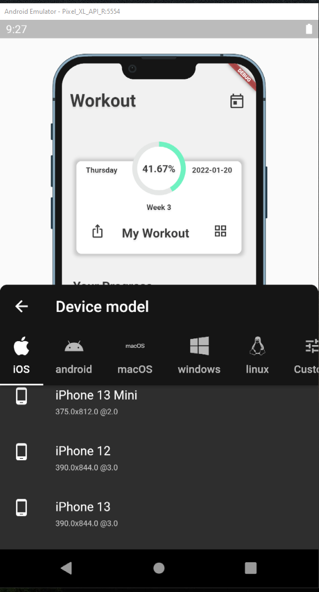

# sportify. : CPD WS21/22

## Projektkontext

Das Projekt fand im Rahmen der "Cross-Plattform Development"-Vorlesung an der Hochschule Mannheim statt. Geleitet wurde diese von den Dozenten Christoph Giess und Phillip Bletzer und besitzt das Ziel die Studenten mit den Grundlagen des Flutter-Frameworks und der mobilen Entwicklung, anhand einer eigenständig entwickelten App, vertraut zu machen. Im Rahmen der Vorlesung sollen für das erarbeitete Projektkonzept bekannte Architekturaspekte von Flutter implementiert und aufzeigt werden. 

## Konzept

### Problemstellung

Laut einer Studie der technischen Universität München haben rund 40% der befragten Erwachsenen seit Beginn der Pandemie durchschnittlich 5,6 Kilos zugenommen. Durch die Pandemie-bedingten Ausgangsbeschränkungen sehen sich immer mehr Menschen gezwungen ihre Sportroutinen daheim fortzuführen. Die Umstellung auf die Weiterführung Zuhause stellt sich jedoch für viele als ein schwieriger Schritt dar. So werden Menschen oft durch die Nähe zum Sofa oder zum Bett dazu verleitet ihre sportlichen Aktivitäten nicht mehr nachzugehen. ToDo-Apps stellen eine gute Möglichkeit dar, die eigenen Sportaktivitäten mitzuverfolgen. Bisher existierende ToDo-Apps ermöglichen jedoch nicht die Pflege von langfristigen Workouts, in welchen Trainingseinheiten beispielsweise nur alle drei Wochen an bestimmten Tagen auftauchen. 

### Projektbeschreibung

Bei *sportify.* handelt es sich um eine mit dem Flutter-Framework umgesetzte Cross-Plattform-App. *sportify.* ermöglicht ein effektives Tracking von persönlichen Workout-Routinen und deren Fortschritte. Trainingseinheiten können hierfür möglichst frei vom Nutzer definiert werden, ohne dass dieser sich auf gegebene Definitionen beschränken muss. Titel, Icon, Ziel, Trackingart und Motivationsnachricht einer Trainingseinheit sind frei wählbar. Zudem kann man in *sportify.* bestimmen, ob sich eine Trainingseinheit wöchentlich, alle zwei Wochen oder alle drei Wochen wiederholt. Das Tracken der verschiedenen Trainingseinheiten wird durch Visualisierungen unterstützt. Durch den eingebauten Date-Picker, kann der Nutzer sich die Trainingseinheiten und Visualisierungen verschiedener Tage anzeigen lassen. Somit können historische Daten verändert werden und zukünftige Daten eingesehen werden. 

### "Login"-Seite

Beim ersten Starten der App, wird der Nutzer aufgefordert sich erstmalig zu registrieren. Hierfür wird nur der volle Name des Nutzers und ein Nutzername gefordert. Nach einer einmaligen Registrierung verschwindet das Fenster von selbst und erscheint bei weiterer Nutzung der App nicht mehr.

### "Workout"-Seite

Auf der "Workout"-Seite sind alle wichtigen Trackinginfos des Tages vorzufinden. Mittig auf der oberen Hälfte des Bildschirms ist die Prozentanzeige des derzeitigen Tags des Nutzers zu sehen. Diese stellt den durchschnittlichen Fortschritt aller anstehenden Trainingseinheiten dar. Rechts neben der Prozentanzeige befindet sich das derzeitige Datum und links der ausgeschriebene Wochentag. Über den sich darunter befindenden Button (gekennzeichnet durch ein "Stift"-Icon) kann der Nutzer zur Editieransicht wechseln. Auf der unteren Bildschirmhälfte befindet sich eine kompakte Anzeige der anstehenden Trainingseinheiten. Diese werden mit ihrem Titel und zugewiesenem Icon angezeigt. Anhand des "Plus"- oder "Minus"-Buttons kann der Nutzer die Trainingseinheiten tracken. Als Fortschrittsindikator gilt eine gründe Umrandung um die Einheit herum. Geht die grüne Umrandung einmal um die ganze Einheit, so ist die Einheit für den heutigen Tag abgeschlossen. Nach der zuletzt aufgelisteten Einheit befindet sich ein Button für das Hinzufügen eines Tasks.

Der Edit-Modus der "Workout"-Seite ermöglicht das Editieren und Löschen der Trainingseinheiten. Hierfür werden unabhängig vom ausgewählten Tag alle angelegten Trainingseinheiten angezeigt. Klickt man auf den "Edit"-Button einer Einheit, so wird man zu der "Add Task"-Seite weitergeleitet, in welcher die Eingabefelder mit den Informationen der zu editierenden Einheit gefüllt sind. 

### "Stats"-Seite

Die "Stats"-Seite bietet dem Nutzer die Möglichkeit sein Tracking anhand von Visualisierungen, auch auf einem größeren Zeitraum von einer Woche, zu verfolgen. Anhand von nebeneinander gelisteten und vertikal angeordneten Balken kann der Nutzer seine Leistung, in der sich befindenden Woche betrachten. Somit stellen jeweils alle Balken den durchschnittlichen Fortschritt der an dem Wochentag getrackten Trainingseinheiten dar. Über den Date-Picker der Workout-Seite kann der Nutzer sich auch die Visualisierung vergangener Wochen anzeigen lassen. Unter der Wochen-Visualisierung werden die Trainingseinheiten mit einer Fortschrittsanzeige für den Nutzer horizontal aufgelistet. Die Einsicht in den Visualisierungen gegenwärtiger und historischer Daten soll den Nutzer zu Disziplin und neuen Erfolgen motivieren.

### "Add Task"-Seite

Die "Add Task"-Seite stellt das Formular zur Erstellung oder Editierung einer Trainingseinheit dar. Hier wird dem Nutzer sehr viel Freiraum angeboten. Neben dem Titel kann der Nutzer, durch einen eingebauten Icon-Picker, selbst das Icon für die Einheit bestimmen. Die Trackingart kann der Nutzer selbst wählen, sodass Einheiten anhand von Minuten (min), Stunden (h), Runden (rounds) oder Weiteres (x) getrackt werden können. Da in professionellen Workout-Routinen manche Trainingseinheiten nur zu bestimmten Wochentagen vorgesehen sind, kann der Nutzer die Wochentage auswählen, in denen die Einheit erscheinen soll. Ebenfalls lässt sich bestimmen, ob eine Einheit sich wöchentlich, alle zwei Wochen oder alle drei Wochen wiederholt. Somit ermöglicht es *sportify.* auch langfristige Workout-Routinen zu tracken. Zur eigenen Motivation kann der Nutzer eine Motivationsnachricht für die Einheit bestimmen. Dieser Text erscheint dann beim Vollenden der Einheit und kann als Reminder für weitere Aktivitäten oder auch nur als Motivationstext genutzt werden. Um die Pflege von langfristigen Workouts noch mehr zu unterstützen, kann der Nutzer für eine Einheit ein Start- und End-Datum bestimmen. Standardweise ist das Start-Datum auf den derzeitigen Tag gelegt und das End-Datum vorerst nicht definiert. Besitzt eine Einheit ein gesetztes End-Datum, so ist diese nach dem Datum nicht mehr Teil des Trainingsplans.

### "Settings"-Seite

Die "Settings"-Seite wurde im Rahmen dieses Projektes als Mockup ohne jegliche Funktionen eingebaut.

## Implementierung

### Backendsimulierung

Anhand des "shared_preferences"-Plugin werden Key-Value-Paare im Gerätespeicher des Nutzers persistiert. Hierunter fallen alle Nutzer- und Workoutdaten. Somit nutzt *sportify.* keine Datenbankpersistenz zur Verwaltung der Appdaten und kann dadurch ohne eine Internetverbindung genutzt werden.

### State Management

Für das Zugreifen auf nutzerbezogene Daten, welche von mehreren Seiten der App genutzt werden, ist ein Provider aufgesetzt, der als Schnittstelle zum User-Modell dient. Der Provider wurde mit dem "provider"-Package umgesetzt.

### Responsive Design

Um eine responsive Anlagerung von Widgets sicher zu stellen, wurden vermehrt LayoutBuilder- und Expanded-Widgets genutzt. Zudem wurde das "device_preview"-Package zur Emulation von verschiedenen Gerätedisplays verwendet. Somit konnte gewährleistet werden, dass die App auch auf kleineren und größeren Geräten responsiv läuft.

### Zeitanbindung

Für die Zeitanbindung wurde die DateTime-Klasse genutzt. Mit dieser lässt sich ein ausgewählter Tag im gewünschten Format ausgeben. Da die Trainingseinheiten eines Tages für die Visualisierungen auch nach dem Tagesende weiterhin zur Verfügung stehen müssen, werden die Einheiten mit den erreichten Fortschritten am Tag in eine "Shared Pereference"-Variable gespeichert. Als Key wird hierfür der derzeitige Tag ausgewählt. Startet der Nutzer die App, holt sich das System den Zeitstempel des ausgewählten Tages. Danach wird überprüft, ob schon eine "Shared Pereference"-Variable mit dem Zeitstempel als Key existiert. Falls nicht bedeutet das, dass es sich um eine erstmalige Nutzung der App an einem neuen Tag handelt, wodurch die Fortschritte aller Tageseinheiten zurückgesetzt werden. Danach werden alle Tageseinheiten auf ihr Enddatum kontrolliert. Stimmt das Enddatum einer Einheit mit dem neuen Datum überein, so wird diese Einheit aus der Trainingsliste entfernt. Vor der Anzeige der Einheiten, werden diese noch nach den zu erscheinenden Wochentagen und Wochenzyklen überprüft. Alle Einheiten, die am Wochentag des ausgewählten Datums angezeigt werden können und nicht enden, werden letztlich in einer "Shared Pereference"-Variable mit dem Zeitstempel als Key gespeichert.

### Tests

Für das Testen der App wurden Unit- und Widget-Tests geschrieben, welche sich auf die zentralen Komponenten beziehen. Die Unittests prüfen die Funktionen der Zeitanbindung und wurden durch das "test"-Package ermöglicht. Die Widget-Tests beziehen sich hauptsächlich auf die Komponenten der "Workout"-Seite. Hierfür wurde das "flutter_test"-Package genutzt. 

## Ausblick

Die im Rahmen der "Cross-Plattform Development"-Vorlesung entwickelte App *sportify.* stellt einen nutzbaren Proof of Concept dar, welcher für den Eigenbedarf schon vollständig genutzt werden kann. Es können eigene Workout-Routinen gepflegt werden und in den verfügbar gestellten Visualisierungen eingesehen werden. Um den Unique Selling Point der App zu verstärken, könnte man *sportify.* um eine Online-Komponente erweitern. Nutzer könnten ihre Trainingsroutinen mit anderen Nutzern teilen und diese gegenseitig bewerten. Dies würde vielen Menschen, welche keinen vorherigen Trainingsplan für sich verfolgt haben, den Einstieg in die App erleichtern. Um die Motivation des Nutzers zu steigern, könnte das Mitteilungssystem der App ausgebaut werden. Somit könnten generierte Mitteilungen den Nutzer aufmerksam auf das Beenden von einzelnen Trainingseinheiten im Laufe eines Tages machen. Ebenfalls sollte der Nutzer Mitteilungen zu bestimmten Uhrzeiten für ausgewählte Trainingseinheiten definieren können. Zudem könnte ein Zähler eingebaut werden, welcher die Anzahl der vollendeten Trainingstage hintereinander darstellt. Das könnte den Nutzer dazu motivieren den Trainingsplan nicht auszusetzen. Des Weiteren wäre eine Kooperation mit bekannten Fitness-Influencern denkbar, welche die App nutzen könnten, um ihre Trainingspläne monetarisiert anzubieten. Zusammengefasst stellt *sportify*. eine App dar, welche um weitere Funktionen, zur Genererierung von Nutzern und Resonanz, erweitert werden könnte. 
