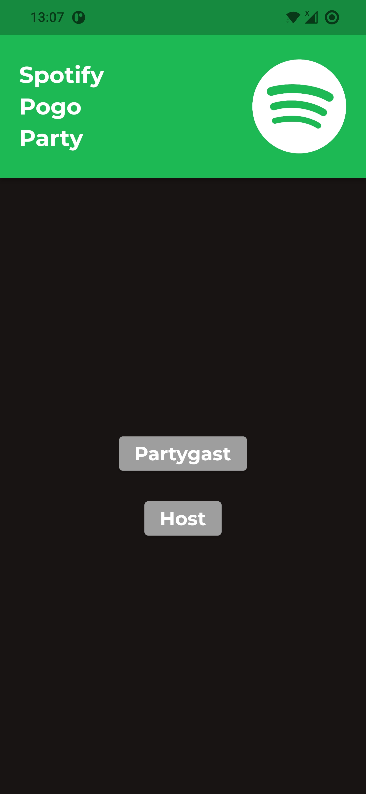
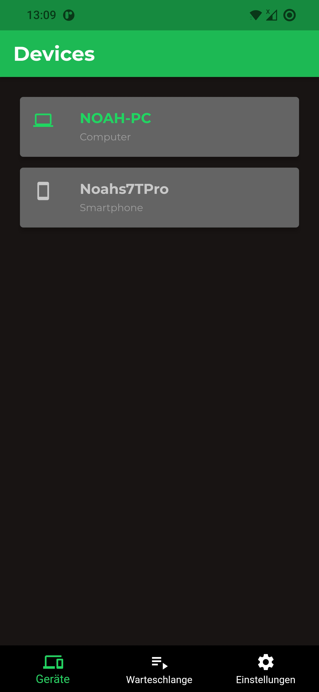

# Spotify Pogo Party

Das Ziel der Volesung Cross-Plattform Development war es, uns Studierenden eine Einführung in das immer populärer werdende Framework Flutter zu geben, das von Google entwickelt wurde und mit dem Anwendungen für Andorid, iOS und sogar das Web aus einer Codebasis entwickelt werden können.

Parallel dazu wurden wir von den Dozenten angeleitet unsere eigene App-Idee mit der erlenten Technologie zu verwirklichen. Dabei wurden wir in Gruppen zu maximal drei Personen eingeteilt und arbeiteten eine gemeinsame Idee nach und nach aus. Besonders hilfreich war die projektorientierte Arbeitsweise mit regelmäßigen Jour-Fixes, in denen der aktuelle Stand präsentiert werden musste und die Dozenten um Hilfe gebeten werden konnten. Da man so immer etwas zu tun hatte, erinnerte die Vorlesung sehr an das SEP. 

Unsere Idee war dabei, eine App zu entwickeln, mit der die Musik auf einer Party entspannt von allen Teilnehmern ausgewählt werden kann. So muss der Gastgeber nicht ständig Musikwünsche annehmen, Playlists erstellen oder andere Personen an seine Musikanlage lassen. Er kann stattdessen einfach sein Spotify Konto mit unserer App verbinden und eine Spotify Pogo Party hosten. Hier werden dann alle Gäste eingeladen und können (mit vom Gastgeber gesetzten Begrenzungen) Songs zur Party hinzufügen. Durch die Verbindung des Gastgebers mit Spotify lässt sich so ganz einfach ein gemeinsames Musikerlebnis auf jeder Party realisieren! 

---

### Alleinstellungsmerkmale

Es gibt die Spotify Gruppen Session, aber diese ist nicht besonders restriktiv bei Rechten der verschiedenen Gäste der Session. Jeder kann so viele Songs der Warteschlange hinzufügen, wie er will. Gleichzeitig kann jeder die Wiedergabe pausieren und Songs auch wieder entfernen. Das alles soll die Pogo Party ändern. Sie folgt dem Konzept eines Hosts, der seine Gäste in die Party einlädt, diese aber wiederum nur eingeschränkte Rechte haben. Der Host bestimmt, wie viele Songs ein Gast in einer bestimmten Zeit hinzufügen kann oder auch die maximale Gästezahl. Zusätzlich können Gäste keine Songs entfernen. Ein weiterer Vorteil ist, dass lediglich der Host einen Spotify Premium Account benötigt und nicht jeder einzelne Teilnehmer.

#### Unsere Vorteile
- Die Bedienung der Anwendung ist einfach und intuitiv
- Der Host hat volle Kontrolle über die Songs, die abgespielt werden können
- Der Host kann Gäste aus der Party kicken
- Der Host bestimmt die Anzahl der Songs die pro Gast in einer bestimmten Zeit zur Party hinzugefügt werden können
- Der Host bestimmt Maximalanzahl der Gäste
- Gäste können die Pogo Party so wenig wie möglich vermiesen, da sie keine Kontrolle über die Songs haben
- Nur der Host benötigt Spotify Premium Account
- Gäste benötigen nicht einmal einen Spotify Account

---

### Features
Die oben genannten Vorteile haben wir mit der Zeit nach und nach als Features in unsere App integriert. Dieser Entwicklungsprozess sowie die daraus resultierenden Features, die bis zum Ende des Semesters umgesetzt werden konnten, werden in den nächsten Kapiteln näher beschrieben. 

#### Prototyp und erste Idee

Die Idee war, mehr Kontrolle in eine Spotify-Session zu bringen, indem der Host einer Party die Verwantwortung hat, während Gäste möglichst wenig die Party stören können, indem sie zu viele ihrer nicht ganz so allseits beliebten Songs abspielen lassen können. Dabei soll die Einfachheit der App dazu beitragen, dass selbst auf der wildesten Party jeder immer noch genau weiß, wie er die App zu bedienen hat.

Dadurch, dass die Pogo Party hauptsächlich vom Host gesteuert wird, hat er auch die meisten Use Cases. Gäste können lediglich einer Party beitreten und begrenzt Songs hinzufügen. Die Anzahl dabei bestimmt der Host, ebenso wie die Dauer, die es für einen Gast benötigt, einen weiteren Song wieder "aufgeladen" zu bekommen. Der Host soll die Wiedergabe steuern können und auch Teilnehmer verwalten können, indem er sie aus der Party werfen kann. Der Host soll ebenfalls bestimmen können, wie viele Gäste maximal teilnehmen können.

Nachdem die nötigen Use Cases definiert waren ging es daran ein Konzept der grafischen Nutzeroberfläche zu gestalten. Hierzu nutzen wir das Tool Miro. Das Ergebnis ist oben zu sehen und sollte grafisch stark an das Design der Spotify App angelehnt sein, weswegen einem die Farben vielleicht bekannt vorkommen. Außerdem sollte dies dabei helfen die App als Nutzer zu akzeptieren und sich darin zurechtzufinden.

Darüber hinaus sollte die Anwendung in die zwei Teile des Gastes und des Gastgebers (hier Host genannt) geteilt sein, die entsprechend der Use Cases nur die Auswahl neuer Songs als gemeinsames Feature beinhalten sollten (siehe rechter unterer Screen). Bei der Gestaltung der App wurde - wie oben bereits erwähnt - stark darauf geachtet, das Design möglicht einfach zu halten ohne überladene Screens oder ähnliches.

#### Implementieung

    
    

        

            Startup Screen
        

        <ul>
            <li>Man wählt aus, ob man als Host eine Party starten will,  
                oder als Gast einer Party beitreten will</li>
        </ul>
    

 

    
    

        

            Host Login
        

        <ul>
            <li>Hier gibt man als Gastgeber einen Nicknamen an  
            und wird anschließend zur Anmeldung bei Spotify  
            weitergeleitet</li>
        </ul>
    

 

    
    

        

            Geräteauswahl
        

        <ul>
            <li>Da Spotify die Musik auf verschiedenen Geräten  
            abspielen kann, muss zunächst das gewünschte Gerät  
            ausgewählt werden</li>
            <li>Unten ist ebenfalls die Navigationsleiste zu sehen über  
                die nach erfolgter Geräteauswahl auf die Warteschlange  
                und die Einstellungen zugegriffen werden kann</li>
        </ul>
    

 

    
    

        

            Warteschlange
        

        <ul>
            <li>Dies ist der "Hauptscreen" des Gastgebers</li>
            <li>Hier befinden sich die Songs, die aktuell in der  
            Warteschlange sind</li>
            <li>Songs können entweder über die Lupe oben oder  
            den Button am Ende der Liste hinzugefügt werden</li>
            <li>Ein Miniplayer, mit dem der aktuelle Song kontrolliert  
            werden kann ist ebenfalls vorhanden</li>
            <li>Durch Swipen kann ein Song außerdem aus der  
            Warteschlange entfernt werden</li>
        </ul>
    

 

    
    

        

            Songsuche
        

        <ul>
            <li>Die Suche nach Songs ist bei Host genauso wie  beim Gast. Der Gast wird jedoch keine Songs hinzufügen   können, wenn er keine Aufladungen zur Verfügung hat.</li>
            <li>Die Suche funktioniert über Künstlersuche,  sowie auch Songtitelsuche.</li>
            <li>Gäste erhalten nach der vom Host eingestellten   Zeit wieder einen weiteren Song und können   eine vom Host festgelegte Maximalanzahl an Songs   gleichzeitig haben.</li>
        </ul>
    

 

    
    

        

            Einstellungen
        

        <ul>
            <li>Auf diesem Screen kann der Gastgeber die  
            Einstellungen für alle Gäste anpassen. So kann  
            eine Obergrenze für Gäste gesetzt werden oder  
            die Wartezeit nach Hinzufügen eines Songs  
            eingestellt werden</li>
            <li>Außerdem ist oben der Partycode sichtbar</li>
            <li>Da die Anmeldung eines Gastes auch per QR-Code  
            erfolgen kann, findet sich ein zur Party passender  
            QR-Code ebenfalls hier</li>
            <li>Gäste werden der Übersichtlichkeit halber angezeigt  
            und nach Belieben aus der Party gekickt werden</li>
            <li>Zuletzt kann der Gastegeber hier die Party beenden</li>
        </ul>
    

 

    
    

        

            Gast Login
        

        <ul>
            <li>Gäste treten einer Party über ihren Code bei.</li>
            <li>Es kann ebenfalls ein QR-Coder verwendet   werden.</li>
            <li>Gäste geben noch ihren Namen an und dann geht's  ab in die Pogo Party!</li>
        </ul>
    

 

    
    

        

            Warteschlange (Gastansicht)
        

        <ul>
            <li>Gäste können die aktuelle Warteschlange   sehen.</li>
            <li>Weiterhin haben Gäste zwei Möglichkeiten zur   Interaktion: Songs hinzufügen und die Party   verlassen.</li>
        </ul>
    

---

### Technische Informationen
#### Verwendete Technologien
- Flutter, Framework zur Entwicklung von Cross-Plattform-Applikationen
- Dart als Programmiersprache
- Firebase als Backend
- Spotify Web API
- OAuth

#### Verwendete Packages
- [flutter_web_auth](https://pub.dev/packages/flutter_web_auth)
- [qr_code_scanner](https://pub.dev/packages/qr_code_scanner)
- [marquee](https://pub.dev/packages/marquee)
- [firebase_core](https://pub.dev/packages/firebase_core)
- [firebase_database](https://pub.dev/packages/firebase_database)

