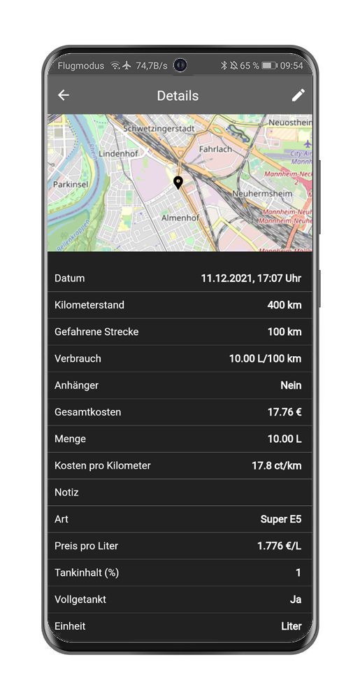
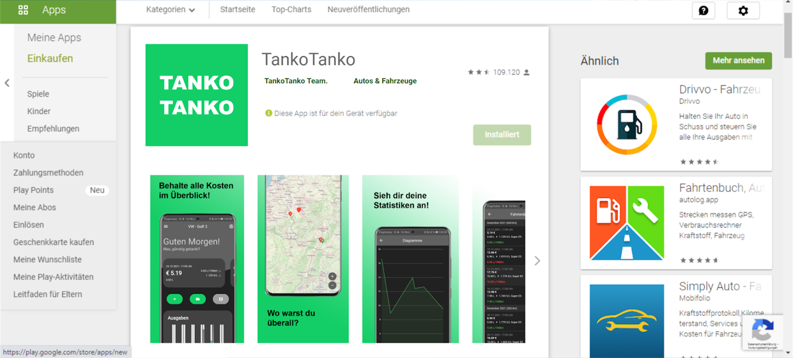

# Entwicklung einer App zur Überwachung der Kosten eines Fahrzeugs
Im Rahmen des Kurses Cross-Platform Development mit Flutter (CPD) hat sich unser Team dazu entschieden eine App zu programmieren, die zur Überwachung der Kosten eines oder mehrerer Fahrzeuge genutzt werden kann. Wir beide nutzen bereits eine App auf unseren Smartphones, um die Tank- und Wartungskosten unserer Autos zu verfolgen, sind aber nicht ganz zufrieden mit diesen. Da es noch keine App auf dem Markt gibt, die unsere Anforderungen erfüllt, haben wir uns entschlossen selber eine zu entwickeln.
Da die Kosten eines Fahrzeugs hauptsächlich durch die Spritkosten beeinflusst werden, sind wir zu dem Namen unserer App gekommen: TankoTanko. 

## Alleinstellungsmerkmale
TankoTanko ist eine einfache, benutzerfreundliche Cross-Platform-Anwendung, die auf iOS, Android und im Webbrowser funktioniert. Sie ermöglicht es die Einnahmen und Ausgaben für ein oder mehr Fahrzeuge im Blick zu behalten. Dazu bietet sie ein übersichtliches Dashboard und weitere nützliche Statistiken und Auswertungen. 
Zudem bietet TankoTanko auch eine Anhänger-Funktion, mit der die Spritkosten und Spritverbräuche für den Anhängerbetrieb eines Fahrzeugs separat verfolgt und berechnet werden können. Neben der Historie eines Fahrzeugs kann man auch auf einer Übersichtskarte sehen, wo man bereits sein Fahrzeug getankt hat. Dazu kann entweder der aktuelle Standort direkt beim Tanken getrackt oder im Nachhinein eine Position auf der Karte ausgewählt werden.
Die Daten bleiben bei TankoTanko lokal auf deinem Gerät und werden auch nur dort verwaltet. Es besteht bereits in einer Beta-Version die Möglichkeit deine Daten über Google Drive auch auf mehreren Geräte zu synchronisieren.

Funktionen ([hier](#funktionen-der-app) zur ausführlichen Beschreibung):
1. Übersichtliches Dashboard
2. Fahrtenbuch - Liste aller Tankeinträge
3. Kostenbuch - Liste aller sonstiger Kosten
4. Übersichtskarte - Erkunden aller eingetragener Standorte
5. Statistiken & Diagramme

## Zeitliche Dokumentation des Projektes
### Prototyping
Nachdem die Entscheidung getroffen war eine Tank-App zu programmieren, war es essentiell Prototypen zu entwickeln. Zunächst haben wir in unserer Gruppe prototypische Screens auf Papier entwickelt, um eine einheitliche Vorstellung der App im Team zu erarbeiten. Dazu wurde einerseits geklärt, welche Screens überhaupt von unserer App benötigt werden und andererseits wie diese miteinander in Verbindung stehen.
Im Anschluss daran haben wir über [Marvel App](https://marvelapp.com/), die ersten digitalen Prototypen entworfen und verfeinert. Die Ergebnisse des Prototyping sind unten in den Abbildungen zu sehen.  Die Implementierung der grafischen Oberfläche unserer App konnte sich somit an den prototypischen Screens orientieren. Damit haben wir die Designentscheidungen bereits vor der eigentlichen Implementierung getroffen.

### Starten der Entwicklung mit Flutter

Flutter ist eine Open-Source-Software Framework von Google, welches im Jahr 2017 erschienen ist. Flutter nutzt Dart als Programmiersprache und soll dem Nutzer eine "native User-Experience" liefern.

Dart ist eine Java-ähnliche Programmiersprache die im Jahr 2011 von Google entwickelt wurde. Es exisitiern viele Compiler für Dart, unter anderem für iOS, Android, Linux, MacOs und Windows Applikationen. Durch den Cross-Compiler nach JavaScript ist es auch möglich, die App als Webapp zu veröffentlichen.

Aufbauend auf unseren Prototypen starteten wir die Entwicklung der App in Flutter
Die Funktion wurden nach Priorität erstellt, sodass z.B. das Dashboard, das zentrale Element zuerst implementiert wurde.

## Architektur
Bevor die eigentliche Entwicklung starten konnte, musste das grundlegende Datenmodell unserer App entworfen werden. Wir haben uns dazu entschieden, unser Statemanangement über [Provider](https://pub.dev/packages/provider) zu lösen. 
Dies ermöglicht uns einen zentralen Provider in der App zu definieren, der beim Hinzufügen oder Ändern von Einträgen dafür sorgt, dass sich alle Widgets, die von dieser Änderung betroffen sind, aktualisieren.
Unten ist ein Klassendiagramm der wichtigsten Klassen abgebildet.

Wie bereits oben erwähnt, sollen die Daten lokal auf dem jeweiligen Gerät gespeichert werden. Da die Menge an Daten überschaubar ist und auch nicht viele Lese- und Schreibzugriffe während der Nutzung erfolgen, haben wir uns dafür entschieden, dass die Nutzerdaten in einer CSV-Datei gespeichert werden. 

## Funktionen der App

### Dashboard

    
    
    <ul class="tankoInline">
         <li>Kacheln</li>
        <ul>
            <li>Letzte Betankung (mit Vergleich zum Durchschnitt)</li>
            <li>Aktueller Verbrauch (mit und ohne Anhänger)</li>
        </ul>
        <li>"Shortcut"-Buttons</li>
        <ul>
            <li>Hinzufügen von Tankeinträgen</li>
            <li>Fahrtenbuch</li>
            <li>Übersichtskarte (TankoTankoMap)</li>
        </ul>
        <li>Ausgaben Übersicht</li>
        <ul>
            <li>Zusammenfassung der Kosten nach Art</li>
            <li>Übersichtliche Darstellung der letzten sechs Monate</li>
            <li>Antippen der jeweiligen Säule liefert die genaue Summe</li>
        </ul>
        <li>Letzten Aktivitäten</li>
        <ul>
            <li>Anzeigen der letzten fünf Einträge</li>
            <li>Farbliche Kennzeichnung, ob Einnahme oder Ausgabe</li>
        </ul>
        <li>Hamburger-Menü (links oben)</li>
        <ul>
            <li>Erreichen aller sonstigen Funktionen</li>
        </ul>
    </ul>

 

 

### Fahrtenbuch und Kostenbuch

    
    
    <ul class="tankoInline">
        <li>Fahrtenbuch:</li>
        <ul>
            <li>Liste aller Tankeinträge</li>
            <li>Wichtige Details auf einen Blick</li>
            <li>Vebrauch in grün, wenn unter,</li>
             und rot wenn über dem Durschnitt
        </ul>
        <li>Kostenbuch:</li>
        <ul>
            <li>Informationen zu dem jeweiligen Eintrag</li>
            <li>Liste der Einnahmen (grün)</li>
            und sonstigen Ausgaben (rot)
        </ul>
    </ul>

 

 

### Detailscreens

    
    
    <ul class="tankoInline">
        <li>Betrachten der Einträge im Detail</li>
        <li>Bearbeiten eines Eintrags</li>
    </ul>

 

 

### TankoTankoMap

    
    <ul class="tankoInline">
        <li>Erkunden aller Tankeintrag-Standorte</li>
        <li>Bei aktivem Standort wird dieser auch angezeigt</li>
        <li>Eigenständiges Zoomen und Verschieben der Karte</li>
    </ul>

 

 

### Statistiken

    
    <ul class="tankoInline">
        <li>Tanken</li>
        <ul>
            <li>Tankkosten</li>
            <li>Tankmenge</li>
            <li>Anzahl der Betankungen</li>
            <li>Tankkosten</li>
            <li>Tankkosten</li>
        </ul>
        <li>Gefahrene Distanz</li>
        <li>Kosten und Einnahmen</li>
        <ul>
            <li>Tankkosten</li>
            <li>Tankmenge</li>
            <li>Tankkosten</li>
        </ul>
        <li>Berechnung von Statistikparametern</li>
        <ul>
            <li>Mittelwerte, Maximum, Minimum, ...</li>
            <li>laufendes/letztes Jahr/Monat</li>
        </ul>
    </ul>

 

 

### Diagramme

    
     <ul class="tankoInline">
     Visualisierung wichtiger Statistikparameter:            <li>Spritverbrauch mit und ohne Anhänger</li>
            <li>Kilometerstand des Fahrzeugs</li>
            <li>Kosten pro Kilometer des Fahrzeugs (Tankverbrauch)</li>
            <li>Spritpreis</li>
    </ul>

 

 

## Weiterführung des Projekts
### Einführung neuer kleinerer Features
- Unterstützung unterschiedlicher Anhänger
- Unterschiedliche Einheiten zum Betanken (Internationalisierung)
- Erweiterung für Elektrofahrzeuge
- Export von Berichten (Diagramme, Statistiken & Historie)

### Google Drive
- Speicherung der Daten aktuell lokal beim Nutzer 
- im Webbrowser ist die Speicherung noch nicht persistent
- Zur Speicherung im Web als auch zur Synchronisation zwischen mehreren Geräten ist zukünftig Google Drive gedacht

### Veröffentlichung der App, Deployen auf Webseite

Eine mögliche Veröffentlichung der App im Google Play Store könnte wie folgt aussehen:

Die Veröffentlichung der Applikation wäre prinzipiell möglich und für die Nutzung von Google Drive auch notwendig, da sonst nur Testnutzer dieses Feature nutzen können.

## Unser Fazit
Abschließend können wir beide sagen, dass die Entwicklung einer App und die Verwirklichung einer eigenen Idee im Team Spaß gemacht hat.
Auch wenn teilweise Probleme während der Projektbearbeitung aufgekommen sind, haben wir sehr viel aus der Vorlesung mitnehmen können. Dadurch, dass die Vorlesung ziemlich praxisorientiert ist, konnten wir die gelehrten Inhalte direkt in unser Projekt miteinfließen lassen.
Besonders die Arbeit im Team an einem umfangreichen Projekt, zeigt wie wichtig auch die Organisation und das Projektmanagement ist. Ohne dies wäre es uns vermutlich nicht gelungen, die App in einem Semester zu entwickeln.
Wir können die Vorlesung jedem empfehlen, der Spaß am Programmieren hat und schon immer seine eigene App entwickeln wollte.
