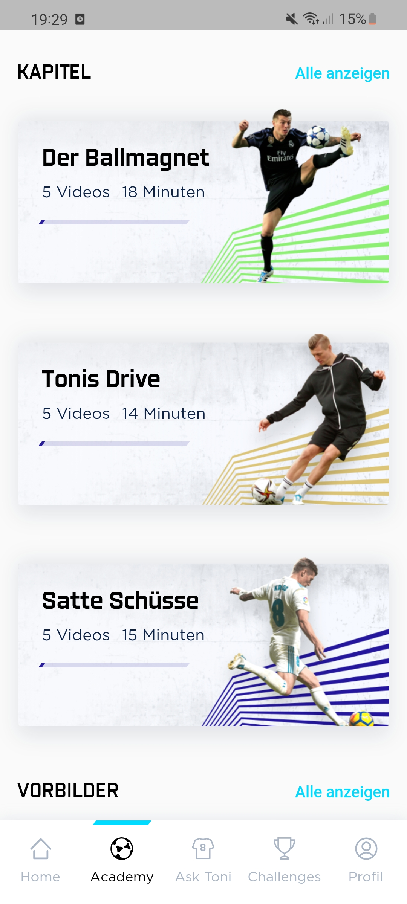
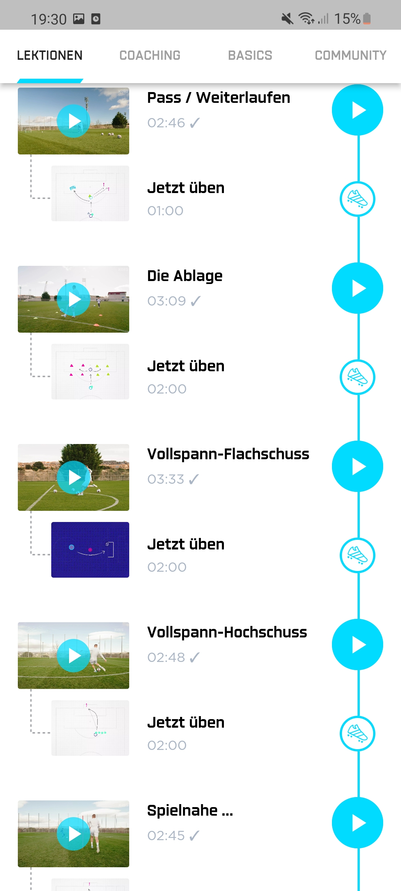
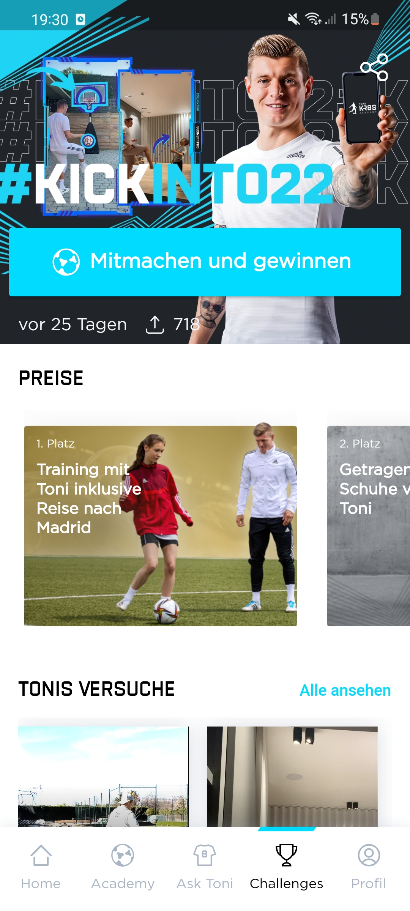
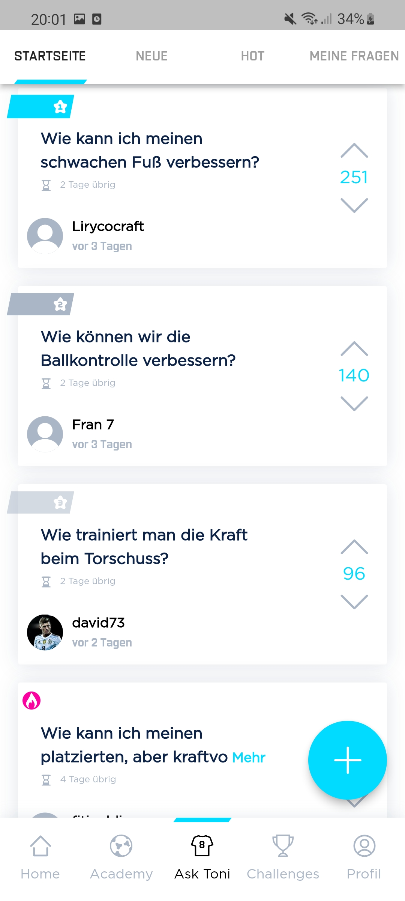
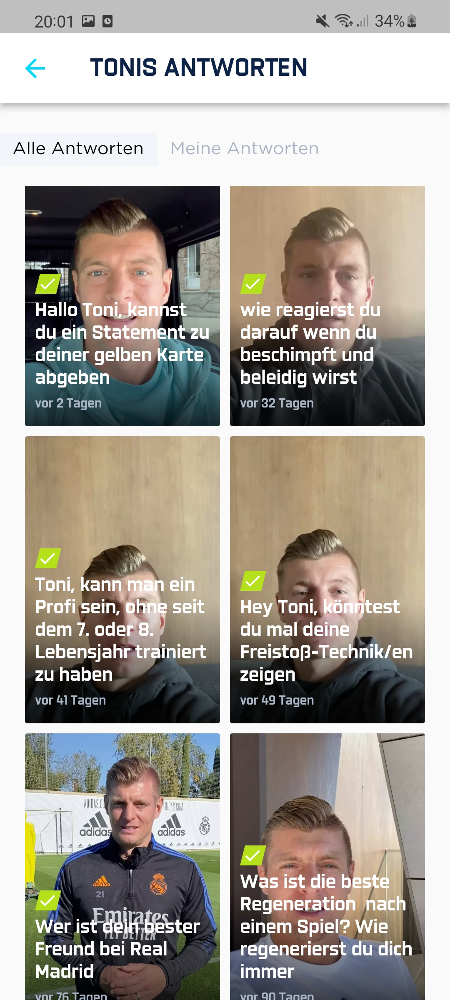
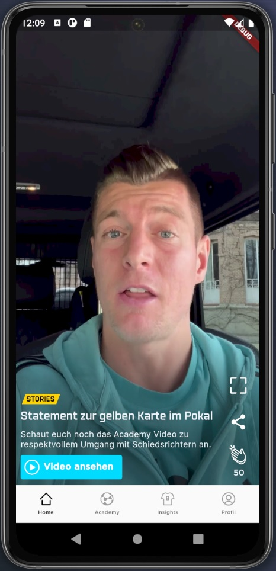
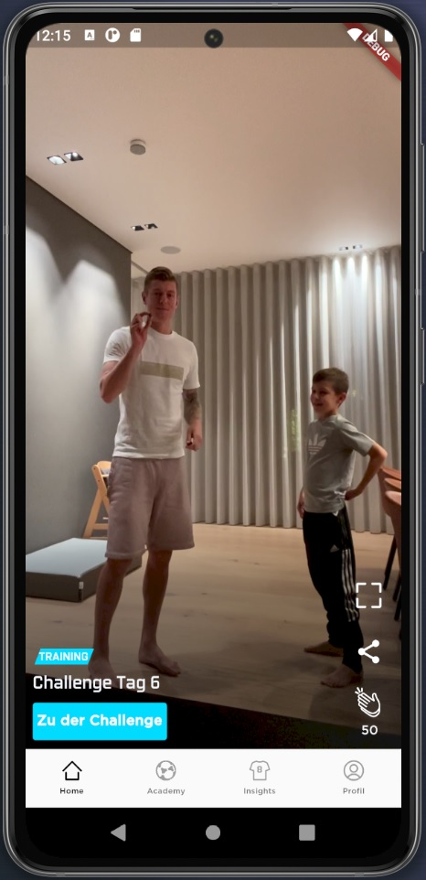
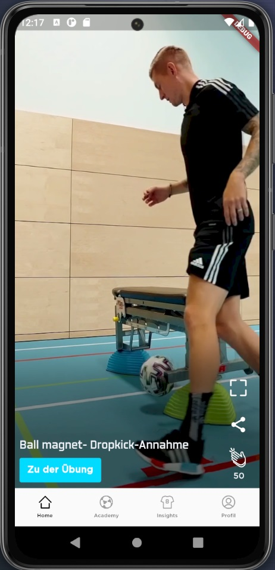
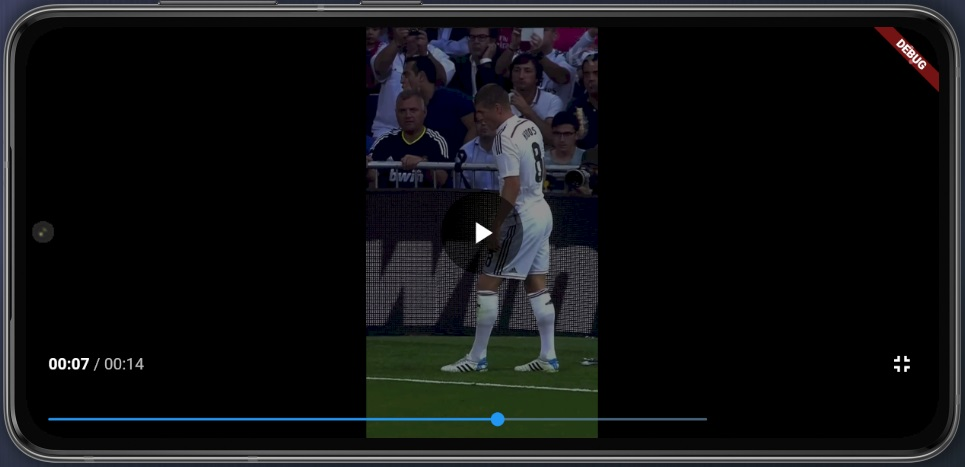

# Veranstaltung "Cross-Plattform Development mit Flutter" (CPD)

Durch den Kurs "Cross-Plattform Development mit Flutter (CPD)" im WS2021/2022 wurde die Möglichkeit geboten, mit Unterstützung der Toni Kross Academy einen Teil der offiziellen App nachzubauen.

Im Folgenden sehen Sie einen Nachbau des Homestreams der Toni-Kroos-Academy-App, entwickelt von dem Studierenden Julian Schlee mit dem Framework "Flutter".

Dozenten: Christoph Giess und Philipp Bletzer

##  Die Toni Kroos Academy App

Die Toni Kroos Academy App hat das Ziel, Tonis langjährige Erfahrung aus dem Profifußball mit den Nutzern der App zu teilen und diese dadurch zu unterstützen, bessere Fußballspieler zu werden - auf und neben dem Platz!
Dazu werden viele verschiedene Fußball-Übungen angeboten, die alle mit entsprechenden Erklärvideos versehen sind und von den Nutzern nachgemacht werden können.

 

Neben den Übungen verfügt die App auch über viele weitere Features wie beispielsweise regelmäßige Herausforderungen mit Preisen oder einen Frag-Toni-Bereich in der die Community die Möglichkeit hat, Fragen direkt an Toni Kroos zu stellen.

Das umgesetzte Projekt bezieht sich allerdings nur auf den Homestream der Applikation.

##  Der Homestream

Der Homestream der Toni-Kross-Academy-App hat die Aufgabe, die Nutzer auf die aktuellen und neuen Inhalten in der App aufmerksam zu machen.
Funktional gleicht er dem Homestream der bekannten App "TikTok" oder dem "Shorts"-Feature der YouTube-App und ermöglicht es die Inhalte möglichst passiv zu konsumieren.

   

In einem sogenannten Karussell werden kurze Videos automatisch ohne vorherigen Start abgespielt und der Nutzer hat anschließend die Möglichkeit, durch vertikales Wischen zu dem nächsten beziehungsweise vorherigen Video zu gelangen.

In diesen Videos werden die weiteren Inhalte der App wie beispielsweise neue Übungen, Videos oder Herausforderungen angeteasert und beworben.
Zu den einzelnen Videos gibt es zudem noch ein kleinen Beschreibungstext und gegebenenfalls einen Button, der den Nutzer zu dem beworbenen Inhalt der App führt.

In einer Sidebar hat der Nutzer die Möglichkeit, das abgespielte Video in einem externen Video-Player wiedergeben zu lassen, in dem ihm beliebige Kontrollfunktionen bereitstehen. Zudem kann er dort den Inhalt liken oder beziehungsweise in diesem Fall beklatschen und ihn in einer externen App teilen.

## Technische Informationen

Der Homestream wurde vollständig mit dem Framework "Flutter" in der Programmiersprache "Dart" entwickelt.

Durch die Kooperation mit der Toni-Kroos-Academy konnten die echten Daten und Videos aus dem Backend der offiziellen App verwendet werden und in den Homestream implementiert werden.
